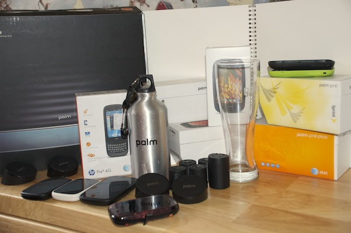

# Upcoming auction of HP/Palm devices and more for a great cause

[Josh Marinacci](http://www.joshondesign.com/c/about) is no stranger to Palm, webOS, or the [community](http://forums.webosnation.com/) of the [webOS Nation](http://www.webosnation.com). As a former member of the webOS Developer Relations team his [presence](http://www.webosnation.com/tags/josh-marinacci) was one of trust and support within the now defunct Palm, Inc. and worldwide webOS developers. And while Josh has since moved on to Nokia, his affinity for webOS is reaffirmed in his own words; “it’s still my favorite OS”. We of the webOS Nation are glad to hear that.

Unfortunately, I must confess that this article is not about webOS’s return to the limelight nor Josh to its relations team. This is an announcement, an all-call, and a plead asking each of you to aide Josh and his family in raising money for his brother-in-law, Kevin Hill. Josh posted a blog explaining the situation. Since Kevin can no longer work, his family will need about $10,000 to get them through the next few months. This is where Josh comes in. He is holding an auction from September 15, 2013 to September 22, 2013 to raise the money. Up for grabs are MANY Palm/HP devices, artwork, some cool swag, and a Palm water bottle that saved his life. (Josh, we need that story!) 4G Touchpads, Pre 3s, original Palm Pres, Palm Pre+s, and plenty more are on the docket.

Josh sent out the [update](http://joshondesign.com/2013/08/31/auctionupdate) with the dates August 31st for all those that have signed up on the mailing list to be notified already. He also started a [thread on webOS Nation](http://forums.webosnation.com/general-news-discussion/325966-webos-charity-auction-update.html). You can sign up to be notified of the auction by clicking [here](http://eepurl.com/EbDP9). The webOS community is the best of any online mobile community and Josh is counting on us for this worthy cause. Let’s rally our support, sign up for the list, and get the word out! So please share!

#webosforever
