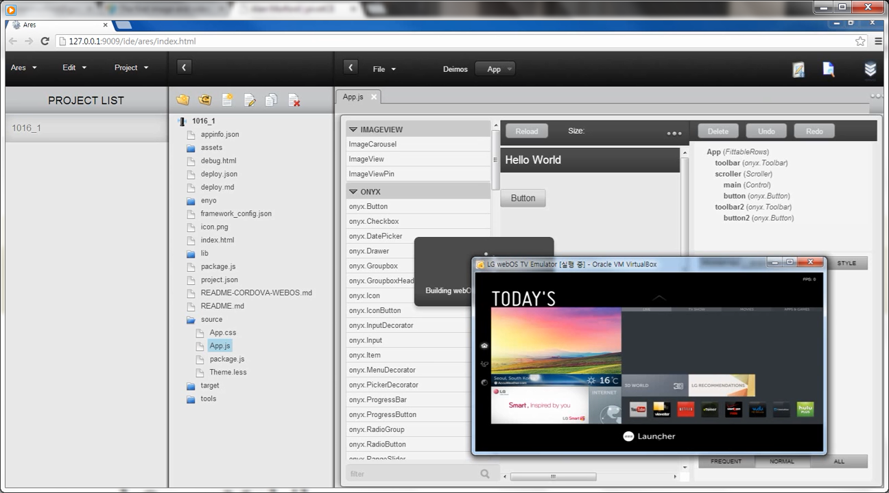
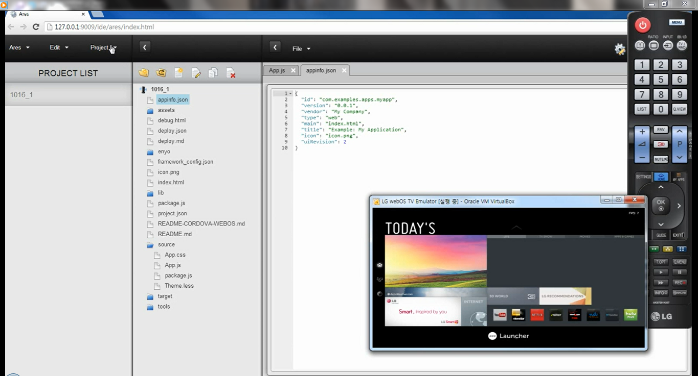

# UPDATE – LG webOS TV emulator spotted

In the dark about what’s been happening at LG webOS these days?  Don’t feel bad.  So are we.  Although if you stare deep into the very dark tunnel with an unknown length you might see a pinprick of light at the end.  The tunnel is LG webOS and the light is the first video displaying the webOS TV Emulator running on [Project Ares](https://ares.palm.com/Ares/about.html).  ~~Hit the break for the video.~~  Unfortunately, LG requested the video be removed so it’s currently unavailable. The video DOES still exist though and pivotCE was able to acquire it, however, to avoid potential copyright infringement we will not repost it for view.  Read on for a couple of nice screenshots though.

 

So, what do you see?  Not much.  An early “Hello World” concept showing the launcher, the remote, and some manually entered code.  But hey, it’s great to see an update.  Take away want you want, friends.  But as for me I see webOS alive and being used for new hardware.  Will my Pre3 and TouchPad connect to the TV somehow?  I’m not sure but I’d be willing to speculate that a bluetooth connected webOS device to the LG webOS TV would make a handy remote.  Here’s hoping!

#webosforever
