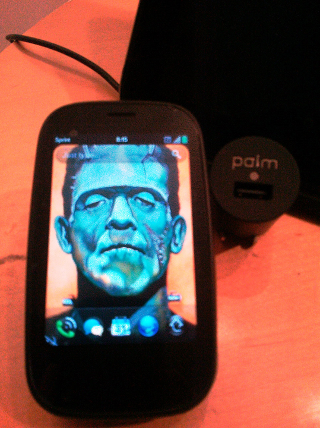
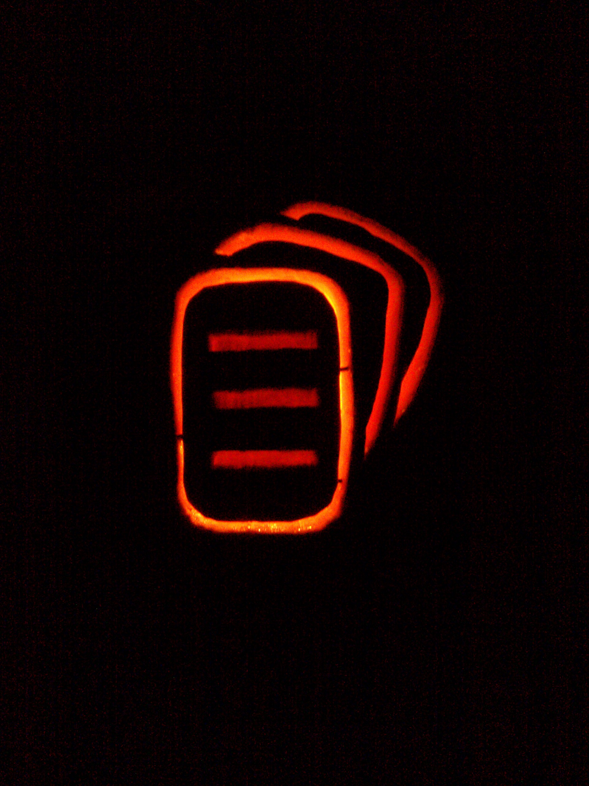
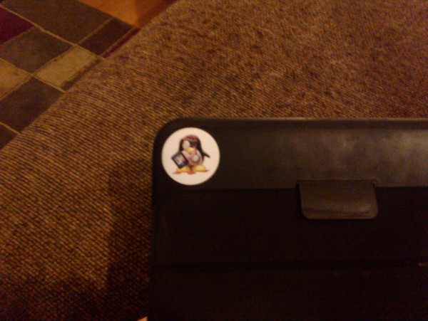
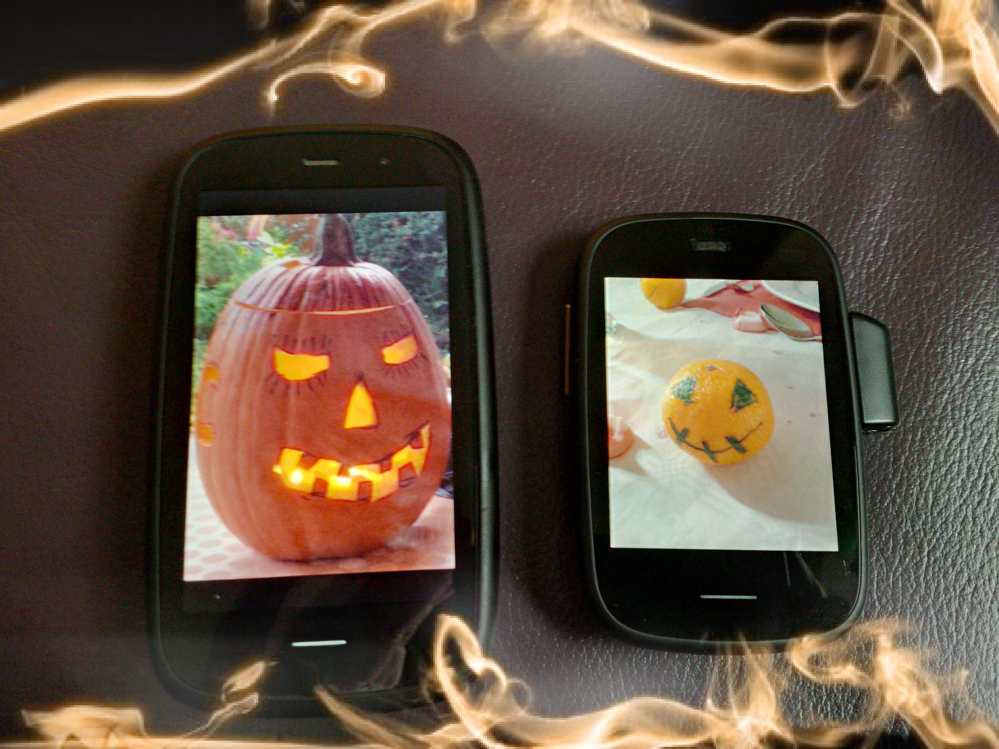
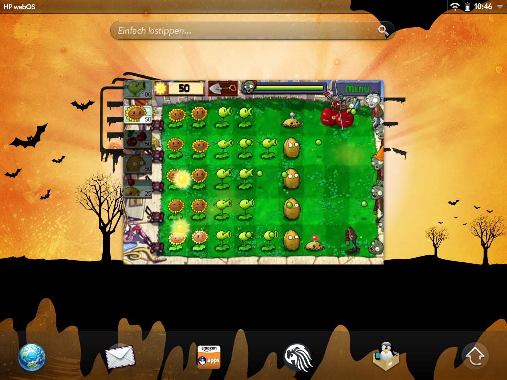

# Halloween/webOS 2013 Contest Results

Thanks to everyone for their submissions to the pivotCE Halloween/webOS 2013 contest.  We didn’t have a HUGE turnout but hey, we’re new around here!  And now….our winner is…..webOS Nation Forum user TJs11thPre!  Congrats!  Check out his picture below.  That’s a [FrankenPre2](http://www.webos-internals.org/wiki/Sprint_Pre_2) dressed up as Frankenstein for Halloween.  Ahhhh, classic…and FUNNY!

TJs11thPre wins a $10 gift card for the Google Play store.  Read on to see other notable entries.

What’s that?  You’re throwing things at your computer screen because you’re a webOS fan and thought we were too?  Ok, you’re right.  I’d much rather give a gift card to the HP App Catalog (which doesn’t exist) but with the release of ACL for webOS just on the horizon this allows faithful TouchPad owners to beef up their app collection WHILE using webOS.  The best of both worlds, we think!

So how about the rest of the entries?  Check them out below.  If you didn’t catch this contest in time don’t worry.  The folks at PIC/OM have already let pivotCE know that they plan on helping us (and you) out on the NEXT contest around here.  What does that mean?  Ha, wink wink…*you know*.

                               
