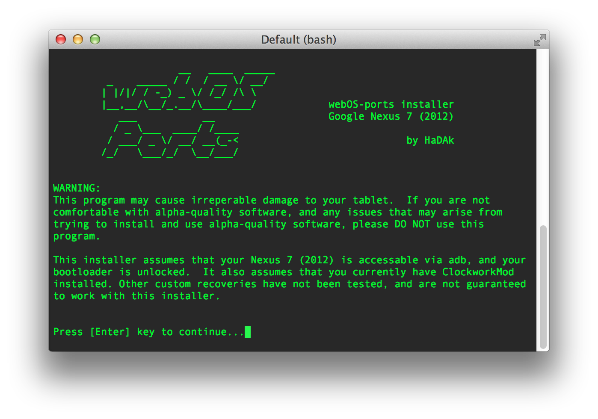
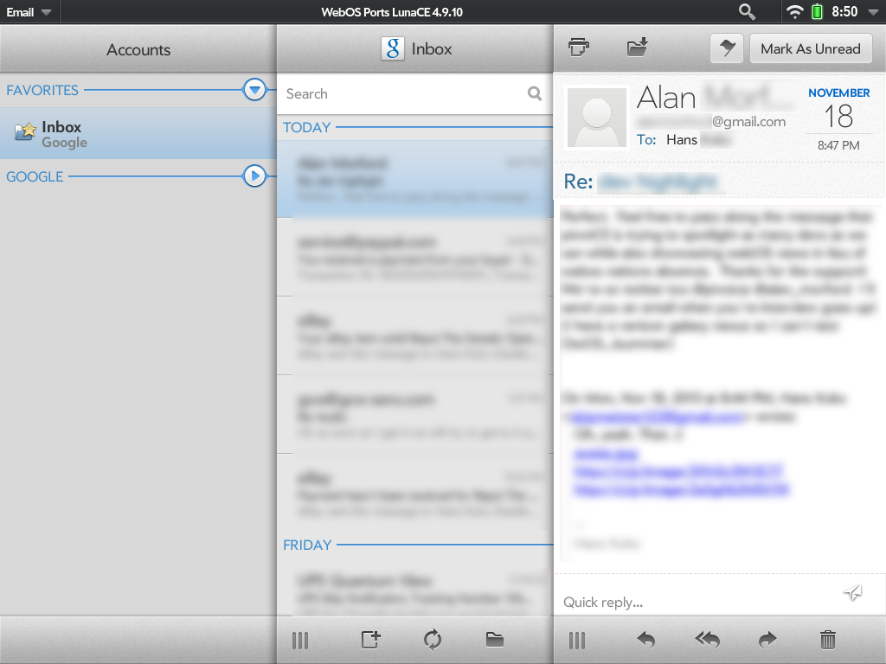
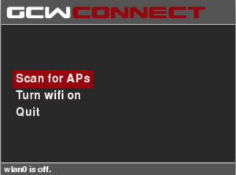

# Dev Highlight: Hans Kokx

Welcome back pivotCE fans!  We have another interview for you!  Hans Kokx comes to us from the webOS Ports Team (among other areas of webOS-dom).  See below for our conversation.

*HaDAk*

**What’s your handle?**
People will know me as HaDAk.

**Where do you hail from?**
I’m currently living in the States, although that may change soon.

**What was your first Palm device?**
Palm Treo 270.  I was a release-day adopter of the Pre though.

**Have you published any apps in the HP App Catalog?**
I do not have any apps in the App Catalog at this time.

**What homebrew apps have you developed?**
I’m the author of the webOS Ports installer script.  It’s still in its infancy, but it will evolve over time.  Keep an eye out on github for it to be released – <https://github.com/webOS-ports/webos-ports-sdk/tree/master/scripts>. **Have you written any patches?**
I wrote the Better Email Headers patch for webOS 3.0.5’s email client.  The aim was to beautify the header area of email messages to increase space for message content and make the header area more aesthetically pleasing.  You can find the patch in Preware or here: <http://patches.webos-internals.org/?do=browse&webosver=3.0.5&category=Email>.

I’ve also been working on a Quick Reply bar for the mail client – the aim is to add a single text area below the message text that you can use to quickly reply to the message you’re reading, without the need to launch a full card. *[author comment: you can see both patches in the photo below]*

**What’s your daily driver phone?**
I’m using a Nexus 4 at this time.  I change phones like I change my sheets, though.

**Which tablet do you use?**
My daily driver is a 2013 Nexus 7.  My 2012 Nexus 7 is used for webOS-ports testing and running various builds of webOS.  I keep my Touchpad around too.

**How did you get your start into programming?**
When I was a young child (perhaps 8?), I taught myself QBASIC.  From there, I delved into VB and abandoned programming for several years after that.  When I finally found myself with a need to write code, I learned PHP and most recently Python.

**Do you develop for other platforms?**
I’m working on writing system apps for the [GCW-Zero](http://www.gcw-zero.com/) right now.  The GCW-Zero is a handheld game console running open-source software.  It lacked a decent wireless manager so I am giving it a shot.  You can find more information in the (unofficial) repository at this time: <http://www.superlongname.com/play/unofficial-wifi-application-created-by-hadak>

Or if you wish to issue a pull request, check out <http://www.github.com/skipmeister123/gcwconnect>

**What projects are you supporting in the future?**
I will continue to offer QA and testing to the webOS-ports project, as well as the GCW-Zero. I am excited to see all the hard work and effort being put in to webOS by the Ports team and I am proud to be a part of history in the making!

Well, we’re just as excited about what the webOS Ports Team has been doing as well!  Good luck on it and we hope to see more of your work in the future.
