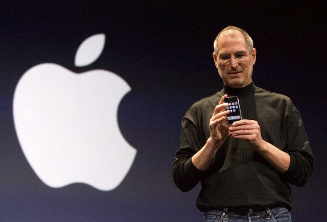
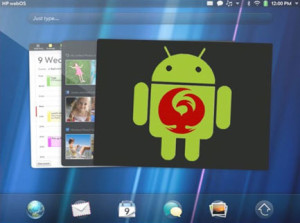

# webOS Internals founder to OM/PIC “Too little, too late”

*Image by © JOHN G. MABANGLO/epa/Corbis*

When Steve Jobs pulled out the iPhone at Macworld 2007 it was a game changer.  Smart phones became what they are today because the iPhone flipped the market on its proverbial lid.  Google built a search engine into a billion dollar industry and the web has never been the same because they changed the game.  Say what you want about Microsoft but when they licensed their software and NOT hardware it changed the computer market forever.  Similarly, mobile computing was in its infancy when Palm and US Robotics came along and released the Palm 1000.  The PDA market exploded because Palm changed the game.

Each game-changer was innovative, fresh, and excited people.  Palm recaptured that exciting spirit at CES in 2009 with the debut of the Palm Pre.  But after HP stopped developing webOS hardware in 2011 it all but killed the innovation of webOS to the mobile world and fans of the platform were left without hope it would ever reach competitive market share.  Open webOS was born but that game was so new it didn’t have a rule book.  The game was over before it really began or so it seemed.

**But before I explain this article’s title let’s have a quick story, shall we?**

In October of 2012, Phoenix International Communications (PIC) came forward with a bold idea to save webOS: run Android within it.  Early [videos](http://www.youtube.com/watch?v=x1wNKCEP1GE) were [promising](http://www.youtube.com/watch?v=pwJYIOPCYCs) but died away quickly.

*Image Credit: PIC*

And then in May 2013 **it happened**…the [ACL for webOS Kickstarter](http://www.kickstarter.com/projects/1957339277/run-android-apps-in-webos-on-the-hp-touchpad).  Suddenly, and for the first time in a long time, the game seemed to be changing.  **$45,533** later, on 23 March, 2013, PIC officially teamed up with OpenMobile WorldWide (OM) and began working on the software to bring HP TouchPads into the modern day with Android apps (pre-Android 3.x).  Those that pledged at least $30 to the project would be given a license upon release with an estimated delivery date of July 2013.  It sounded too good to be true, but a Cinderella story this is not.

Only **16 days later** on 8 June, PIC [announced](http://www.kickstarter.com/projects/1957339277/run-android-apps-in-webos-on-the-hp-touchpad/posts/504579) a delay.  It was a bummer for the community but at least the lines of communication were open.  The new release date was 30 September with a beta release on 3 August.  Unfortunately, the frequency of their communication with the webOS community began to dwindle from this point on.

Other than YouTube [videos](http://www.youtube.com/watch?v=iphcoKmFIow) of ACL for webOS “running” on a TouchPad there weren’t any status updates to their blog for 25 days.  However, true to their word, PIC launched the beta program on 3 August.  But beta testers signed non-disclosure agreements so no reviews or other information were released about the quality of the product to the community.  What happened next nearly put the nail in the coffin for webOS fans who were waiting…well, patiently might not be the best word…

**More than a month passed without word from PIC.**  On 9 September PIC [blogged](http://www.kickstarter.com/projects/1957339277/run-android-apps-in-webos-on-the-hp-touchpad/posts/594206) that hardware acceleration problems were causing a hiccup elsewhere within the software.  The pre-release was pushed back but the official release plan of 30 September was still set.  Nine days later a [new blog](http://www.kickstarter.com/projects/1957339277/run-android-apps-in-webos-on-the-hp-touchpad/posts/602658) went up admitting their solutions to those problems had failed.  But on 27 September, PIC [announced](http://www.phxdevices.com/2013-09-27-ACL_for_webOS-Release-Update) that a pre-release version was available to Kickstarter Backers, however, the final release date was officially “on hold”.  And with that update there came only silence from PIC’s blog.

**Two months** **passed** with zero official communication from PIC.  Strangely enough, the [next update](http://support.openmobileww.com/hc/en-us/articles/201186663-When-will-ACL-and-AppMall-for-webOS-be-released-for-the-HP-TouchPad-3-0-5-) would not come from PIC but from OpenMobile via their FAQ page on their support site.  According to them, ACL for webOS development is complete and they are “90% complete in [their] Release Cycle”.  Whatever that means…  The next projected release date is labeled “soon – meaning weeks not months”.

**I told you that story to tell you this one…**

Imagine if you will, Google pulls all apps and support from iOS.  Samsung and LG stop making phones for and supporting Android.  All Microsoft licensees bail for Linux.  The result?  Mass hysteria?  Stocks crash?  Cats and dogs get along?  Apple, Google, and Microsoft suffer value and user loss?  You bet.  Maybe not the cats and dogs thing…

*Image Credit: webOS Internals*

Similarly, last week Rod Whitby, the founder of [webOS Internals](http://www.webos-internals.org/wiki/Main_Page) and to many, the father of webOS homebrew, published [a post](http://forums.webosnation.com/hp-touchpad/324645-pic-kick-starts-touchpad-open-mobile-acl-78.html#post3408032) on webOS Nation forums pulling his support for ACL for webOS.  Here’s a snippet of what he had to say:

*“Quite honestly, I’m so unimpressed by the unprofessional attitude of OM and PIC to its sole demographic customer base right here on this forum that I’m not going to use ACL going forward.*

*“I invested time and effort getting ACL to install reliably and work on the TouchPad Go. OM state that they will not include those improvements in their final product, and when asked if they will actively disable the improvements that I did, they have no answer (so one must assume that they will, as it would make no sense not to appease those with TouchPad Go devices by at least stating that it should work but will not be supported).*

*“This is it for me as far as OM and PIC are concerned. Too little, too late.”*

He went on to [reply](http://forums.webosnation.com/hp-touchpad/324645-pic-kick-starts-touchpad-open-mobile-acl-79.html#post3408089) to a later comment:

*“OOM is a company trying to sell Android virtualization software to hardware OEMs* […] *Providing timely information to end-users or customers of PIC would be very far down the list of corporate priorities, which is why you see the actions not matching the promises.”*

Wow.  Talk about a punch in the gut for PIC, OpenMobile, and the ACL for webOS project.  It seems the lack of communication has been the downfall all along.  Although, with news from [OM](http://forums.webosnation.com/3406596-post1468.html) that the HP TouchPad GO would not be supported for ACL for webOS even after **Rod personally provided a [solution](http://forums.webosnation.com/3405136-post1170.html) for it**, who can blame him for waving the white flag?  With a figurehead of the webOS community as prominent as Mr. Whitby pulling his support for this project it makes me wonder who’s next!  Ouch.

Despite the negativity and nay-saying going on many are still excited to add more options to their TouchPads.  Have things been great between the community and PIC/OM?  No and far from it.  But with or without top community developer support, ACL for webOS is still coming.

The debate about PIC, OM, and ACL for webOS is still raging on at the webOS Nation forums [thread](http://forums.webosnation.com/hp-touchpad/324645-pic-kick-starts-touchpad-open-mobile-acl.html).  Head on over to get in on the action (read “drama”).

#webosforever
