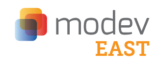

# Calling East Coast (USA) Enyo Developers

As you may (or may not) know, [MoDev East](http://east13.gomodev.com) is happening this week on the 12th and 13th of December at the Gannett Conference Center in Mclean, VA. The Enyo team are also going to be present so this is a good chance to pose any questions you may have, or just to pop in and see them.  What’s more, they are giving away a free pass to any interested Enyo developers.  All you have to do is to get in touch with them via Twitter [@EnyoJS](https://twitter.com/EnyoJS).
