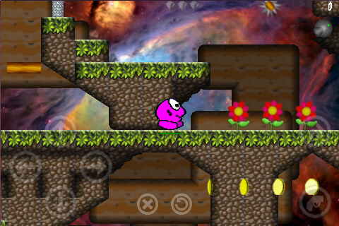
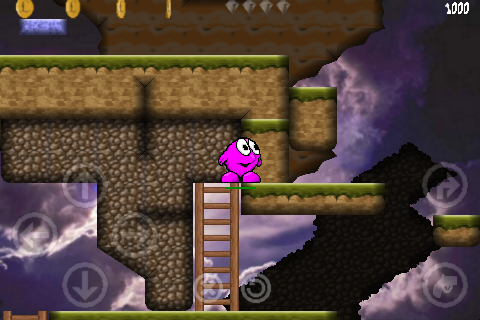

# Orcrest – A Brand New webOS Game

My name is Alan Taylor and I am the developer behind the new WebOS game Orcrest, which I have been working on for two and a half years. The game should really be Orcrest II as it follows from a game I wrote for Acorn’s BBC Model B which was published in 1985. It started from a drawing I did of a purple egg to which I added eyes and feet and later animated in BBC Basic. After a number of sleepless nights I had the re-written it in assembler and a 50 level platform game was born. The game was published just as I started university, studying applied Physics. I started work on Orcrest II four years later. This was on the Atari ST and was much more ambitious than the original. The key challenge was to develop an 8-way parallax scrolling platform game with intelligent baddies and a puzzle solving element. I managed to complete the character design and a scrolling proof-of-concept but the development was abandoned due to performance issues, which I couldn’t solve, and me joining a band as a drummer. The band years ended all thoughts of re-starting Orcrest II and it wasn’t until I saw ‘The Social Network’ film, that my desire for development returned. I was inspired and started thinking about returning to the game.

(I must say here that it had always been a dream of mine to be a games developer and I was offered a job at a leading games firm when I left University but turned it down following advice from the careers advisor. Don’t take advice from career advisors if it flies in the face of what you want to do!)

Anyhow, continuing… it was a round about this time that I bought four Palm Pre 2s for my family. We loved the phones and it wasn’t long before I was trying little demos. I found my original game on the internet, ran it on an emulator, captured the graphics and once again started by animating ‘Ormally’ the main character. Within 3 months I had the original game coded in Java with the characters I’d designed for the Atari. I ported this to C++ and so began the long haul.

I have found the coding thoroughly enjoyable but the graphics difficult. I am particularly pleased with the font. It took an age to find a font that suited the style of the game, represented something of its 8-bit history and fitted with my vision of the characters. The music was a challenge. The intention was that the guitarist and bass player form my old band would do that piece but that didn’t work out.

The characters in the game, ‘Ormally Wormally’, the main character, and his family ‘Sessie’, his wife, and children ‘Love’, ‘Lumpkin’  and ‘Bubble’ seem now to live in a little universe I have created in my head. Evil-N, the villain, arose from a childhood drawing by my wife and the search for a nickname for our niece Evelyn (who isn’t evil at all).

I’m grateful that I have not had to work alone. Paul Shotbolt has worked with me on the artwork and has done a lovely job at bringing the characters in my head to life. We wanted the artwork to have a storybook quality and he has done a great job. My wife Claudia has provided the narration, both in English and Spanish and my boy William designed level 19 (he’s 9).

It has been hard, with many, many, many long hours and numerous dead ends but we are all on a high at the moment. I hope everyone enjoys playing the game as much as we have enjoyed our journey in bringing it to you. We have plans for Ormally and Evil-N in the future with the next game being the story of Evil-N. Before then there will be an update containing the final 24 levels of the game. This will also include a new graphic set and additional features and will be available mid-February.

Some not-so interesting facts about the development:-

1) Most listened to songs (according to iTunes):  ‘The High Road’ by ‘The Broken Bells’  ‘Tightly’ by Kosheen (this has been something of an anthem)  ‘Be Here Now’ Ray LaMontagne.

2) Strangest development location:  On the floor, by the main entrance to the O2 in London during a ‘One Direction’ concert.

3) Most uncomfortable development location:  On the floor, pool-side during a swimming gala (genuinely worried the heat and damp would blow the machine)

4) Most inspirational moment  Indie Game: the Movie (watch it, it kept me going knowing others were going through the same problems and emotions).

5) Low point  Christmas 2012. Having problem with OpenGL screen translation on the Pre 2 & 3. It took me an age, maybe because of the wine. The Touchpad was a dream.

Good luck to all and lets hope you enjoy.
