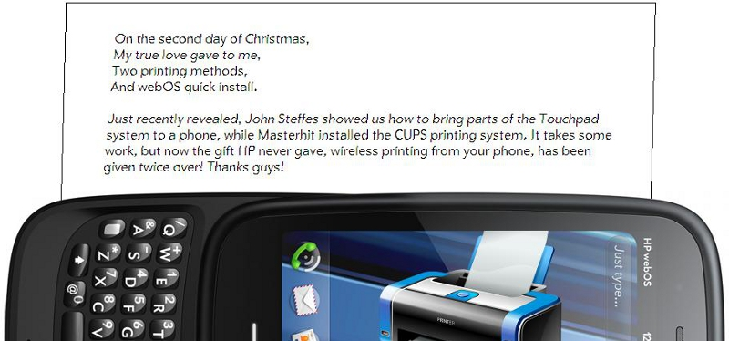

# The Second Day of webOS-mas – Print from your phone

*Image: Printer by Artua.com, Pre 3: Dailytech.com*

On the second day of webOS-mas,
My true love gave to me,
Two printing methods,
And webOS quick install.

Just recently revealed, John Steffes [showed us how to bring parts of the Touchpad system to a phone](http://forums.webosnation.com/webos-tips-info-resources/326533-native-printing-webos-phones.html?highlight=native+printing), while Masterhit [installed the CUPS printing system](http://forums.webosnation.com/webos-internals/326528-cups.html). It takes some work, but now the gift HP never gave, wireless printing from your phone, has been given twice over! Thanks guys!
