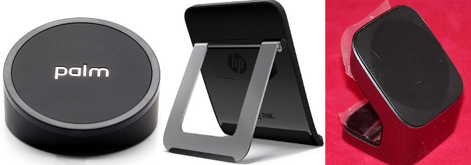

# The Third Day of webOS-mas – The Touchstone.

*Images: letstalktablets.com, fasttech.com, ebay.com*

On the third day of webOS-mas,
My true love gave to me,
Three Touchstone Chargers,
Two printing methods,
And webOS quick install.

Ah! The Touchstone! Wireless charging done right, using magnets to position. Exhibition mode – still somewhat under explored, but perfect to make a slideshow of all your Christmas cards! There is the original phone ‘hockey puck’, the Touchpad version and if you have the money and desire, the unreleased Touchstone 2 with bluetooth & audio line-out that can rarely be found on auction sites.
