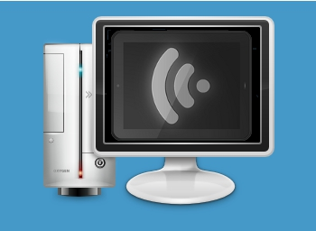

# The Fourth day of webOS-mas – WiFi File Sharing.

*Image: PC by oxygen-icons.org, WiFi File Sharing by BlueRQ*

On the fourth day of webOS-mas,
My true love gave to me,
Four WiFi Shares,
Three Touchstone Chargers,
Two printing methods,
And webOS quick install.

[WiFi file sharing](http://forums.webosnation.com/touchpad-patches/312049-app-2-x-3-x-wifi-file-sharing.html)? Easy: Just start the app! Your device is now a drive on your WiFi network. Connect & Share whatever files you want. Merry Christmas! Thanks Shifty Axel!
