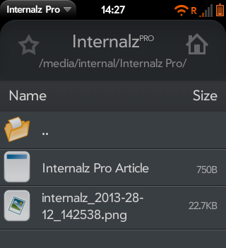

# The Fifth day of webOS-mas – Internalz Pro.

*Browsing files with Internalz Pro*

On the fifth day of webOS-mas,
My true love gave to me,
Internalz Pro!
Four WiFi Shares,
Three Touchstone Chargers,
Two printing methods,
And webOS quick install.

Need a file browser? [Another gift from Jason Robitaille](http://forums.webosnation.com/canuck-coding/256518-internalz-pro-v1-5-0-a.html). It can even install apps for you.
