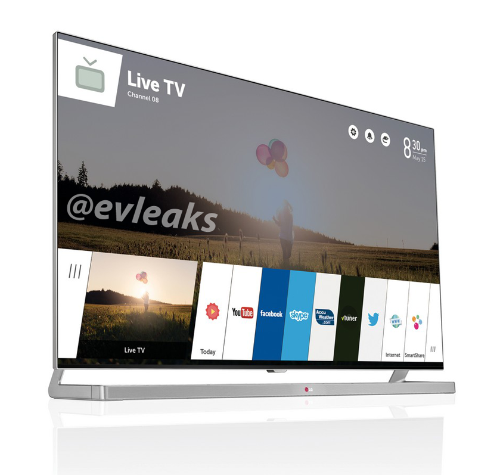

# A preview picture of the LG webOS TV

The Consumer Electronics Show (CES) opens in a few days in Las Vegas, USA. We are hoping it will bring big news from LG as they debut their new webOS powered smart television. Naturally, pivotCE will be… watching it on the internet. As a purely volunteer staffed publication, we lack the resources to actually attend, but we will be putting in the effort to make sense of the news that comes out for you, our dear readers.

So, here is some breaking news for you! Former senior editor of engadget, Evan Nelson Blass is also known on Twitter as @evleaks and is known for often being first with images and information about new tech gadgets.

*Image: @evleaks*

He has published an image of the new webOS TV from LG electronics. You can see a row of cards along the bottom of the screen holding apps for Youtube, Facebook, Skype, Accuweather & Twitter. There is also what appears to be a radio tuner, web browser and [LG’s smart share service](http://www.lg.com/uk/support/smart-share) which allows you to access multimedia files from multiple sources on your TV.

It’s webOS – not as we know it, but webOS still alive and with [LG’s plans to make the TV a hub for home automation control](http://www.cepro.com/article/ces_2014_how_many_smart_home_platforms_does_lg_need/D1/), there arises the possibility of a mobile device to join this eco-system.

Tell us what you think in the comments.
