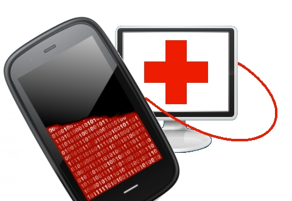

# The Ninth day of webOS-mas – webOS Doctor.

On the ninth day of webOS-mas,
My true love gave to me,
Nine OS doctors,
Eight Macaws tweeting,
Seven Spiders Feeding,
Six T’s to reset,
Internalz Pro!
Four WiFi Shares,
Three Touchstone Chargers,
Two printing methods,
And webOS quick install.

OK, it depends how you count… There may not be *exactly* nine, but there are a number of webOS doctors available, depending on your device and carrier. What is a webOS doctor? When all seems lost and your device appears to have all the utility of a brick, you can plug it into a computer and run the webOS doctor to reinstall webOS. Here is [the WebOS-Internals guide](http://www.webos-internals.org/wiki/How_To_Recover).
