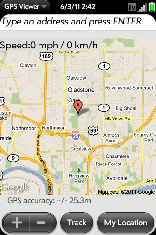
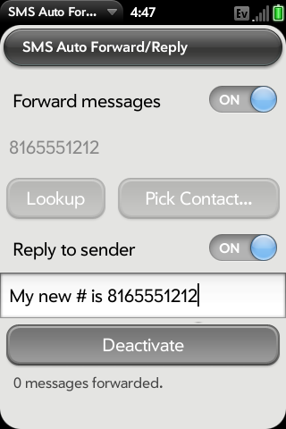
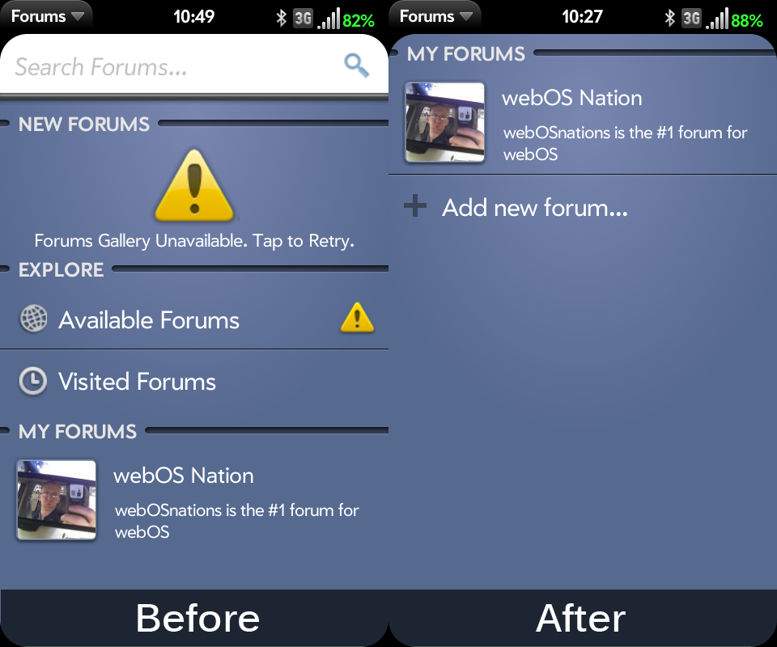
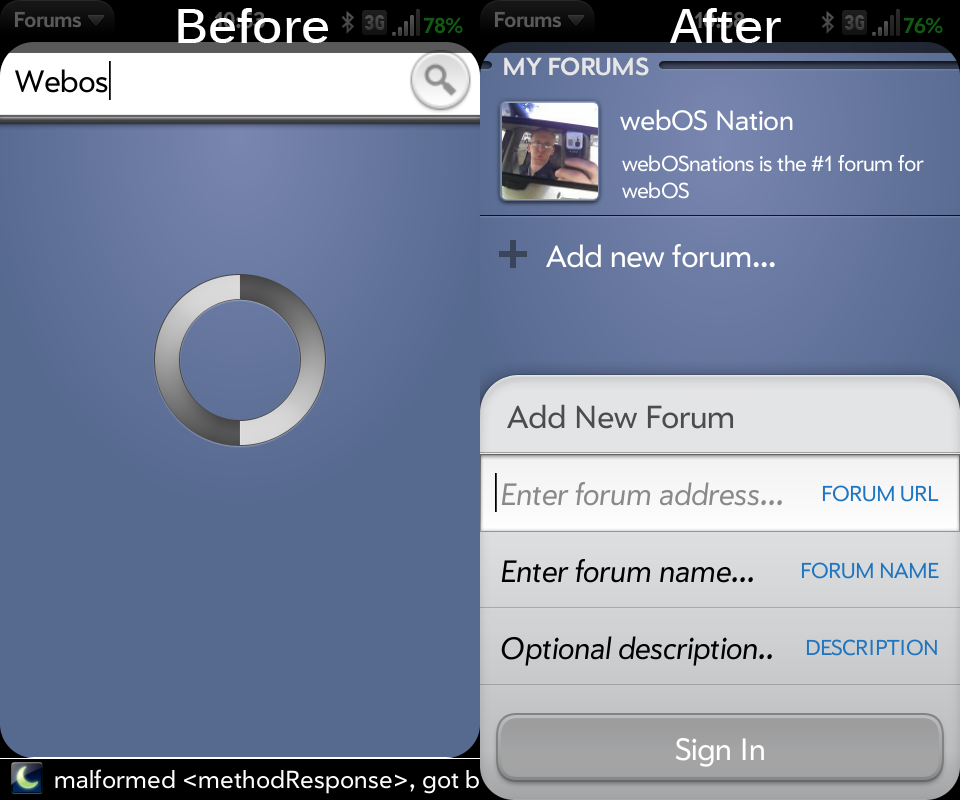
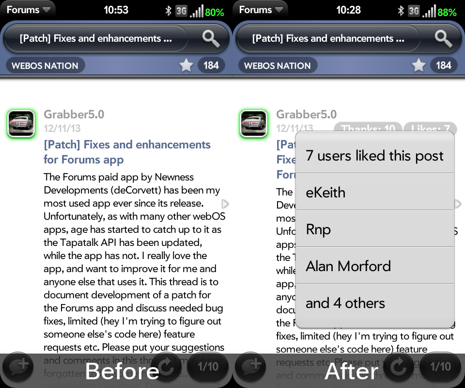

# Dev Highlight: Grabber5.0

It’s that time again where we highlight, spotlight, and showcase one of the many webOS devs that have stuck around to keep us all going.  Next up is a very busy and active member of the our great webOS community.  Please join me in welcoming Grabber5.0!

**What’s your handle?**Matt Williams aka Grabber5.0

**Where do you hail from?**Kansas City, Missouri

**What was your first Palm device?**PDA:  Palm IIIx (still around here somewhere I think, but I haven’t seen it in a while)
Phone:  Treo 800W – I seem to be one of the few that really liked that phone.  I have read about a lot of issues I never experienced – kind of like Sprint Pre hardware failures. 🙂
webOS phone:  Pre (Oct 2009 – I wanted one at launch, but was not eligible to purchase one until Oct)

**Have you published any apps in the HP App Catalog?**[GPS Viewer](http://pivotce.com/files/2014/01/gpsviewer1.png)

**What homebrew apps have you developed?**[SMS Auto Fwd/Reply](http://forums.webosnation.com/webos-homebrew-apps/246994-sms-auto-forward-reply.html) (webOS 1.x only).  I have written a few other apps, mostly for myself – nothing anyone else would be interested in.  Unless you happen to own a Ford Maverick or Mercury Comet, then I have a forum app of my own you might be interested in using 🙂

**Have you written any patches?**“[Fixes and enhancements for Forums app](http://forums.webosnation.com/webos-patches/326829-patch-fixes-enhancements-forums-app.html)“, contributed to “[Better email headers](http://forums.webosnation.com/webos-patches/318504-patch-betteremailheaders.html)” patch for TouchPad, and I run an unpublished addition (I was going to upload it, but the patches portal is shut down because it was hacked) for better display of email sender and recipient to show which email address it was from/to, which is nice if you or your contacts have multiple email addresses.  [HD patches for Keyring](http://forums.webosnation.com/touchpad-patches/290402-touchpad-hd-patches-27.html#post3350764) and [ClassicNote](http://forums.webosnation.com/touchpad-patches/290402-touchpad-hd-patches-27.html#post3350825) homebrew apps, and the [Youtube](http://forums.webosnation.com/touchpad-patches/290402-touchpad-hd-patches-15.html#post3150689) app from 2.1, to run full screen on the TouchPad.

      Clean start page         Manually add forums      Likes and Thanks enabled

**What’s your daily driver phone?**DD is an iPhone 5, but I always keep my Pre3 on me. Makes me wonder why I didn’t just keep my FrankenPre2 as my DD and get something else to use for Exchange server access for work calendar. I didn’t want to carry two devices… Ha!

**Which tablet do you use?**HP TouchPad, Nexus 7 (mostly for Netflix and kids’ movies in the van)

**Tell us about yourself and how did you get your start into programming?**Married with three kids, ages 8, 14, and 16.  Seems like I’ve always been into cars and computers, and a few years ago got into flying RC planes (not real well, but I am trying).  I started my Grabber5.0 handle on my Maverick forum.  My Maverick is a 1971 Grabber (which is just a paint and stripe package), and has a late 80’s 5.0 block in it with some go-fast goodies. My first exposure to programming was BASIC on a Commodore PET when I was in elementary school.  BASIC is the only language I can remember using until I started my degree, which was almost entirely on a mainframe doing Assembler and COBOL. Since starting my career, I’ve gone from the mainframe to a little PC-based VB stuff, then briefly did a little C++ before learning Java and writing midrange server apps and finally where I am now, writing client/server web apps using web technologies.  I only got into phone development after I got my Pre, because there was such a low barrier to entry $-wise, and I was already pretty familiar with the languages used (which was Palm’s selling point to devs in the first place).  I’ve never considered myself to be all that creative, but given a good idea, I love to try to make it happen. I love digging in and tinkering with stuff, and I’ve always enjoyed the challenge of problem solving and troubleshooting.

**Do you develop for other platforms?**I have never had any interest to develop for any other mobile platform — that doesn’t mean I never will, but at the moment there is no room for it between work, home, family and hobbies. I did write and maintain the forum software on my website, but it has fallen way behind the dominant forum software, so I’m thinking of moving it all over to vbulletin or phpBB – if maintenance of that would not exceed the time I spend enhancing my own software.

**What projects are you supporting in the future?**The only thing I’m actively doing is the patch for the [Forums](https://developer.palm.com/appredirect/?packageid=com.newnessdevelopments.forums) app.  I had fixed the recent posts function for myself a while back, and when more people started asking about getting fixes for the app, I decided I should publish a patch, and the ideas just started flowing.

“Flowing” is a nice way of saying that he’s completely revitalized the Forums app for webOS phones. *Completely.*  Thanks to the [GlobalSign CA issue](http://pivotce.com/2014/01/29/hotmailoutlook-com-accounts-misbehaving/), he is also [beginning work](http://forums.webosnation.com/webos-discussion-lounge/327226-microsoft-outlook-certificate-expired-4.html#post3412873) on a more permanent solution.  Good luck and thanks for all you do, Grabber!

#webosforever
