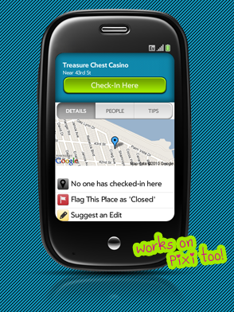

# Foursquare broken and fixed in 24 hours

Wow, do we jump on problems quickly as a community around here or what?  On Thursday, forums user aexellent [reported](http://forums.webosnation.com/zhephree/327250-foursquare-login-error.html) an [API change](https://developer.foursquare.com/overview/versioning) from the folks behind Foursquare.  [Foursquare](https://foursquare.com/) is a popular location based social networking service (if you’ve been living under a rock).  The update to the API effectively broke [Foursquare for webOS](http://zhephree.com/foursquare/) but not for long!

Similarly to how [YouTube functionality](http://pivotce.com/2013/10/03/tip-youtube-searchquality-fix-for-webos-1-x2-x/) was restored within 48 hours, Foursquare was gone and then restored in only 24 hours.  Who should we thank? Forums user and meta-doctor expert, [Herrie](http://herrie82.wordpress.com/), came to the rescue.  But this wasn’t the typical patch solution.  Oh no no no!  The *great* news is that Foursquare for webOS creator, Zhephree, open-sourced the app and uploaded it [onto github](https://github.com/foursquare/foursquare-palmpre).   This made the fix that much “easier” to come by.  Not only is the app back to life and [available for download](http://forums.webosnation.com/zhephree/327250-foursquare-login-error.html#post3412993) on the forum thread but Herrie also added the solutions to github which *should* generate the request to update it for the HP App Catalog as well.

I’ve said it before and I’ll say it again…I’m *consistently***blown away** by the amazing webOS community.  Thanks Herrie!

#webosforever

Image: [zhephree.com](http://zhephree.com/foursquare/)
