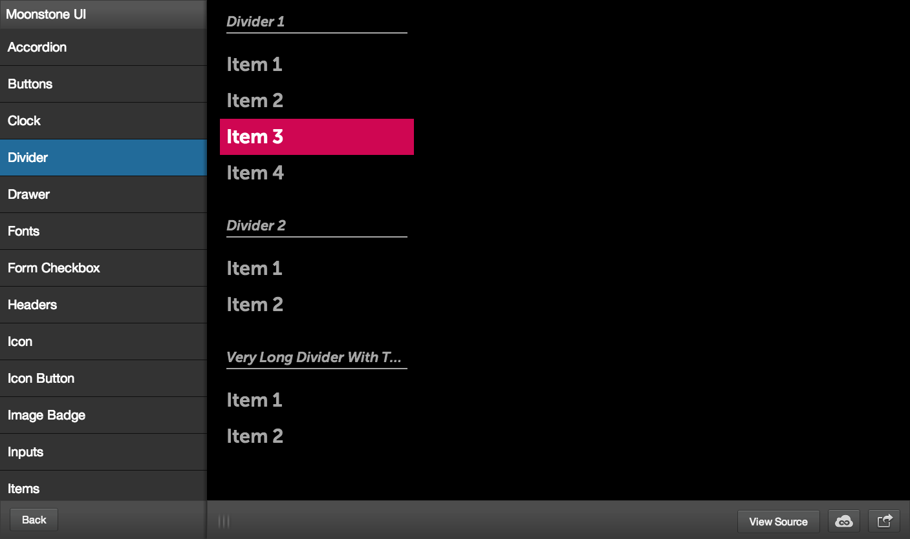
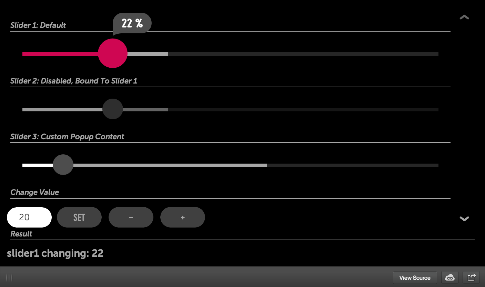
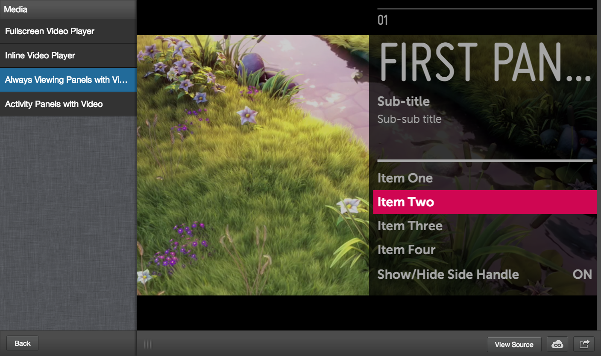

# The Pink Side of the Moon

On February 10th, the Enyo Team unveiled [Enyo](http://enyojs.com/) 2.4.  Among the many improvements there are two especially great features that will make webOS the best TV operating system out there.

## Moonstone

Moonstone is a library for the user interface. It takes the panel-based navigation we know from the TouchPad and optimizes it for the TV. Together with widgets, themes and interaction patterns it should give developers a good base to create stunning apps.

                   

## Spotlight

Spotlight is another library, but for navigation. It helps developers create key-based apps by determining where to move focus when the user has only simple up-down-left-right controls. We will see how this nearest-algorithm works when the first apps popup in the LG Store.

You can try both features in the new 2.4 pre sampler: [enyojs.com/sampler/2.4.0-pre.1/](http://enyojs.com/sampler/2.4.0-pre.1/)

Remember that Enyo will stay Open-Source and Cross-Platform, so you can use it to develop all your non-TV apps too!

Source: [blog.enyojs.com](http://blog.enyojs.com/post/75721205254/introducing-moonstone-spotlight-and-enyo-2-4)
