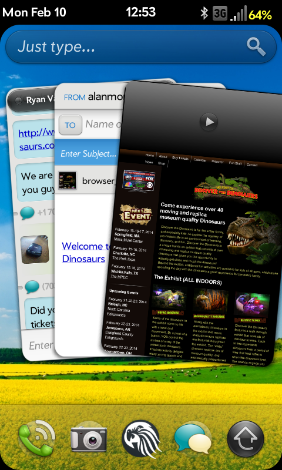
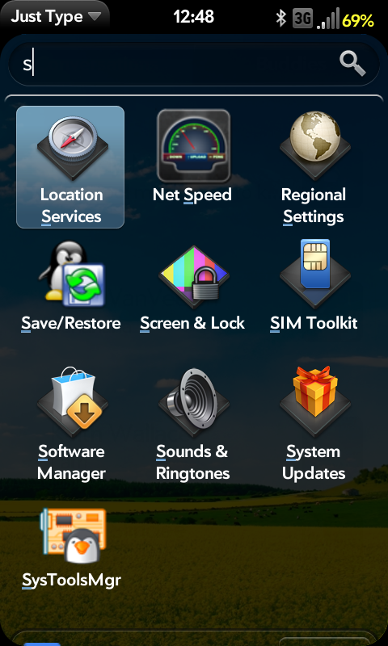

# I don’t care about webOS on TVs

I’ve really been struggling about how to cover LG webOS and their SmartTV news lately. pivotCE isn’t my personal blog so I want to make sure that what I cover aligns with what webOS fans are eager to read about. And while I *want* to write about webOS, I haven’t been able to bring myself to draft up the news about LG and their TVs.  It’s taken me this long to even sit down and put my thoughts together.

LG recently showcased their version of webOS running on TVs at AppsWorld in San Francisco. They hosted several talks on Enyo and app development for their new flagship SmartTV OS. All well and good, yeah? I mean, I love Enyo and am very appreciative of LG giving webOS a chance, so *why have I been in such a funk*?  Then it hit me…**I don’t care about webOS on TVs*.***

# Alan, have you lost your mind?  I thought you were a webOS fan!

I am!  And that’s why I feel so strongly about this.  I’ve read a lot about the rebirth of webOS and that it’s “back”.  Let’s get one thing straight, webOS isn’t “back”.  For that to be true it would have to return to where it started (ie. phones).  This is what’s leaving such a bad taste in my mouth.  LG has webOS but it’s only for TVs.  It’s completely new, not “back”, and frankly, isn’t what I *want*.

Don’t get me wrong, what’s there is amazing.  I think it will help SmartTVs really take off for the first time especially with LG’s brand on it.  **But it’s not the webOS I remember and use daily**.  It’s not on a mobile device.  LG hasn’t even commented on how or if legacy webOS devices might work with the new OS version and hardware.  I *want* to care about it, but as a fan of the original webOS, *I just don’t*.  I don’t want it on a TV.  I’m a toddler not getting his way.  I want a new webOS phone and tablet.

# “webOS” is more than a name

I asked the question “what is webOS to you” to a few folks recently. Here are the top 4 answers:

1.  **Multitasking card stacks** – LG webOS has a version of this. Check the videos they’ve posted and see that it’s ALL of the cards in an overlay of what you’re watching in the background.  It *does* look pretty slick but it’s not the same.  Functional? Yes.  Could it be made to work on a mobile device? I’d like to see them try (honestly).

2.  **Synergy** – AIM, Google, Skype, SMS, Yahoo, and *more* all in one Messaging app. That messaging app was from Palm **on day 1**. Google is just now implementing that with Hangouts and that’s only for SMS and their chat.  The technology is 5 years old from Palm.

3.  **Just Type** quick task/app/search access – Instant device-wide search for web history, emails, texts, apps, tasks, settings, etc. *Everything on the phone is accessible in one place at the same time*.  Period.

4.  **A powerful Linux-based backbone with a simple to use interface** – LG webOS is essentially legacy webOS.  Yes, it’s all Linux-based.  This gives an incredible amount of power to the advanced user or developer but you don’t have to even know about those features to use webOS.  That’s how powerfully simple it is; all the power if you need it but not too advanced if you don’t.

# It’s not about “fanboy-ism”, it’s about a fun and simple mobile experience

Android gets touted as being complicated and “too techy”.  iOS gets poked at for being childish or boring and too locked down.  Windows Phone 8 has never ending scrolling screens and makes it difficult to find what you’re looking for.  Blackberry is marketed for corporations and is known for security, not “user-friendliness”.  It’s madness!

**I’m not about to say “webOS is just right” because frankly, in its current state, it’s not**.  Far from it.  But LG is on the right track with marketing webOS’ simplicity.  Their TV interface really does make a lot of sense.  It’s beautiful and very easy to use.  It’s as powerful as you want it to be.  Now imagine if they brought the same concept to phones.  “Let’s make phones simple again – LG webOS”  AH HA!  *Revolution!*

# The positives of webOS on TVs

1.  **webOS name recognition** – LG is getting the name of webOS back in the market. Awesome!  Get a user-base, get a ton of developer support, and release the webOS toaster, washer, dryer, stove, and then PHONE AND TABLET…please. 🙂

2.  **Enyo** – Forget platform specific apps.  Seriously.  As a developer, create ONE APP and publish it for every platform.  **That’s stupid simple.**

3.  **webOS Ports** – LG pledged support for Open webOS back when they acquired webOS from HP in February 2013.  While they still have a laundry list of due-in deliverables they are still coordinating missing pieces of the open source puzzle for the webOS Ports team.  I’ve said it before that Ports is the future of webOS on phones and while it is only a matter of time before we can install Open webOS onto whichever hackable Android phone we choose (give or take), LG can of course release a device on their own.  The possibilities for the future are what keep me coming back for more.

# Final thoughts

I got asked this past week “isn’t webOS allowed to evolve and progess”?  Yes.  GOD YES.  Of course it is!  But it never got a chance to transition from mobile to appliances.

LG has been very careful about what they’ll talk about in regards to webOS’ future.  Rightfully so, if you ask me.  The mobile industry is a lot less about innovation and a lot more about protecting the bottom line.  webOS could be a huge competitor if LG plays their cards right. How would I know?  Well, you learn more from mistakes than successes, right?  All LG has to do is look at what HP did and do the *complete opposite*.  How hard can it be?  😉

#webosforever
