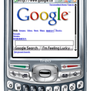
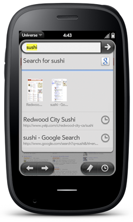
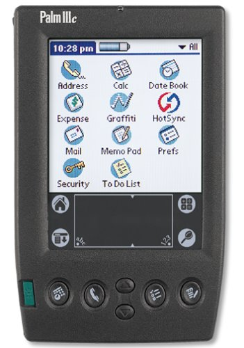

# Dev Highlight: Donald Kirker

What’s that?  You want to know who else is still dev’ing for webOS?  Well, my friend, you have come to the right place.  Next up in our Developer Highlight series is…Donald Kirker!

**What’s your handle?**[dkirker](https://twitter.com/dkirker)

**Where do you hail from?**United States. In fact, < 1 mile from Palm’s old headquarters in Sunnyvale. 😉

**What was your first Palm device?**Palm IIIc – I hail from the PalmOS days!

**Have you published any apps in the HP App Catalog?**Universe

**What homebrew apps have you developed?**Well, I have a bunch of apps in the mix that are homebrew/FOSS, but they are not in any homebrew catalogs. They’re all on <https://github.com/dkirker> and <https://github.com/openmobl>

A good place for all of my projects is here: <https://github.com/dkirker/me/wiki>

**Have you written any patches?**I have my patches here: <https://github.com/dkirker/webos-patches>. Right now I have created updated FedEx and USPS modules for [Package Tracker](https://developer.palm.com/appredirect/?packageid=de.omoco.paketverfolgung). I am going to be putting in some mods to [@choorp’s](https://twitter.com/Choorp) [device menu patch](http://www.webosnation.com/garrett92c-takes-his-next-big-challenge-redesigning-webos-device-menu).

**What’s your daily driver phone?**Pre3!!  [And an] HTC One (which will be replaced someday soon with an Oppo find5).

Wrist watch: SmartQ Z Watch and a Pebble.

**Which tablet do you use?**TouchPad

**How did you get your start into programming?**I got started with computers in elementary school, but that was nothing huge. I really picked up in middle school, and was programming through high school. The beginning of high school got me involved with mobile computing, and I obtained a Palm IIIc in my freshman year from a teacher. I had started working on WAPUniverse, and by the end of high school I was adding support for HTML and HTTP. My freshman year of college allowed my programming to take off. Then, in 2007, I formed my own little company, [OpenMobl Systems](http://www.openmobl.com/) (NOT the ACL folks…), WAPUniverse became Universe, and I got more involved. I ended up interning at Palm in 2008 (then returned in 2009), and was able to see webOS in pre-birth development. I returned back with the webOS group at HP in 2011, and we all know what happened around that time.

**Do you develop for other platforms?**Little bits here in there for Android. I stick mostly to Linux systems.

**What projects are you supporting in the future?**Working on the next generation of Universe. This is going on the Open webOS stuff that we’ve got over at webOS-Ports. 🙂 Also working on Constellation, a sort of mesh-network of sorts for notifications. This will allow different devices to interact. Notifications can be broadcast from devices to other devices, and sensors can be used to provide feedback. This is more of a long-term project, but will be seen in [webOS Ports](https://twitter.com/webosports) work.

Thanks for the interview, Donald!  We are all eagerly awaiting Open webOS (or whatever it will end up being called) and the mods you’re making to New Device Menu.  Cheers!

#webosforever
