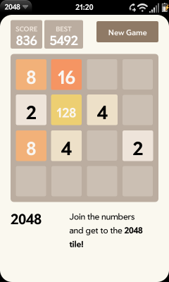

# App Review: 2048

*The 2048 Game*

There are a couple of popular games out there at the moment that involve sliding numbered tiles around. One is Asher Vollmer’s ‘Three’s’, another is ‘[2048,](http://gabrielecirulli.github.io/2048/)‘ by Gabriele Cirulli. Click that link and you can play it in your web browser. These type of games are ideal for the screen and touch interface of the modern smartphone. On the forums of webOS Nation, member [juerg.riehen](http://forums.webosnation.com/webos-apps-games/327688-2048-game.html#post3417013) asked if anyone was able to port the open-source code into a webOS app. That was the 6th of April. Within two days, webOS mapping expert 72ka (aka Jan Heman) responded to the challenge. It’s in Preware, now. You can go and get it, but we don’t get much chance to review new, trendy games on pivotCE, so stick around for a quick read:

The goal of the game is to make a tile with the number 2048. This is done by sliding tiles in four direction across the grid. When identically numbered tiles collide, they combine physically & numerically. Every time you move, a new tile is added apparently at random to the remaining empty spaces of the board. It’s usually a 2, sometimes a 4. It sounds simple enough and it is. But even as you make higher numbers the board starts to fill and it’s all too easy to find you are blocked from making progress. I must admit that I’ve got no higher than 512 so far! Like the recent ‘Flappy Bird’, the apparent simple design, interface and a goal that is frustratingly difficult to achieve make for a very addictive game.

Visually, the game closely resembles the web version with a few layout and format changes for webOS. I tested it on a Pre3, but it is claimed that it works on all webOS devices. Give it a try if you are sure you can resist the urge to have one more go.

You can donate to the port [here](http://forums.webosnation.com/webos-apps-games/327688-2048-game.html#post3417101), and to the original game developer [here](http://gabrielecirulli.github.io/2048/).

Name: 2048
Description: Puzzle game
Version: 0.01
Status: Available from [Preware](http://preware.pivotce.com/package/cz.72ka.2048), the [webOS Nation app gallery](http://www.webosnation.com/2048) or as a direct [IPK download](http://mujweb.cz/hp2/webos/2048/cz.72ka.2048_0.0.1_all.ipk).
Price: Free / Donate.

UPDATE: There is also an Enyo version of this game for cross-platform fans. Here is author, [Jakuje’s post](http://forums.webosnation.com/webos-apps-games/327688-2048-game-2.html#post3417219), with links to code and installable IPK.
