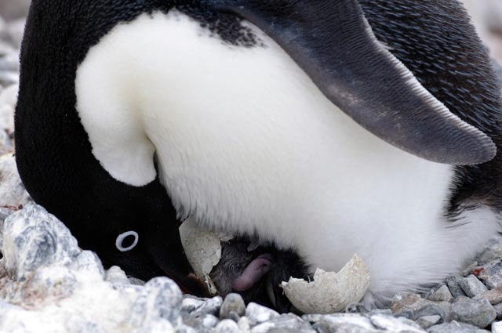

# Happy Easter from pivotCE

*Photo: Sean Bonnette / National Science Foundation*

With a cute penguin picture, pivotCE would like to offer all our readers a Happy Easter.

Special thanks go to the [webOS-Ports](http://www.webos-ports.org) team who are working to deliver their own little penguin.

For an Easter Egg hunt, we’ll direct you over to the experts at [webos-internals](http://www.webos-internals.org/wiki/Easter_Eggs).

If anyone finds an Easter Egg in a webOS TV, let us know in the comments!

The picture came from the [United States Antarctic Program](http://www.usap.gov). Take a look for more penguins and other frosty fun.
