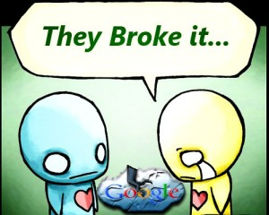

# Tip – Fix Google Account Authentication Error

What…Google accounts are broken? This might not be news to you but at the end of March, Google changed their connections to force secure communication. By now, you’ve either patched the problem or you’ve been suffering with a broken Google account or two on your favorite webOS device. It’s possible you may not even realize there’s a problem. But I assure you, not all is well.

webOS Nations Forum user and rising patch-developer-star, Grabber5.0 (Matt), crafted a beautifully simple solution to this issue. I wanted to get the specifics of his research and solution so I set out to get the scoop.  Read on to delve into his mental processes and the psyche of a webOS developer.

Me:  So when did you realize there was a problem?  Most of us didn’t know until [you posted](http://forums.webosnation.com/webos-patches/327662-patch-google-sync-https-fix-unknown-error-sign.html) on the forum.

Matt:  *Timing is everything isn’t it? A* [few]*weeks ago, I decided to go ahead and re-doctor my Pre² back to 2.2.4, because some of the bugs in 2.1 were starting to, um, bug me.  On first boot, I logged in to my Palm Profile and it prompted me to re-enter all of my passwords for my Synergy accounts. For some reason, I kept getting an error on my gmail account. Oh, well, I’ll just enter the rest of them and log in to gmail when the phone restarts. But it STILL wouldn’t log me in – ugh!  So I set off to investigate this ‘unknown error’. I was certain I was entering my password correctly, but just to be safe I changed my password. Oh great, now I can’t even update my password on my other devices without getting the same error. So now I’m stuck with no contacts, email, or calendar on my daily driver phone!  I was desperate to get them back, so I dug in.*

Me:  Well, you knew there was a problem, how did you set about determining “the why”?

Matt:  *I used Lumberjack, to monitor the system log while I tried to sign in, and saw some errors appear – one of which was the ‘moved permanently’ http response on the contact sync URL. A few google searches eventually turned up a message on the google contact API indicating that as of March 31st (hmm, that’s the day before I doctored my phone…) they were redirecting all contact API requests to the secure version of the URL. So the URL changed apparently, but webOS was not following the redirect. I tracked down the filename listed in the error message, and from there was able to locate the google sync service files with the URL in them that needed to be changed. I changed those and was immediately able to log in.*

Me:  Sounds simple enough. What next?

Matt: *As I knew this would begin affecting everyone else that uses gmail, I quickly created a patch and started a thread on the forum to distribute the patch. All seemed well, including adding new contacts on the device properly syncing to the cloud, but [gizmo21 noticed](http://forums.webosnation.com/webos-patches/327662-patch-google-sync-https-fix-unknown-error-sign.html#post3416792) that changes to existing contacts made on the device were not syncing to the cloud. I could locate no other code that contained the non-secure URL, so I started digging around my contact data using Impostah, and found that with the account and the contacts themselves, was stored the non-secure version of the URL! At that point gizmo suggested we reach out to frantid, who had created several Google calendar-related patches, for some assistance. Frantid came back with something that he called a [“horrible hack”](http://forums.webosnation.com/webos-patches/327662-patch-google-sync-https-fix-unknown-error-sign-3.html#post3417080) to intercept outbound requests and change them to https if necessary.  I prefer to call it a clever solution, not a hack at all, because it worked, and two-way sync was restored.  I added frantid’s patch to mine (with proper credit) and updated the forum.*

Me: webOS users seem to be constantly avoiding one crisis in loss of functionality after another. This could have been the “straw that broke the camel’s back” for some users and caused them to jump ship. Did you find yourself in the same place thanks to this error?

Matt: *I have received several emails and posts from people saying they would have had to finally give up their webOS phone without Google sync. I was not ready to go that far, but was not looking forward to moving all my contacts and calendar to another service, assuming there was another that still worked properly for contacts and calendar.  That’s to say nothing of losing access to my primary email account on my phone.*

Me: This exact same thing happened to [Yahoo connections of webOS](http://forums.webosnation.com/webos-synergy-synchronization/327645-yahoo-contact-sync.html) recently too, right?

Matt: [Yes], *apparently Yahoo had done the same thing in late Feb (though in a less friendly manner, returning a ‘not found’ error instead of a ‘moved permanently’ message), but I had not noticed as I stopped using Yahoo for contacts when I found out Yahoo contact sync was only going to be one-way, from the cloud to device.  I uploaded [a patch to fix](http://forums.webosnation.com/webos-synergy-synchronization/327645-yahoo-contact-sync.html#post3417582) that yesterday, but Yahoo calendar sync is still broken, and it’s already using https, so it’s something else.*

So there you have it.  Crisis averted.  It’s important to note that the next time you have to doctor, you’ll need to reapply the patch to be able to log in to your Google account.  That means if you’re trying to restore your Palm Profile on first use, you’ll have to skip the account log in portion for Google.  It’s just one more step webOS users must do immediately.  The die hards are here to stay but these little hurdles have become normal everyday life.  If you’re on the fence, hang on! The community makes it all possible even as the rest of the technology world writes us off.

#webosFOREVER

Image source: http://androidspin.com/wp-content/uploads/2012/11/tumblr_kzrv9j07vx1qbue9so1_500.jpg
