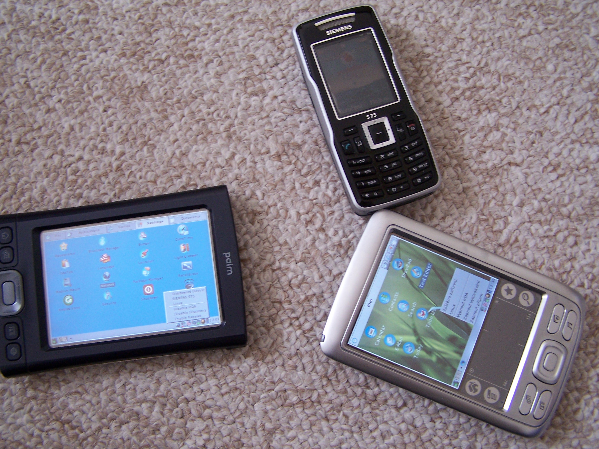
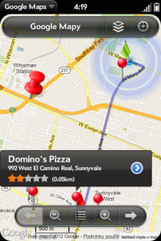
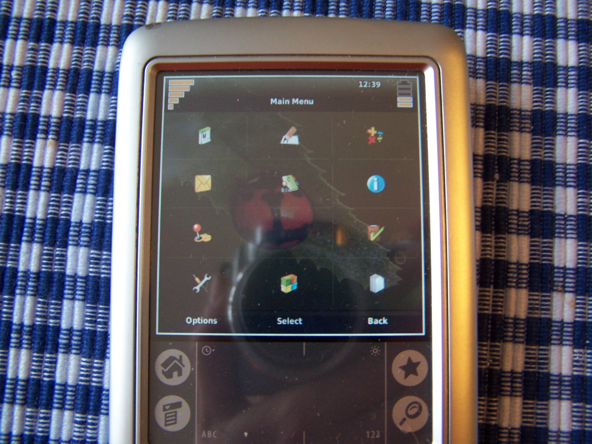
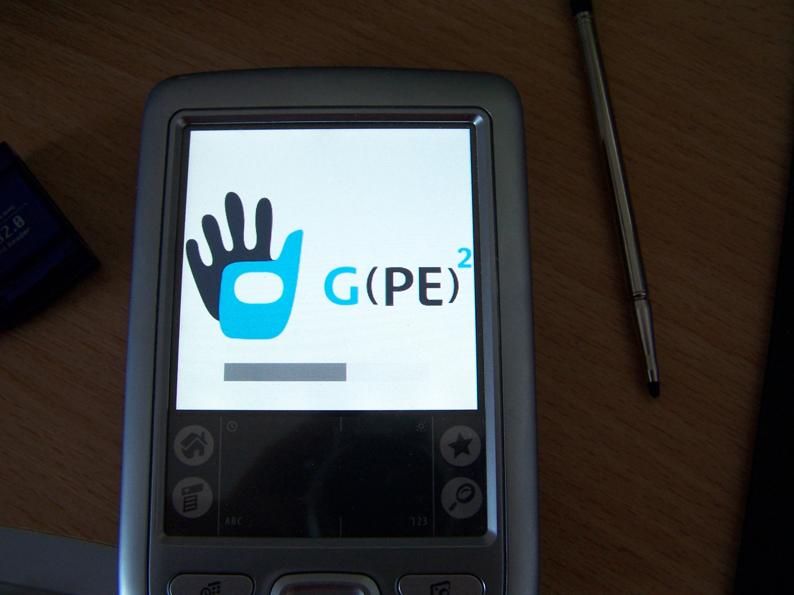

# Dev Highlight: 72ka

It’s been quite a while since we’ve highlighted a developer on pivotCE!  So here’s a long over due highlight on a webOS developer practically every webOS user should know for his homebrew solution to Google Maps: 72ka.

**What’s your handle?**My name is Jan Heřman, webOS people know me as 72ka. The “72” comes from my old beloved Palm Zire72 and “ka” is the Czech suffix for number personifying.

**Where do you hail from?**I live in Prague, Czech Republic.

**What was your first Palm device?**My first device was the 3Com Palm IIIe, which helped me to finish the university, mainly using the famous [EasyCalc](http://easycalc.en.softonic.com/palm), which was my right hand all the time! Then I owned a Zire71, Zire72, then I won a Tungsten T and Palm Vx in the competition for the best article on [a] [website](http://www.palmhelp.cz) about Palm devices. I still have the Zire72 and Palm Vx. After PalmOS died, I migrated to the Nokia internet tablets N770 and then N810 and made the czech localization for Maemo OS2008. After Maemo died I jumped into Android for one year, but I was not satisfied with the system and bought a “dumb” phone for a while. The webOS Palm/HP devices have not been and are not available on the Czech market, so one day I saw an offer for a used old locked AT&T Pre Plus and bought it. The same day I successfully unlocked it just for fun and to try it. I fell in love with webOS.

Then I started the Google Maps development activity, because the map application is important for me. I have never seen an original Google Maps application in real use, because I started to be a webOS user after Bing Maps was released to all Palm/HP devices. Then, thanks to the amazing webOS community, I received enough money to buy a Pre3 from Germany for an unbeatable price (many thanks again). Then I was able to optimize my apps for it which contains many development exceptions.
And what´s the point? If I like some device/system, it will always die (PalmOS, Maemo, webOS) and vice versa (Android)… I´m not lucky with that.

**Have you published any apps in the HP App Catalog?**I don’t have a developer account. I tried it to upgrade my community account, but the dev account needs a credit card with PayPal and I don’t have (and don’t want) to bind any card with PayPal, so the dev account is not available for me… sadly. And the support e-mail is cancelled, it always returns as undelivered. Any advice is appreciated.

**What homebrew apps have you developed?**[Google Maps](http://www.webosnation.com/google-maps-72ka) – <http://github.com/72ka/google-maps>
[wInNeR](http://www.webosnation.com/winner) –  <http://github.com/72ka/wInNeR>
[HERE maps](http://www.webosnation.com/here) – <http://github.com/72ka/here>
[Gas&Oil Mix](http://www.webosnation.com/gasoil-mix) – <http://github.com/72ka/GasOilMix>
[Aladin](http://www.palmhelp.cz/html/modules.php?name=Forums&file=viewtopic&t=1923&view=next&sid=8b9b7c08d85016a173bab0ea389a5299)

**Have you written any patches?**Nothing…because I started to be a webOS user at the end of webOS’ life, all the patches that I needed I found. Thanks to the authors!

**What’s your daily driver phone?**I use the Pre3 and after one year, I love its form-factor. Only the battery life is really poor.

**Which tablet do you use?**One of a dozen cheap tabs. ICOO D70GT. I successfully ported Open webOS on it but without graphics acceleration. Recently looks like that the touchscreen will definitely fail soon, typical for such cheap hardware.

**How did you get your start into programming?**My first experience (I was around 10) was a Commodore 64 and BASIC, Assembler and Pascal. Then I developed two apps for Psion Series 3a handheld. Then some apps in TurboPascal for the electronics, like 4 channels oscilloscope just for logical circuits developing. I made an app for model train automation and for driving the model locomotive using pulse width modulation, including the inertia simulation. I remember an app for converting the midi music files to the old Nokia phones text code for custom ringtone melodies. I like reverse engineering in combination with C low-level programming of linux kernel – but it needs a lot of time. Recently I developed one app in .NET, one database system using WAMP for my job. Currently I´m developing only for webOS with care for other possible platforms, which are supported by Enyo2. I need to say, I´m not a professional developer as most of the others, my profession is far different.

**Do you develop for other platforms?**My most successful time was in Linux development for Palm Zire72. As a Hacking&Development member of the Linux4Palm project, where we ported the Linux kernel on almost all PalmOS devices. My latest release of a complete bootpack for Palm Zire72 can handle all hardware excluding a camera. Some of our code was submitted to mainline, what I see as a big success. Within this project, we even organized some meetings and we participated twice at international linux conference LinuxExpo Prague 2007 and 2008. Back then, linux on a handheld was really rare.

**What projects are you supporting in the future?**My current active project is still Google Maps for webOS (Mojo framework), and the rest of the apps written in Enyo 2. I have a lot of tasks to do, but my free time is very limited (almost nothing). My future plans are aimed to bring my apps to other platforms using PhoneGap. I´ll see how the things with Open webOS and the other platforms will go.

Finally, I want to thank all the people who supported me. Compared with my other activities, I have never seen people so accommodating, supportive, and positive with feedback. It makes me more sad about the fate of webOS.

**No need to thank the community. It is the community that thanks you for the continued development for webOS. I for one, use the homebrew Google Maps app from Jan all the time!**

#webosforever
