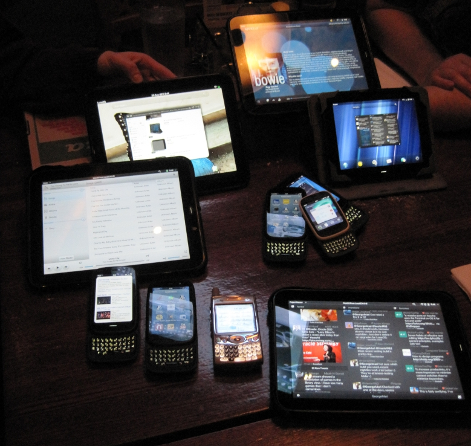

# Chicago WebOS Meetup September 28th, 2014

*Main image: From left: Sara, Chad, Keith and Marc. (Not pictured – George)*

***Here is a report from George Mari:***

“Just for some background, we have been having our Chicago WebOS Meetup at the same local restaurant, Moretti’s in Schaumburg, IL, every 6 to 8 weeks, since August of 2011. Well, OK, some of the Meetups have been at other restaurants, but the vast majority have been here. I don’t remember what our record attendance was in the past, but I’ve been at several meetups where we’ve had at least 12 people. More recently the numbers have been down to about 4 or 6.

We usually order some food and drinks, and just talk about what’s been going on in the world of webOS, which sometimes in the past, was way too much to fit into one night of discussion!

We’ve had employees from Palm/HP attend in the past, and so we’ve had quite a few device and accessory giveaways over the year. Pretty much everyone who has ever attended has gotten one thing or another over the years.

This past meetup, these were some of the things we talked about:

1. Marc showed off a recent nightly build of LuneOS to everyone at the meetup. Everyone got a chance to see the progress being made on this open source hope for the future of webOS and we liked what we saw so far.

2. Sara talked about how she is still looking for a calculator that works the same as on her old Treo – the conversions to different units can be done by just tapping the button. For example, if you enter 12 on the calculator display, and tapped the button for feet, the display would immediately show 1. The webOS calculators and converters all seem to make this a 2-or-more step process.

3. Sara asked if there was a way to run the “Classic” ROM on her Pre3. Marc replied that the Pre3 was the only device that people were unable to get Classic to run on.

4. Keith asked if anyone had played with one of the new webOS TVs. I mentioned that I had done so at a local electronics store, and I liked what I saw – very easy to use. However, it bore little to no resemblance to the webOS we have all come to know love on phones and tablets.

*Image: George Mari*

*A tradition of ours – we try to take a picture of all of the webOS devices everyone brought to the Meetup, and this time was no exception.*

A few other minor discussions that started with, “How do I…” and “Does anyone know…” were had, as well. Everyone pitched in and tried to answer as best as we could.

Well, that’s about it. If you’re ever traveling to the Chicago area, check out @chiwebosmeetup on Twitter to find out the date for our next meetup – we’d love to have new people!”

***Note for your diary:** [The next Chicago Meet up is proposed for the 16th of November.](http://forums.webosnation.com/webos-events/313031-chicago-webos-meetup-2.html#post3425668)*
