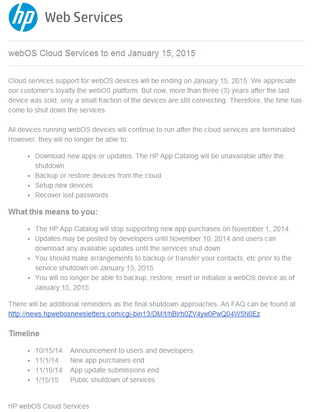

# HP to Shut Down Catalog and Cloud Services

Mark your calendars for January 15th, 2015. It’s the day that HP will officially end the HP App Catalog and cloud services for webOS. How do I know? They put up a banner [here](https://developer.palm.com/). That’s it. No tweet. No blog. Just a banner and a [FAQ](https://developer.palm.com/content/resources/develop/faq.html).

This doesn’t mean you can’t continue to use your webOS phone after that date. In preparation for the shutdown, here are a few things to do:

**UPDATE:**Added another backup method, clarified advanced backup method link, and specified the need to check for your apps in the catalog before uninstalling them. Added Save/Restore info, webOS 1.x note, and post-install script advice.

1a. Backup your purchased and favorite apps from the catalog. **Check to see if you apps are still in the app catalog FIRST** and only if they are still there, proceed…**backup apps using [Save/Restore](http://forums.webosnation.com/webos-internals/237558-save-restore-community-development.html) or you will likely lose app data**, [grab the post-install scripts](http://forums.webosnation.com/webos-discussion-lounge/328720-hp-app-catalog-cloud-services-shut-down-jan-15-2015-a-5.html#post3426570) with WOSQI or Internalz Pro (see 1c for links), then uninstall the apps, [install this patch](http://forums.webosnation.com/webos-tips-info-resources/322549-how-retain-app-ipks-app-catalog.html), and reinstall them. The app .ipk file will land in your downloads folder on your USB internal memory. You can then plug it in to a computer and drag your files off. Don’t forget to reapply your Save/Restore backup.

Note: the patch does not apply to webOS 1.x phones. Use the next two methods instead.

1b. There is also a more [advanced backup method](http://forums.webosnation.com/webos-internals/303114-webos-survival-kit-4.html#post3377219).

1c. You can also use [Internalz Pro](http://www.webosnation.com/internalz) or [webOS Quick Install’s](http://pivotce.com/2014/08/31/tip-preware-net-solutions-for-wosqi-preware-v1-9-13/) Linux commandline function to copy the entirety of the contents of the /media/cryptofs/apps/usr/palm/applications folder over to your device’s internal storage/computer and then individually rebuild those app’s IPKs by using [IPK Packager](http://forums.webosnation.com/canuck-coding/237326-ipk-packager.html). Open IPK Packager, browse for the app folder, and click Create IPK File.

2. Move all of your contacts out of your Palm profile to another client service. For instance, [Google](http://forums.webosnation.com/webos-patches/327662-patch-google-sync-https-fix-unknown-error-sign.html) and [Yahoo](http://forums.webosnation.com/webos-synergy-synchronization/327645-yahoo-contact-sync.html#post3417582) (thanks to some patching). You can export your contacts to a file and then import them via the web interface for the service you choose.

3. Get acquainted with the [Survival Kit](http://www.webos-internals.org/wiki/WebOS_Survival_Kit). Hopefully, webOS Internals comes through with their plans to keep us going when the catalog gets shut down.

**UPDATE 1:** webOS Internals have tweeted two very important messages to app developers:

> Preware cannot host any apps from the soon-to-be-dead [#webOS](https://twitter.com/hashtag/webOS?src=hash) app catalog without the legal copyright holder’s explicit permission.
>
> — WebOS Internals (@webosinternals) [October 16, 2014](https://twitter.com/webosinternals/status/522575745311191040)

> We recommend any authors who wish to continue distributing their apps to submit them to the WebOS Nation app gallery to get into Preware. — WebOS Internals (@webosinternals) [October 16, 2014](https://twitter.com/webosinternals/status/522576034227437568)

Unfortunately, there isn’t a payment system in place for Preware, but you CAN add a donate link in your app description for PayPal. The webOS community is pretty good about [giving money for what they deem a worthy app](http://www.webosnation.com/phoenix-acl-touchpad-passes-35000-kickstarter-goal-10-days-spare).

The webOS Nation [app gallery is here](http://www.webosnation.com/apps) and app submissions can be sent through their [contact page](http://www.webosnation.com/contact). Select “Submit Homebrew Application” in the category drop down.

**UPDATE 2:** HP sent an email this morning to developers. See the screenshot below. It is important to note the shutdown timeline. App purchases are DONE in 15 days. Big name companies are not likely to submit their apps to the webOS Nation app gallery so if you’ve been holding out on that Dungeon Hunter purchase, *now is the time to pull the trigger*.

- 10/15/14    Announcement to users and developers
- 11/1/14      New app purchases end
- 11/10/14    App update submissions end
- 1/15/15      Public shutdown of services

*HP Email to Devs*

Make sure to read the FAQ linked above to understand just what all of this means. We knew this day was coming, and the point now is to be prepared. HP gave us 3 months which is twice as long as Leo gave the TouchPad!

[Join the discussion.](http://forums.webosnation.com/general-news-discussion/328720-hp-app-catalog-cloud-services-shut-down-jan-15-2015-a.html)

#webosforever
