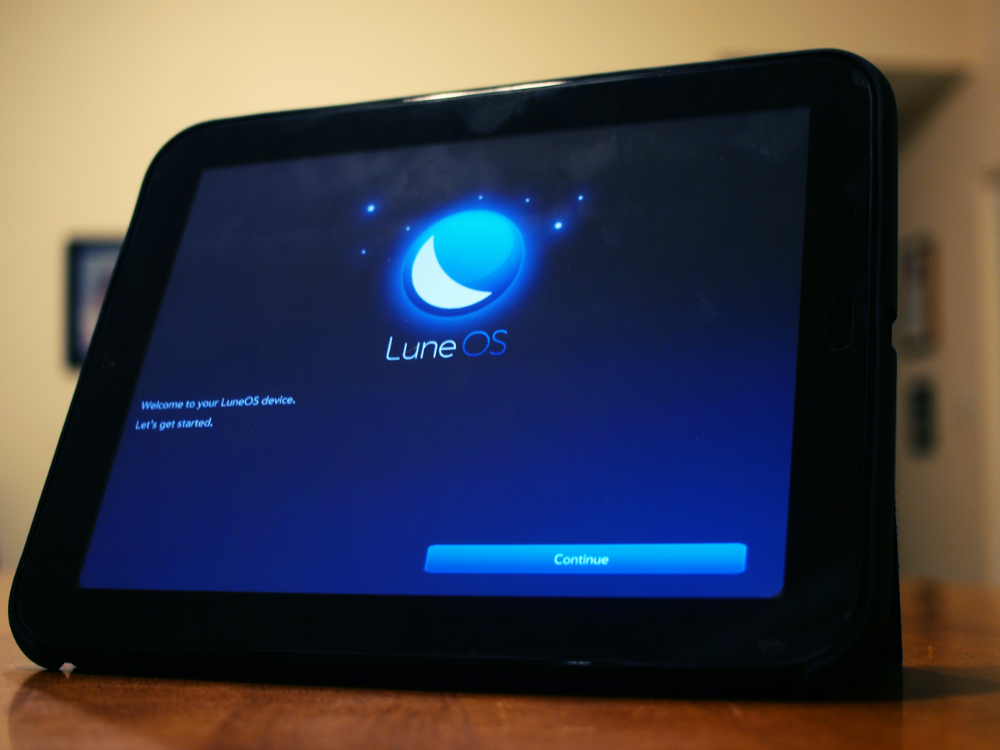

# Next LuneOS Stable Release Available: Black Eye

It’s the first of the month so you know what that means! Rent is due! Oh, and the next stable release of LuneOS is available code named Black Eye. So pull out your TouchPad and/or Nexus 4 (and your checkbook for the rent) and get updating.

**LuneOS – Black Eye Changelog:**

*The new first use application in action.*

- First version of the new QML based first use application including fresh new layout.
- Wifi works at first use without reboot
- PIN/password support for the lockscreen.
- Various bug fixes and improvements for the browser.
- Memory caches for apps are now cleared when a new version gets installed.
- Performance overlay support for the compositor which can be enabled from settings app.
- Various bug fixes and improvements for CDAV Synergy service.
- Quota of 5MB for databases of web applications.
- Support for 64bit emulator.
- Bug fixes for Preware.
- Enabled verbose logging for WebAppManager by default.

All of the same disclaimers from [last month’s release](http://pivotce.com/2014/10/03/next-luneos-release-builds-available-antoccino/) are still true.

Make sure you familiarize yourself with them and then [download the updated builds](http://build.webos-ports.org/luneos-stable/images/) to get started. Tenderloin and Mako remain our focus for now and the emulator works too. Other builds are there but won’t boot.

Installation instructions for [TouchPad (Tenderloin)](http://webos-ports.org/wiki/Install_WOP_for_Tenderloin) and [Nexus 4 (Mako)](http://webos-ports.org/wiki/Install_WOP_for_Mako) are on the [wiki](http://webos-ports.org/wiki/Main_Page). And remember we [don’t do timelines](http://webos-ports.org/wiki/ETA).

We’re also looking for more folks to [join our team](http://pivotce.com/2014/09/22/webos-ports-help-wanted/).

Two questions keep popping up: 1. Can you make the install process easier? and 2. Will you ever release LuneOS for legacy webOS hardware other than the TouchPad (ie. phones)?

The answers to both are no. The install process will likely become more automated the further along we go but right now the focus is on OS content and backend support. If you are having trouble following the instructions that exist now then you are not likely to enjoy or find much use in LuneOS in its current state.

As for legacy webOS phones, please remember they are proprietary hardware and no drivers were released. Part of the reason LuneOS exists today is because it borrows from Android. There are no truly viable options for Android on webOS phones. Yes, we know of a build but no it is not stable enough to build upon.

Here’s what we’re working on for the not-so-distant future:

- Upgrade to qt 5.4, recent libhybris and qtwayland for improved graphics performance
- Upgrading to the next OpenEmbedded/Yocto release [Dizzy](https://www.yoctoproject.org/blogs/jefro/2014/yocto-project-introduces-yocto-project-17-%E2%80%9Cdizzy%E2%80%9D-release)
- Overall system performance improvements
- Further work on the messaging app with dummy backends and maybe SMS integration.
- Getting mobile data working
- First sketch of phone call support from the UI

As you can see we’re trekking right along. Stick with us and we’ll see you again right here on pivotCE next month! Catch us on Twitter [@webosports](https://twitter.com/webosports) on IRC: Freenode:#webos-ports or email webos.ports@gmail.com.

[Join the conversation](http://forums.webosnation.com/luneos/328828-pivotce-next-luneos-stable-release-available-black-eye.html).

Image: http://www.mycoffeebook.com/coffee-beverages/
