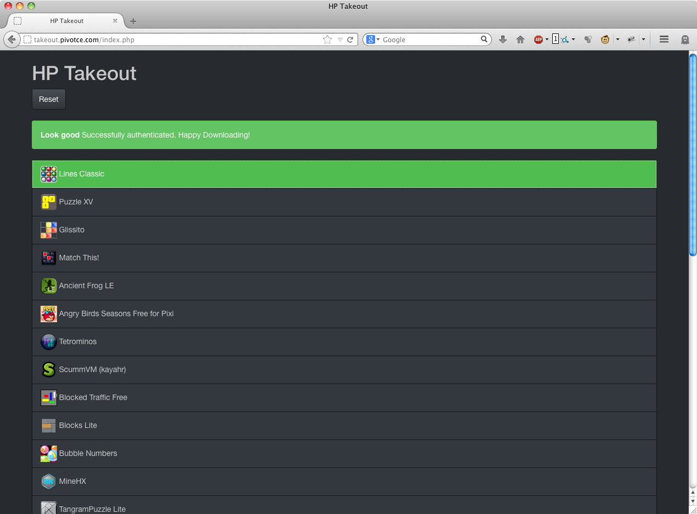

# Guide: Saving Apps From The App Catalog Part 2: HP Takeout

** PLEASE NOTE: Following the closure of the HP app catalogue, the instructions in this article are no longer relevant. It is now of historical interest only. **

---

Though the HP App Catalog may be closing, there are still many creative members of the community working on ways to help you back up your apps before they’re gone for good. Today, we’ll continue on with our series of how to back up your apps. This guide will walk you through the process of using pivotCE’s solution, developed by our very own Pattyland: HP Takeout.

#### Why this method of backup?

Simply, this method allows you to download the IPKs for every available app on your device directly from the HP servers to your computer. So, you don’t need to worry about saving them to a webOS device first.

Like the [noDeleteIPK patch](http://pattyland.de/pivot/2014/12/02/guide-saving-apps-from-the-app-catalog-part-1-nodeleteipk-patch/), this method allows you to take a backup of the “cleanest” version of the app – the package issued directly from the manufacturer. Some other methods will attempt to rebuild the IPKs using data from an already installed app, so run the risk of not working quite right. This is especially true if the app does something quirky as part of its setup process. Those methods should only be relied upon if the IPK is not available from the App Catalog.

With that explanation out of the way, lets get started. This guide assumes that you have followed the instructions in the first guide, and that your device is ready for homebrew apps.

Here’s what you have to do:

1. Install Impostah.
2. Acquire device data.
3. Run HP Takeout.
4. Download and save IPKs.

#### Step 1: Install Impostah

Impostah is a toolkit for getting all sorts of information about, and doing interesting things to, your webOS device. Developed by WebOS Internals, most of its features are beyond the scope of this document. They can potentially be dangerous if you don’t know what you are doing, so don’t stray off the beaten track here.

We’re just getting some information about your device, which HP Takeout will use to generate the download links for your IPKs. It is safe enough, but, as always, proceed at your own risk.

To install Impostah:

1. Open up Preware if you don’t have it open already. (instructions for installing preware are [here](http://pivotce.com/2014/10/21/guide-coming-back-to-webos-in-2014-part-1/))
2. From the main screen, Type “Impostah”, and this should bring up the “Impostah” app by WebOS Internals.
3. Tap on the app, then tap “Install” at the bottom.
4. Preware will download and install the app, and then let you know when the installation is complete.
5. When the installation is complete, tap “OK” and then close Preware.

#### Step 2: Acquire Device Data

In order to use HP Takeout, you’ll need two pieces of information to uniquely identify your Palm Profile and device, and a list of all of the apps that are installed on your device:

##### Palm Profile

1. Open up Impostah
2. Tap “Palm Profile”
3. Tap “Show Palm Profle”
4. Open the app menu
5. Tap “Email”
6. Send the generated email to yourself

##### Device Profile

1. Back out to Impostah’s main screen
2. Tap “Device Profile”
3. Tap “Show Device Profile”
4. Open the menu
5. Tap “Email”
6. Send the generated email to yourself

##### Installed Apps

1. Back out to Impostah’s main screen
2. Tap “App Catalog”
3. Tap “Show Installed Apps”
4. Open the menu
5. Tap “Email”
6. Send the generated email to yourself
7. Close Impostah

#### Step 3: Run HP Takeout

At this point, we’ve retrieved the information that we need from your webOS device. So, we will be switching to your computer to run the HP Takeout tool and download IPKs.

You should now have 3 emails in your inbox, with the subjects “Palm Profile”, “Device Profile”, and “Installed Apps”. Get them ready, and, in a new browser window, navigate to <http://takeout.pivotce.com>.

First, you will be asked what kind of webOS device you have: a phone or a tablet. Choose the appropriate device.

Next, we’ll need the info that you saved from your device. Open up the email with the subject “Palm Profile” and find the line that says “token”. Copy everything between the quotation marks (e.g. WGHIOWGON23T7WF9QRF9WVBEE9F6CST4) and paste it into the first field.

Then, open up the email with the subject “Device Profile” and find the line that says “deviceId” (for phones) or “nduId” (for tablets). Copy everything between the quotation marks (e.g. IMEI:4848762458774595) and paste it into the second field. Note that phone IDs will always start with IMEI and tablet IDs will not.

Finally, open up the email with the subject “Installed Apps”. Copy the entire body of the email (excluding the email signature, if any) into the third field, and hit “Submit”.

The tool will then process your information and generate a list of apps for you to download.

#### Step 4: Download and Save IPKs

Click on each item on the generated list and download the IPK to a directory of your choice. At this point, you should have a collection of IPKs stored on your computer representing all of the apps that you wanted to save.

I also recommend copying them to an additional place, such as a CD/DVD, flash drive, or cloud storage drive, as a further backup.

At this point, you’re done. You’ve successfully backed up your apps. Just make sure that they’re kept in a safe place in case you ever need them.

#### What’s Next?

If you have more than one webOS device, go through this procedure on all of your webOS devices to make sure that you have backed up all of your apps.

NOTE: If you download additional apps to your device before the App Catalog shuts down, you will need to re-generate the list of installed apps (Step 2: Installed Apps section) which you can use to run HP Takeout again.

If you need to reinstall your apps, Preware and WebOS Quick Install allow you to take IPKs that you backed up from the App Catalog, or downloaded from other sources (such as homebrew), and install them on your device.

In the mean time, you have a month to get anything that is both free and interesting from the App Catalog. Download and back up whatever you can.

While [some apps](http://forums.webosnation.com/webos-development/328732-developers-post-here-if-your-apps-will-available-after-hp-catalogue-closes.html) will continue to be available through the [webOS Nation App Gallery](http://www.webosnation.com/apps), most of these apps will be gone for good when January 15th rolls around. Save them while you can.

[Comment Here.](http://forums.webosnation.com/webos-tips-info-resources/329083-pivotce-guide-saving-apps-app-catalog-part-2-hp-takeout.html)
