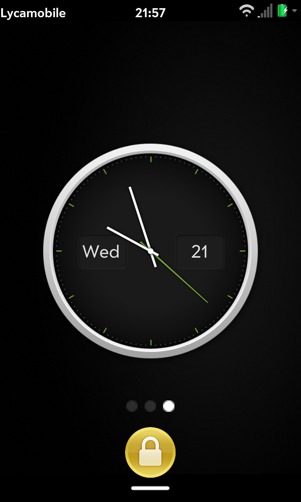
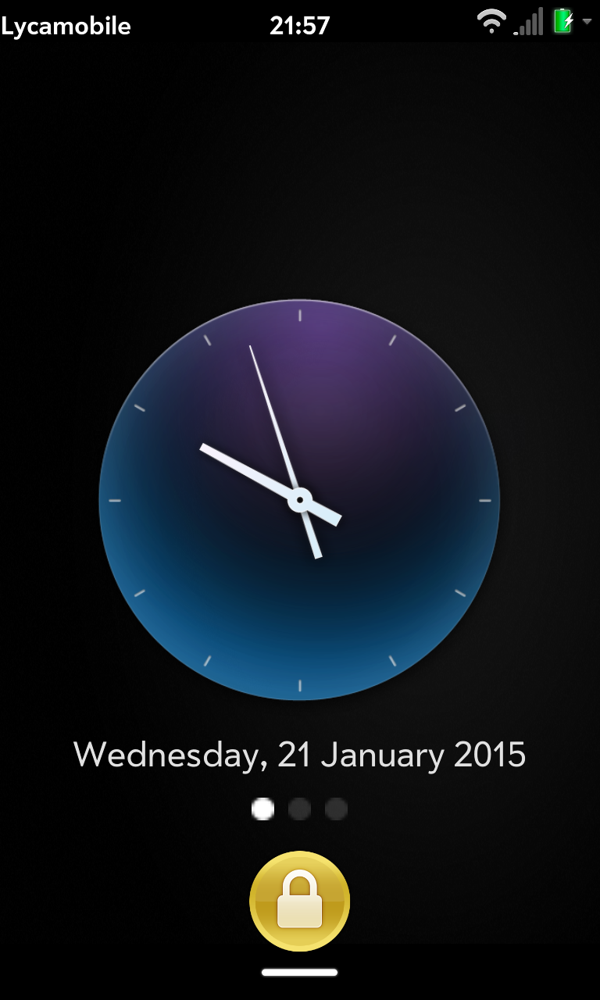
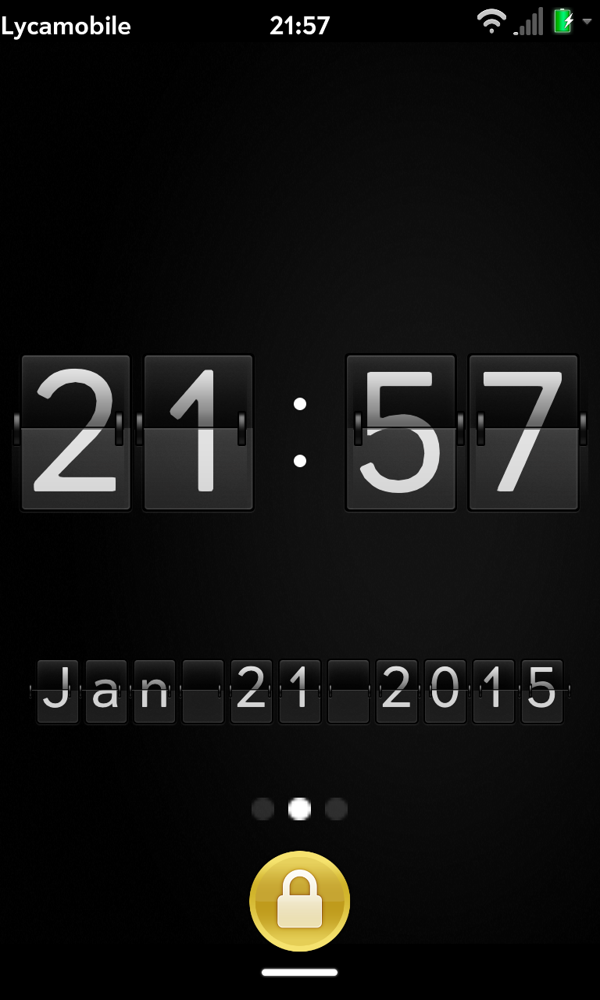
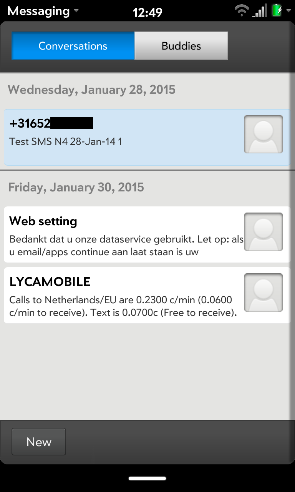
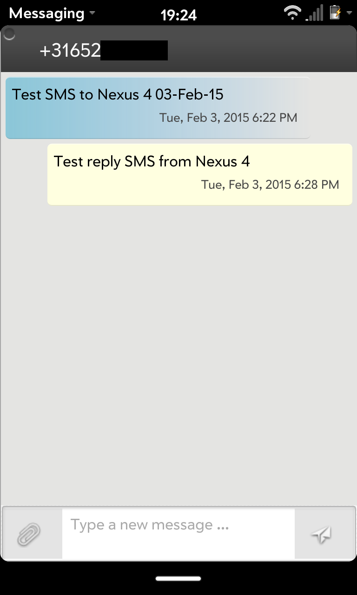

# LuneOS February Stable Release: Americano

We’ve made significant progress this month and we have been able to fix a lot of outstanding bugs. We do our best to get a new release out near the first of every month. The 1st was in a weekend this month so there was a little delay, but we proudly present our latest release: Caffè Americano or Americano in short.

We concentrated a lot on bug fixing for Americano, but we still have some known bugs left. Mainly we have a critical memory leak on the Touchpad which isn’t fixed yet. With every closed card we lose about 80 MB of memory. We know now where this is coming from and are working on a fix.

### Changelog

- Improved support for SMS messaging, it is now possible to send and receive SMS.
- Mobile data usage is now automatically enabled in the First Use application.
- Several fixes and changes to our way of handling window management.
- Add splash for windows not loaded yet.
- Several icons are available in higher quality now and got resized to hit the screen size.
- Carrier operator name is now shown in the status bar (+ custom carrier name using Tweaks).
- Splash screen is now handled by the compositor.
- Window management was reworked to make sure windows are destroyed at the right time.
- Showing a window is now bound to stageReady state again.
- New navigator.InAppBrowser API to open in application browser windows for authentication purposes.
- Privileged applications can now set the allowCrossDomain field in appinfo.json to allow cross domain access.
- Added functionality to add and edit contact.
- Added subscription to WiFi status so the system menu will be updated whenever the connection status changes.
- Prevent applications from being reloaded when they don’t require internet connectivity.
- Fix applications not getting visible because stageReady timer was never fired.
- Update most apps to latest stable Enyo 2.5.1.1.
- Various improvements and bug fixes to messaging services.
- Mark us as being on puck (touchstone) when any charger is connected to get dockmode visible.
- Only adjust the focussed window for a visible keyboard.
- Multi window support for Browser application.
- Contact picker for Messaging application.
- Dock mode implementation with Clocks only (Exhibition Mode will follow).
- Save new contacts in Contacts application but only locally for now.
- Switched to new InAppBrowser for Google OAuth account validator.
- Various improvements for the C+Dav Synergy connector.
- SMS messages can now be sent to multiple recipients.
- Rework webview creation to render launcher always correctly.
- Fixed kernel crash for Touchpad when accessing specific sites from the browser.

### For next release:

For the next release (“Café au lait” or “Au lait” in short we’ll be working on bringing back some of the missing hardware bits amongst other things:

- Fixing the critical memory leak on the Touchpad.
- Further enhancements to messaging and contact app and service backend.
- Bringing the phone application to life.
- Blinking LEDs to indicate pending notifications.
- Vibration support.
- Support for other sensors so we can implement orientation for example.

### Gallery

  

### The usual

1. [Sign up for the bug tracker](http://issues.webos-ports.org/projects/ports/issues?set_filter=1)

2. [Get involved](http://pivotce.com/2014/09/22/webos-ports-help-wanted/) and

3. [Join the mailing list](http://lists.webos-ports.org/mailman/options/luneos-dev)

Feel free to [download the updated builds](http://build.webos-ports.org/releases/americano/images/) to get started. Tenderloin and Mako remain our focus for now and the emulator works too.

Installation instructions for [TouchPad (Tenderloin)](http://webos-ports.org/wiki/Install_WOP_for_Tenderloin) and [Nexus 4 (Mako)](http://webos-ports.org/wiki/Install_WOP_for_Mako) are on the [wiki](http://webos-ports.org/wiki/Main_Page). And remember we [don’t do timelines](http://webos-ports.org/wiki/ETA).

See you next month! We’re getting closer and closer to being able to use LuneOS as a daily driver.

Don’t forget to contact us with any questions and feel free to join the discussion on the webOS Nation forums. Also, continue spreading the word! #LuneOS

[Join the discussion.](http://forums.webosnation.com/luneos/329372-pivotce-luneos-february-stable-release-caffe-americano.html)
