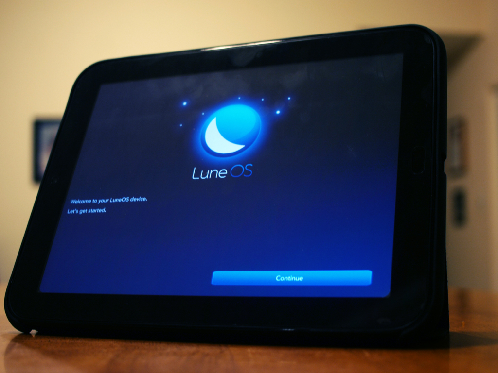

# LuneOS Update for March

There’s a lot going on with LuneOS and the webOS Ports team this month. We’ve been working a TON on some of the more ambitious parts of the OS. These are huge features that take a lot of time to get right. Because of that, there won’t be a stable build released this month. Read on to see what we’ve been up to.

### Current status:

Here’s what we’re working on so diligently:

- Bluetooth on N4 “works” for the most part
- Work on ambient, gyroscope, etc. sensors has been done with more to come
- GPS via cellular is ongoing
- Mochi UI style being worked for QML components for QML apps
- Lots of telephony progress
- Contacts intergration coming along
- SMS work is constant

As you can see, they are some of the biggest pieces to the puzzle.

### For next release:

Same as last month (except the TouchPad memory bug-we fixed that) plus emphasis on those items above:

- Further enhancements to messaging and contact app and service backend.
- Bringing the phone application to life.
- Blinking LEDs to indicate pending notifications.
- Vibration support.
- Support for other sensors so we can implement orientation for example.

### Nightlies

We know there ~~is~~ **was**a problem with the ~~latest~~ **March 7th**nightly. Part of the reason we aren’t rushing to get a stable out is because it will likely cause another sub-par build. We really *did* try to get a stable out this month. But remember, we’re about a quality product and timelines are not our primary concern. **Quality over quantity**.

**UPDATE**: There is a new nightly for 10 March. [Get it here](http://build.webos-ports.org/luneos-testing/images/).

### The usual

1. [Sign up for the bug tracker](http://issues.webos-ports.org/projects/ports/issues?set_filter=1)

2. [Get involved](http://pivotce.com/2014/09/22/webos-ports-help-wanted/) and

3. [Join the mailing list](http://lists.webos-ports.org/mailman/options/luneos-dev)

Feel free to [download the updated builds](http://build.webos-ports.org/releases/americano/images/) to get started. Tenderloin and Mako remain our focus for now and the emulator works too.

Installation instructions for [TouchPad (Tenderloin)](http://webos-ports.org/wiki/Install_WOP_for_Tenderloin) and [Nexus 4 (Mako)](http://webos-ports.org/wiki/Install_WOP_for_Mako) are on the [wiki](http://webos-ports.org/wiki/Main_Page). And remember we [don’t do timelines](http://webos-ports.org/wiki/ETA).

Stay with us as we have lots of great things coming in the near future. Daily driver status for the N4 is a goal for us and we’re doing everything we can to accomplish it. Lots of work up front makes porting easier later on.

[We do have rules](http://webos-ports.org/wiki/Install_WOP_for_Mako#Rules_that_you_must_agree_to_before_using_these_images) for testing LuneOS. In short, join the [mailing list](http://lists.webos-ports.org/mailman/listinfo/luneos-dev) and [report bugs](http://issues.webos-ports.org/projects/ports/issues?set_filter=1), please. It only makes LuneOS better. Thanks for the continued loyalty!
