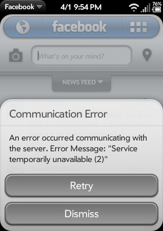

# Farewell to Facebook webOS Synergy/App

In October of 2014, Facebook for HP webOS was removed from Facebook’s authorized apps list, as [has happened before](http://forums.webosnation.com/palm-pre-pre-plus/320200-facebook-hp-webos.html). This had the effect of hiding (but fortunately not deleting) all of the status messages, photos, and videos uploaded by the app. Additionally, the change broke the app and the Synergy connector for contacts and calendars. Namely, it broke the authentication process so that if you ever logged out of the app, had to doctor, or restore from a backup, you could never log back in. Users who were logged into the webOS app at the time of the change are still able to read their timelines but can’t post. Nice, right?

This was particularly frustrating for those users who were using Facebook as a storage space for their pictures, and did not have backups elsewhere. They were able to see that the albums were still full of pictures, even though those pictures were not visible to them. As if to add insult to injury, the pictures were not even included when users went to download their “Facebook Archive” which is supposed to include everything, even recently deleted items. Many requests from the community followed, asking Facebook to restore the app and the content that had been uploaded by it. Among them were our own Alan Morford (his letter is pasted below) and Grabber5.0. These requests were met by nothing but silence and the occasional auto-responder email.

*Greetings,*
*It saddens me to report that with the discontinuation of Facebook for webOS and the change from SSLv3 to TLS I can no longer use the app or the upload functionality from any Palm or HP webOS device.*

*But more importantly, all photos I have uploaded using one of these devices and the Facebook integration since 2010, have been deleted or possibly hidden from view. My mobile uploads photo album lists a total of 103 photos but only shows 24. Those 24 images were uploaded via other means. Seventy-nine photos were uploaded via webOS Facebook integration and with the discontinuation of SSLv3 and Facebook for webOS support, they are now gone.*

*It would be greatly appreciated if someone could make an exception for webOS users. We are a small community. If it is also possible to retrieve those photos, I would again be greatly appreciative. Thank you.*

*Alan*

After four months of silence, Facebook has finally addressed the issue and restored the hidden pictures uploaded from webOS devices back to users’ timelines though the posts have lost the app tag, ie. “Facebook for HP webOS”. However, it appears that the app is broken for good this time. Visit your authorized app list on facebook.com and you’ll see that the webOS app is no longer in the list.

The good news is that while the app is broken, you can still use Facebook on your phone. According to the forums, m.facebook.com still works in the webOS browser, so you can do everything through that except post photos and videos. Fortunately, there are options for photos and videos too. You can use [post by email](https://www.facebook.com/help/210153612350847) for photos and videos, or [Facebook Texts](https://www.facebook.com/help/130694300342171) to post photos, videos, status updates and more.

Don’t forget, if you have a TouchPad, the Facebook app continues to work, kind of, for the moment anyways. (You can’t upload pictures there either or login on a fresh install). Fortunately, the webOS community is a creative and resourceful bunch, and has already started tearing that app apart to [see what makes it tick](http://forums.webosnation.com/webos-apps-games/328759-facebook-problems-4.html#post3436091). With any luck, a reverse engineering and patching effort will allow TouchPad (and hopefully phone) users to keep using Facebook on our devices for the foreseeable future.

Check out the [threads](http://forums.webosnation.com/hp-pre-3/328754-facebook-account-login-broken.html) on the [topic](http://forums.webosnation.com/webos-apps-games/328759-facebook-problems.html) over on the forums.
