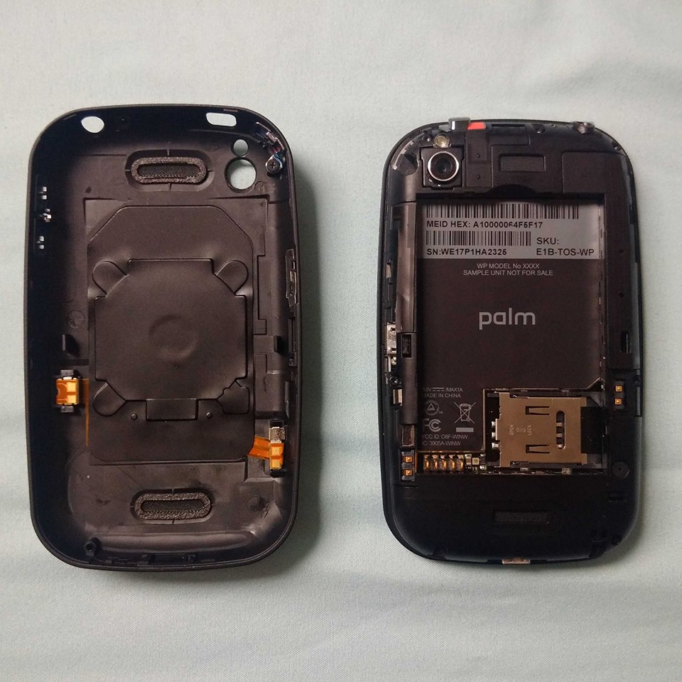
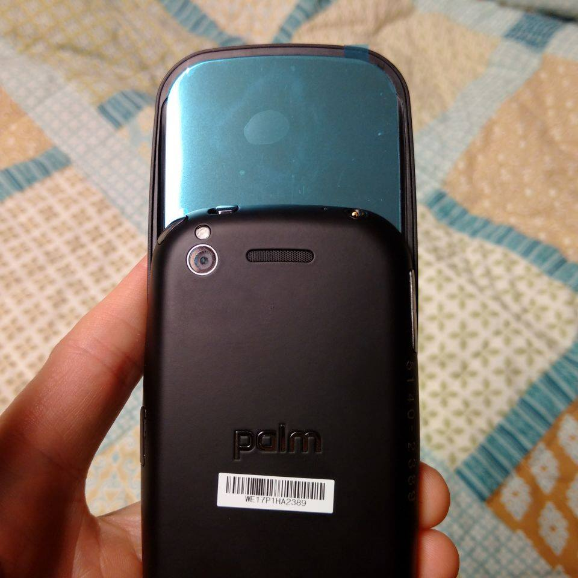
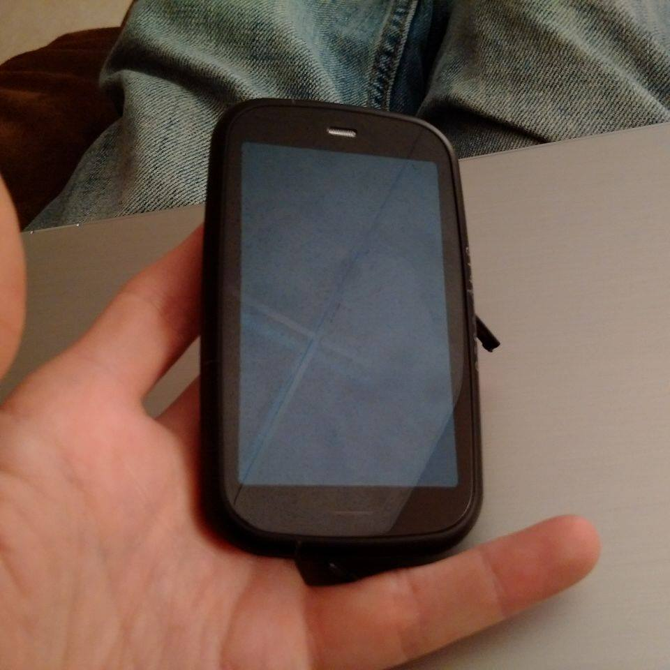
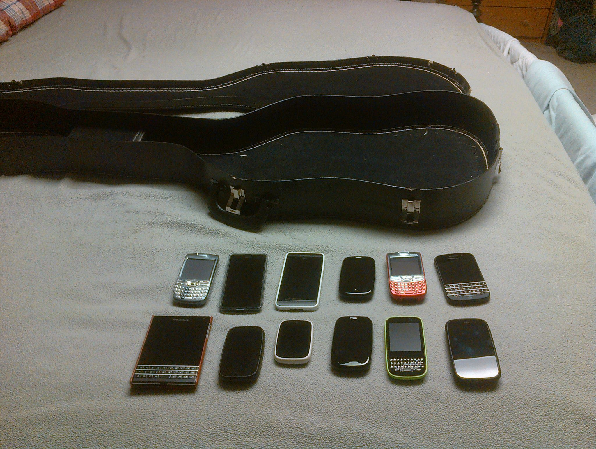
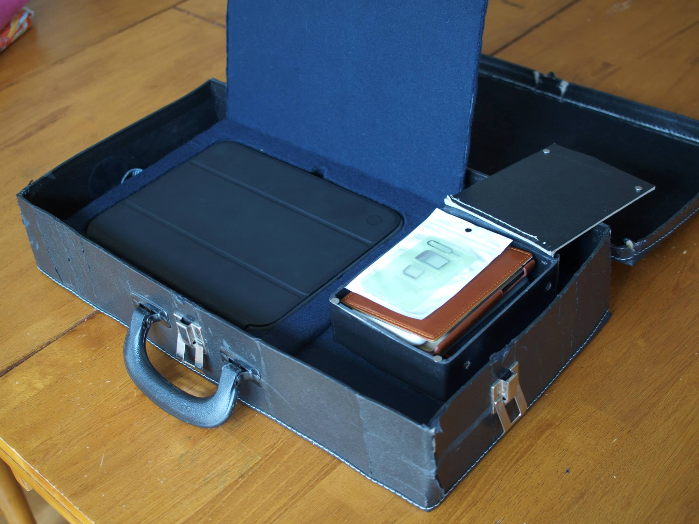
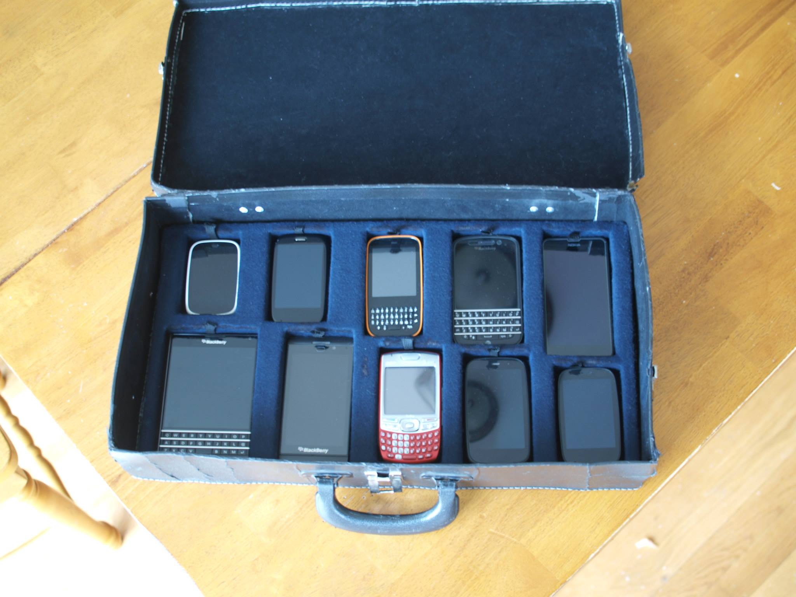
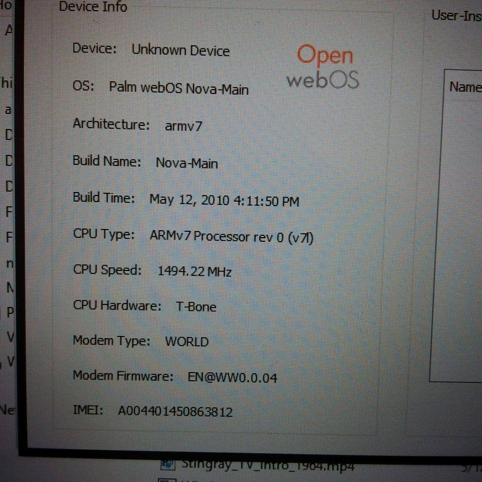

# St. Louis webOS Meetup Recap

I’ve never met another webOS user. Well, not in person.

Ok, that’s a bit of a stretch. I got a Palm Centro back in the day when my Aunt still worked for Sprint. Cost me $100 back in 2008? 9? Somewhere around there. Anyway, I was using that until I met a guy with the original Palm Pre in 2010. I had no idea Palm had a new phone out. Seriously. Totally missed its launch. So did most of the world…I digress.

I got the Pre Plus shortly after that encounter. About a year later I met a girl using the Pre Plus. I geeked out. She didn’t. Just a user. She switched to an iPhone shortly after I talked to her.

About a year ago I met a different guy that saw my Pre3. He asked if it was a Pre. I said yes and showed it to him.  He was a Pre user back in 2010.

And that’s it. My entirety of webOS user interaction. But I had a plan to fix that.

### Vacation

I knew I had to do something over my kids’ spring break. But what? The wife wanted to stay in the DC area and sight-see. Bleh. I hate this area because of traffic. And the Metro is…dirty. So I thought, we should visit family! What? Where’d that come from? Anyway, it seemed like a good idea at the time.

I started talking to [Grabber5.0](https://pivotce.com/2014/01/31/dev-highlight-grabber5-0/) (Matt) via text a while back. We were testing different things and exchanged numbers. Turns out he’s about 3 hours away from where I was to visit family. And that’s how it all began…

### The meetup

After I advertised on the [Forum](http://forums.webosnation.com/webos-events/329427-st-louis-mo-webos-meetup.html) and on Twitter about a possible meetup, there were about 4 folks interested. Bleh. After the article [here on pivotCE](http://pivotce.com/2015/03/04/webos-meetup-st-louis/), about10! Yay! And eight of them showed up! Yay again! So who was there?

- Me! (black shirt, right)
- Grabber5.0 (next to me, right)
- creepingmee (closest to camera, right) and his nephew (closest to him, right)
- Atif (closest to camera, left)
- mattmers (blue shirt, right)
- soccerbudd (lady)
- Silug (hiding behind Atif, left)

### The discussion

SO MUCH. Things got pretty hectic at the start because we didn’t quite know where to begin. Chaos insued. Fun chaos. But chaos all the same. I couldn’t believe there were other people at the same table with webOS phones. Reference my previous ‘in person’ webOS user interaction I mentioned above.

Some of the topics we covered were:

- How to fix a TouchPad that wouldn’t boot. soccerbudd’s (Karla). [It’s fixed now by the way](http://forums.webosnation.com/webos-events/329427-st-louis-mo-webos-meetup-4.html#post3436601).
- We passed around my Windsor which is a Pre3 prototype.
                
- creepingmee (Marc) passed around his TouchStone 2. JEALOUS. Seriously. The viewing angle on it is PERFECT. Oh and I plopped my Pre3 on it and the screen wouldn’t come back on. Had to hard reboot it with the mute/power switch toggle trick. I blame Marc. 😉

> From last night's webOS meetup. [@creepingmee](https://twitter.com/creepingmee) has a TS2 that totally jacked my Pre3 and I had to hard reboot! [pic.twitter.com/8ALARi3Fox](http://t.co/8ALARi3Fox)
>
> — Alan Morford (@alan_morford) [April 4, 2015](https://twitter.com/alan_morford/status/584351557090578433)

- I passed around my Nexus 4 with the April 1st [nightly build of LuneOS](http://build.webos-ports.org/luneos-testing/images/mako/) installed. I actually was able to get rotation working while I was sitting there thanks to a late email from Herrie.
- Atif brought up the idea of LuneOS as an OS that smaller, security conscious countries might like to run internally. Neat idea. He’s planning on elaborating on that idea soon as well as brushing up his coding skills for LuneOS development after his doctoral program is done. He’s building energy efficient robots. Seriously cool. Def the smartest guy at the table.
- Silug (Steve) and I reminisced about Red Hat Linux among other Linux based topics. In fact, he started and leads the [Southern Illinois Linux User Group](http://www.silug.org/)…I bet you know where he gets his screen name. He also brought me gifts in the form of a Pre+ and Pre2 to find them a new home. No problem!
- mattmers (Matt #2) brought sticker sheets he made with cool Palm, LG, webOS, and LuneOS logos on them. Awesome! My TP case is way cooler now. You can see the sheet in the pic above or [click here](http://forums.webosnation.com/webos-events/329427-st-louis-mo-webos-meetup.html#post3434725) to grab the image and make your own.
- My cell phone and tablet case I made out of an old bass guitar case was a topic too. Who builds a custom case for phones? Nerd alert.
        The original plan.        The top layer with everything inside.        I think it turned out pretty great!

### Cool stuff

We had a LOT of cool gadgets with us. Some I’ve already mentioned but I’ll list out what we brought!

- A GSM Pre3 running webOS 2.2.5. [We know about 2.2.5](https://herrie82.wordpress.com/verizon-pre-3-2-2-5-webos-doctor/) already but that’s for Verizon. This is the only GSM one anyone has reported seeing before.
- Windsor. 1.4 GHz, Pre3 prototype. Has Nova Main installed which is a factory testing OS that is essentially a VERY buggy webOS 1.x variant. Has a 32GB flash! I loaned it to creepingmee to tear apart to see if it can be swapped in a Pre3! I hope it can be because having the world’s only 32GB Pre3 would be super ~~geeky~~ awesome.
- There were 3 TouchPad Gos at the table.
- One of each production webOS device was there as well as the other development devices mentioned.
- A TouchStone 2!
- A Pre3 and a Veer dev device with the HP and Palm logos on the back. Not super rare but still cool to see the Palm logo in action.
- Two people at the table were still using Sprint Franken Pres. TWO. Ha.

### Conclusion

That was a lot of fun! Everyone had a good time and it just made us want to do it again next year. So be on the lookout for that announcement! I’m thinking about having one here on the east coast before I move this summer to Kansas! Which reminds me, anyone from Kansas???

#webosforever
