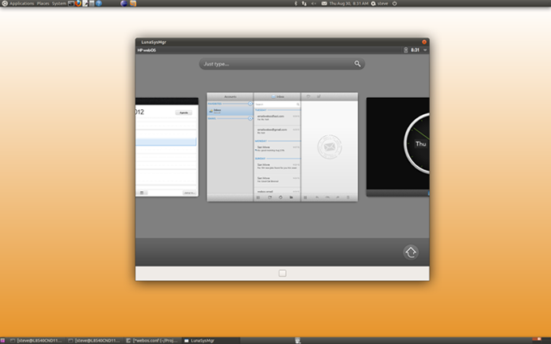

# LuneOS Is All About Users

The webOS Ports team has a momunental task ahead of them. They’re building an operating system from scratch. And no don’t think for one second that [Open webOS](https://www.openwebosproject.org/) which started the LuneOS project was actually an operating system. See the pic and video, it ran on TOP of Ubuntu so make no mistake, making it into what we now know as LuneOS has been no small feat.

To make anything as complicated as an operating system it likely helps to have a direction when planning for certain concepts. Concepts like assuming users want a certain level of control over accounts, documents, messaging, usability, and multitasking for example.

If you aren’t excited about LuneOS, trying reading the Ports team’s [Human Interface Guidelines](http://webos-ports.org/wiki/Human_Interface_Guidelines) and try not to see how much thought is going into creating a system designed around making users the focus. Go ahead. Try. Good luck.

#webosforever

[YouTube video](https://www.youtube.com/watch?v=8sS3Vk821w8)

[Image](https://www.openwebosproject.org)
