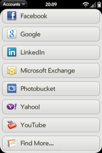

# C+Dav Synergy Connector Updated for webOS

*webOS Synergy Accounts*

webOS Nation’s forums user and webOS Ports team member, [Garfonso](http://pivotce.com/2013/11/15/dev-highlight-garfonso/), has updated the C+Dav Synergy Connector for webOS to version 0.3.31.

CalDav and CardDav are now the standards with the broadest server support for syncing calendars and contacts. And thanks to his and webOS Ports’ efforts it works for legacy webOS AND LuneOS too.

These are some of the services you can use with the connector:

- ownCloud
- iCloud
- Google
- Yahoo
- eGroupware
- SoGo

Get in on the [thread](http://forums.webosnation.com/webos-development/328133-c-dav-synergy-connector-owncloud-google-yahoo-icloud.html) for more details or to add your own comments, read about [how to install it](http://webos-ports.org/wiki/C%2B_Dav_Synergy_Connector) on the webOS Ports wiki, and enjoy! Don’t forget the patches but do NOT use “Sync fix for stable upload” patch found in Preware with the connector unless you enjoy undoing everything and redoing it because it WILL kill your battery very quickly.

#webosforever
