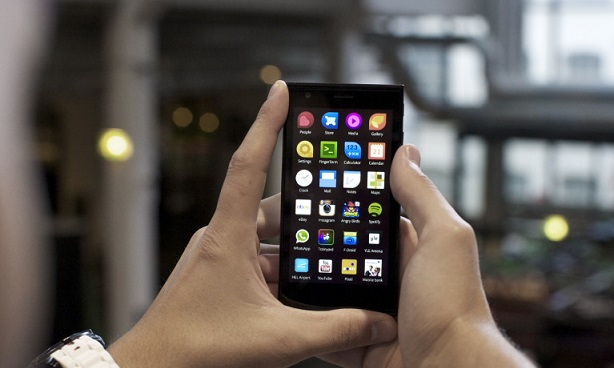

# Where Will LuneOS Get Its Apps?

The webOS Ports team has been developing LuneOS for a long time now. It started after HP released webOS as an [open source project](http://www.openwebosproject.org/) in December of 2011. With [monthly updates](https://pivotce.com/2015/06/06/luneos-june-stable-release-cafe-cubano/) the LuneOS project now hosts a ton of awesome features as it draws nearer and nearer to daily driver status.

I wrote about [testing apps for LuneOS](http://pivotce.com/2014/09/16/two-weeks-with-luneos-an-app-sideload-test/) several months ago. The TLDR version is there aren’t many current Enyo (think webOS 2.x and up) based apps that work with LuneOS. There are a LOT of Mojo (think webOS 1.x) apps for webOS out there but when HP open sourced webOS, Mojo was not included so that’s a no-go for LuneOS too. Bummer.

Will there be apps for LuneOS when it does reach daily driver abilities? Where will the apps come from?

Most of the webOS developers have long since abandoned the platform. There are a handful of folks remaining that could potentially develop Enyo or QT/QML/C++ apps for LuneOS but the number is pretty small. However since webOS Ports are using the latest open sourced technologies to build LuneOS it might be possible to find other sources of already made apps that are easy to port.

One of those sources is Jolla’s Sailfish OS. Questions remain about whether their app’s code are open source but their [coding language](https://sailfishos.org/develop/sdk-overview/) is right. [Their app list](https://thejollablog.wordpress.com/tag/app-list/) isn’t very long but it’s *modern*…something webOS’ list is *not*.

[YouTube video](https://www.youtube.com/watch?v=y64ja7WBHU8)

While I’m talking about community made applications I should mention that [Symbian](http://www.allaboutsymbian.com/) is still being developed for despite Nokia [pulling the plug](http://www.onlinegadgetstore.com/12570-nokia-announces-developer-support-symbian-meego-platforms/) in January of 2014 for it and Meego. The Symbian community has their own [app store](http://applist.schumi1331.de/) and [custom firmware](http://www.allaboutsymbian.com/news/item/20355_Delight_15_Custom_Firmware_hit.php) (think Android AOSP-based dev-created ROMs like CyanogenMod).

If only webOS still had a large developer community! pivotCE does have a way to [submit new apps](http://feed.pivotce.com/manage/) to Preware which is our last recourse of an app catalog. And Preware will be LuneOS’ primary catalog as well. Will there be apps for it? WILL THERE???

#luneosforever
