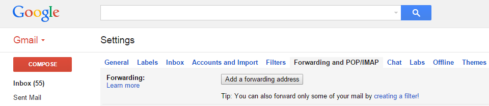
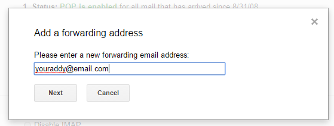
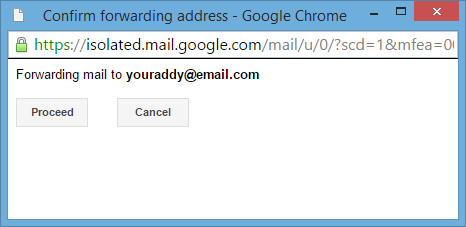
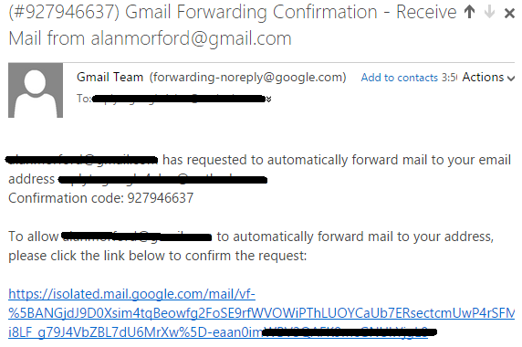
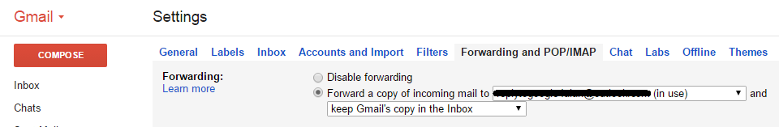
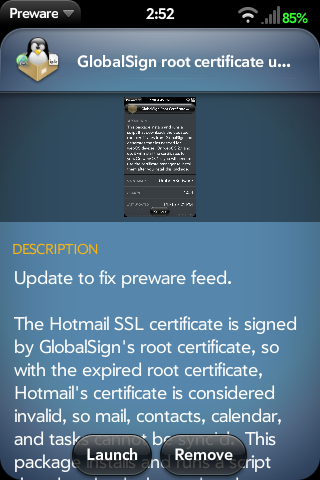
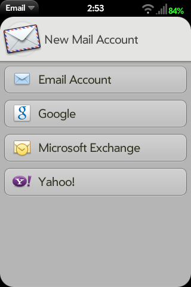
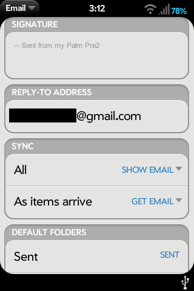

# UPDATE Guide: Getting Around the Yellow Gmail Triangle of Death

UPDATE: Grabber5.0 has fixed GMail in the same manner that Yahoo was fixed. [Check the forum post](http://forums.webosnation.com/hp-touchpad/329860-google-error-requested-encryption-not-supported-server-6.html#post3439562) for the 3 certificate files you need. You can ignore pretty much everything about forwarding emails below but I’ll leave it there in case someone wants to know how to do that.

Grab the zip from the above linked post, unzip the 3 .pem files, transfer them to the webOS device, and open each one by one and accept the certificate. Refresh your GMail account in the Email app and BOOM. FIXED! YAY!

I’ve had it. Break [YouTube](https://pivotce.com/2015/06/16/guide-how-to-fix-youtube-for-webos-2-x/) and we’ll fix it, kill [Skype](https://pivotce.com/2014/08/18/are-we-dreaming-skype-still-works/) and we’ll throw a fit and get it turned back on, but take GMail away? SERIOUSLY? It’s a deal breaker. I’ve had the same email address for over a decade. If it doesn’t work on webOS then I quite honestly cannot live without it. YES THE MOBILE VIEW WORKS but who else here is sick of a browser workaround (ie. Facebook)?? I mean, the browser isn’t exactly winning awards for innovating technology these days, amirite?

The error GMail is throwing is about SSL. I’m not a smart man but I know what SSL is…and that’s about it. Without knowing more I had to find *something else* to fix it.

After I got over my irritation of webOS getting harder and harder to use I set out like a man possessed looking for a solution. I found one. It’s not awesome but it works for every webOS version there is. This guide will setup a new email account to act as a GMail emulator of sorts, setup automatic GMail email forwarding to that account, and setup a reply to address for that account on your webOS device.

### Create another email account

Pick another email service. Yahoo, AOL, your own… , or any other IMAP (I recommend it) email service that’s out there. NO YOU WILL NOT BE SWITCHING YOUR EMAIL ADDRESS. Just create a new one. If you pick Yahoo, you’ll need [to do some work](https://pivotce.com/2015/03/05/guide-fixing-yahoo-mail/) by the way. Don’t throw a fit, it’s 2015, what ISN’T work in webOS these days? We’ll be forwarding all of your incoming email to GMail to this account. Say what? Yeah, stay with me here.

Important to note is that not all email services allow “reply to” which I talk about below. Outlook.com is one of them. If you want to use reply to then don’t pick Outlook.

### Enable forwarding through GMail

Google has graciously provided [instructions](https://support.google.com/mail/answer/10957?hl=en) about how to forward all new messages to a different account while also leaving the messages in your GMail too. They’re copied below.

1. Open the Gmail account that you want to forward *from*.
2. At the top right, click the gear .
3. Select **Settings**.
4. Select the **Forwarding and POP/IMAP** tab.
   
5. Click **Add a forwarding address** in the “Forwarding” section.
6. Enter the email address you want to forward to.
   
7. For your security, we’ll send a verification email to that address. Open your other email account and find the confirmation message from the Gmail team. If you’re having trouble finding it, check your Spam folder.
   
8. Click the verification link in that email.
   
9. Back in your Gmail account, reload the page in your web browser – look for the reload icon .
10. On the same **Forwarding and POP/IMAP** page in Settings, check that **Forward a copy of incoming mail** is selected and your email address is in the drop-down menu.
    
11. In the second drop-down menu, choose what you want Gmail to do with your messages after they’re forwarded, such as **keep Gmail’s copy in the Inbox** (recommended) or **archive Gmail’s copy**.
12. Click **Save Changes** at the bottom of the page.

### Install Globalsign Certificate

You might need the Globalsign cert. You have a few ways to do this.

webOS 1.x: [We made a guide](https://pivotce.com/2014/01/29/hotmailoutlook-com-accounts-misbehaving/) for you already! Just browser to the site on your 1.x device’s browser and accept the cert.

webOS 2 and up: Open Preware, search for globalsign and install the root certificate updater package.

Any version of webOS: use **step 6** in our [coming back to webOS guide](https://pivotce.com/2014/10/21/guide-coming-back-to-webos-in-2014-part-1/) to do it manually with webOS Quick Install.

### Add the account to your webOS device

1. Open the Email app
2. Swipe down for the top menu
3. Tap Preferences & Accounts
4. Tap Add Account
5. Tap Email Account
6. On webOS 2 and up type in your **new** email address and password and then tap Manual Setup. On webOS 1.x you have to attempt to sign in first. I got an error (you should too) but then I could tap Manual Setup.
7. Change mail type to IMAP and enter in all of your settings. Do a search for them online.
8. Tap Sign in.
9. Give the account a name and tap Create

### Change default email account and set reply to address

This is optional but if you want to keep your GMail address as the primary email you use you’ll want to set this up so that when you email from your new address the person who replies to you will get your GMail address autofilled instead of the other account.

1. Open the Email app
2. Swipe down for the top menu
3. Tap Preferences & Accounts
4. Under ACCOUNTS tap your new account
5. In the REPLY-TO ADDRESS field type your GMail address

This is also optional but if your primary account is GMail you’ll want to switch it to the new one since GMail is broken.

1. Open the Email app
2. Swipe down for the top menu
3. Tap Preferences & Accounts
4. Under DEFAULT ACCOUNT tap Google and change it to your new one in the popup menu.

By the way, SENDING emails from GMail still seems to work in webOS so the reply-to is a solution for being lazy and not remembering to change the FROM address when you hit reply and fire back an email.

### What about my old emails?

This was a concern for me. GMail cannot autoforward old messages already in your account. There is a way to do it but it’s pretty involved and let’s face it, the unified Inbox built in to webOS pretty much does that same thing! Just make sure All Inboxes is turned on under SMART FOLDERS in Preferences & Accounts. Just remember, if you reply to an email that’s in your GMail emails you’ll need to change the FROM address to your new email account.

It’s also important to note that the receiver will see your other email address but if you setup the reply-to address they would have to manually copy and paste your new email address into a new email! So feel free to get creative with the new email you setup. I chose replytogoogle4me as my handle in the new account. Feel free to do something similar!

#webos <pant heavily> forever
