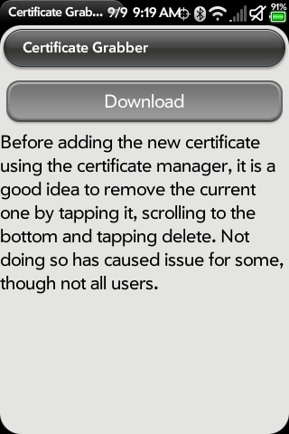
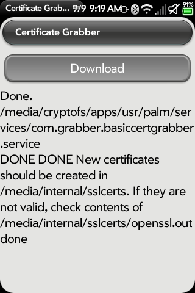
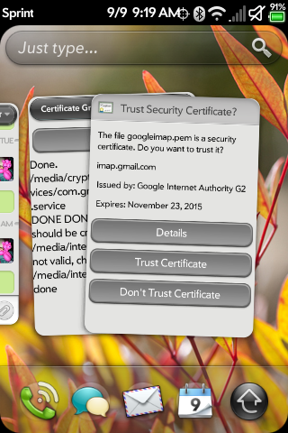

# UPDATE App: Certificate Grabber

**UPDATE: Matt has continued to update his Cert Grabber app and with the latest 0.5.5 release, the app now automates the download, removal of old certs, and installation of the new certs with just a touch of the download button!**

Everyone’s favorite “GMail on webOS fixer”, [Grabber5.0](http://pivotce.com/2014/01/31/dev-highlight-grabber5-0/) (Matt), is at it again. If you’ve been following along, that dumb [yellow triangle](http://pivotce.com/2015/07/25/guide-getting-around-the-yellow-gmail-triangle-of-death/) keeps popping up for GMail users on webOS. There’s a fix for it but it was pretty manual until now.

A couple weeks ago Matt provided a nice script that you could download, transfer to your webOS device (2.x and up), and run in [wTerm](http://preware.pivotce.com/package/us.ryanhope.wterm) to get the latest IMAP certificates for GMail. You’d then open up [Internalz Pro](http://preware.pivotce.com/package/ca.canucksoftware.internalz), tap the certs, and install them manually. It works great but not everyone is comfortable with command line. Recognizing the problem and wishing to help as many as possible, he devised a nice little app called Certificate Grabber. Get it? Grabber? LOL. Clever… I digress.

Better yet, you can get that app in [Preware](http://pivotce.com/2015/04/22/new-preware-and-our-own-feed/) RIGHT NOW. It’s in our [pivotCE feed](http://preware.pivotce.com/package/com.grabber.basiccertgrabber) or here’s a [direct link](http://www.fordmaverick.com/GrabberSoftware/SSLcerts/googlecerts/com.grabber.basiccertgrabber_0.5.1_all.ipk). Just install it and tap Download. It will launch the Certificate Manager all on its own and all you have to do is tap Trust Certificate. DONE!

Right now it only autolaunches the IMAP certificate and not the SMTP certificate. Both certs get downloaded though. You likely don’t need the SMTP cert yet but if you do you can hit the + in Certificate Manager and browse for it there or use Internalz Pro. We should probably expect updates to the app though. He already notes that some TouchPad users are [getting an error](http://forums.webosnation.com/hp-touchpad/329860-google-error-requested-encryption-not-supported-server-29.html#post3441478) with the app. If that’s you, you can still [use his script](http://forums.webosnation.com/hp-touchpad/329860-google-error-requested-encryption-not-supported-server-18.html#post3440336).

This is way easier! Yay!

#webosforever
