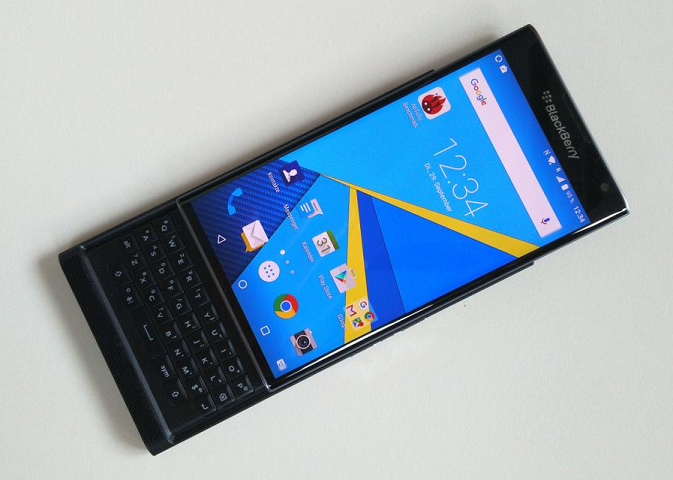

# Making Android More Like webOS

Making Android more like webOS is not an idea without precedent. webOS Nation [covered a similar article](http://www.webosnation.com/switching-android-itll-probably-feel-familiar) in 2013 and there are several posts on XDA and webOS Nation about that very thing. Some still work and some don’t.

Mods like [webcm10](http://forum.xda-developers.com/showthread.php?t=1514235), which offers swipe up card switching, were designed for Cyanogenmod 9 and 10. You can [see it in action here](https://www.youtube.com/watch?v=06jdESXEzYs). Old themes for Android launchers might still work but there have been a lot of changes to Android since they were released 2+ years ago so YMMV. I’m talking about [WebOS GO Launcher EX Theme](https://play.google.com/store/apps/details?id=com.gau.go.launcherex.theme.vezatmwm#?t=W251bGwsMSwxLDIxMiwiY29tLmdhdS5nby5sYXVuY2hlcmV4LnRoZW1lLnZlemF0bXdtIl0.) for [GO Launcher](https://play.google.com/store/apps/developer?id=GO+Launcher+EX&hl=endWcBw), of course.

But how about for Android 5 and beyond? My solution for those days when I must use Android is Nova Launcher. Below is the short video I made showing my setup.

[YouTube video](https://www.youtube.com/watch?v=rxvD31Fkk-k)

Since I was away from Android for so long, I also missed the [Wave Launcher](https://play.google.com/store/apps/details?id=com.wavelauncher&hl=en) for Android app. I just found out about it yesterday! Here’s a video of it in action too. The nice thing is it doesn’t replace your home launcher but rather sits on top and works inside other apps. I’m definitely going to try this out soon.

[YouTube video](https://www.youtube.com/watch?v=uU1bCPajaZQ)

If you’re using Android and want to give Nova Launcher a try, I recommend [the “pro” addon](https://play.google.com/store/apps/details?id=com.teslacoilsw.launcher.prime&hl=en) called Nova Launcher Prime which enables gestures. Get the free Nova Launcher [from the Play Store](https://play.google.com/store/apps/details?id=com.teslacoilsw.launcher&hl=en) first and then Prime. Then happy editing!

If you’ve read about the BlackBerry Priv you’ll know it’s a portrait slider running Android. Combine these tips with the Priv and [webOS wallpapers](http://forums.webosnation.com/webos-wallpapers/) and you’ve got something very similar to webOS’ look and feel!

#webosforever

Image: webOS Nation
