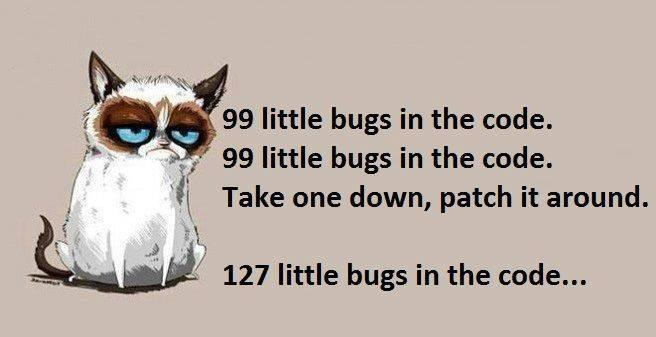

# LuneOS Update for November

You can’t win them all, folks! We won’t have a November stable release of LuneOS because we’ve always been about quality and not forcing made-up timelines to satisfy feelings.

BUT we do have nightlies still coming. The latest of which are available for [Grouper](http://build.webos-ports.org/luneos-testing/images/grouper/luneos-dev-package-grouper.zip) (Nexus 7), [Maguro](http://build.webos-ports.org/luneos-testing/images/maguro/luneos-dev-package-maguro.zip) (Galaxy Nexus), [Mako](http://build.webos-ports.org/luneos-testing/images/mako/luneos-dev-package-mako.zip) (Nexus 4), [emulator](http://build.webos-ports.org/luneos-testing/images/qemux86/luneos-dev-emulator-qemux86.zip), and [Tenderloin](http://build.webos-ports.org/luneos-testing/images/tenderloin/luneos-dev-image-tenderloin.tar.gz) (HP TouchPad). Don’t forget the [latest uImage](http://build.webos-ports.org/luneos-testing/images/tenderloin/uImage) for TouchPad.

So what’s new? First off, we have a new supported device! Well, ok so it’s an old supported device that has been brought back to life. The Galaxy Nexus! Also, the RaspBerry Pi 2 port will be most likely an official target shortly. We just need to work out logistics on our build server. More to come there.

**Changes:**

– Updated from QT 5.5.0 to QT 5.5.1
– Migrated rendering of Enyo 1/2 apps from QtWebKit to QtWebEngine (still has some issues in the email app for example), which we are currently working on.

**Known issues:**

– Email list doesn’t display in email app
– Occasional odd behavior for Enyo 1/2 apps, *[please report](http://issues.webos-ports.org/projects/ports/issues?set_filter=1) this so we can investigate further*
– Splash screen disappears too quickly
– Audio doesn’t seem to work in the browser

**Device Specific Fixes:**

Nexus 4:
– Fixed not working PulseAudio after upgrade to PulseAudio 6

Galaxy Nexus GSM:
– Brought back support for Samsung Galaxy Nexus. In theory you CAN install LuneOS to your CDMA Galaxy Nexus but cell radio will likely not work and it might break your device. If you try and you brick it, don’t say you weren’t warned.

Applications:
– Testr: Added tests for responsive images
– Browser: Migrated BrowserUtils to QtWebEngine
– FirstUse: Added support for enabling 3rd party Preware (LuneOS App Catalog) feeds to FirstUse
– FirstUse: Switch to use luneos-components and use QtWebEngine instead of QtWebKit
– Phone: Migrated to use luneos-components
– Tweaks: Fixed broken banner notifications
– Calculator: New rotatable layout, that makes full use of QtWebEngine features
– Luna-next-cardshell: Made time display in correct format (12/24 hrs), added optional system menu items for devices without hardware power/volume buttons (RaspBerry Pi 2)

System level:
– luna-webappmanager: Migrated Enyo 1/2 apps to QtWebEngine. Still quite fresh, so looking for feedback on things that don’t work.
– luna-appmanager: Improved handling of a crash in luna-webappmanager so that Power menu and other apps will keep working.
– luna-init: Added a default keyboard size.
– luneos-components: Finished migration of phone app components and added additional features.
– luna-qml-launcher: Tweaked behavior for QML apps using QtWebEngine.
– webos-keyboard: Fixed erratic/non-working extended keys on … keys.
– downloadmanager: Initial work on a download manager for browser and other system bits.
– luna-service2: Switched from QtWebProcess to QtWebEngineProcess
– luna-sysmgr: Standardization of available fields in device specific .conf file.
– luna-sysmgr: Made sure to remove com.palm.app apps and replace them with org.webosports.app equivalents where available.
– qtwebengine-chromium: Migration webOS/LuneOS specifics from QtWebKit to qtwebengine-chromium
– qtwebengine: Migration webOS/LuneOS specifics from QtWebKit to qtwebengine-chromium
– luna-next: Fixed non-working back gesture in Enyo 1 apps.
– luna-next: Fixed Units and Settings singletons.

Phew! That was a lot of work. As you can see, we’ve been busy. Implement a lot of changes and find a lot of bugs!

Help us test and [report your findings](http://issues.webos-ports.org/projects/ports/issues?set_filter=1), please! We’re always looking for energetic volunteers to [join the team](https://pivotce.com/2014/09/22/webos-ports-help-wanted/). See you next month.
