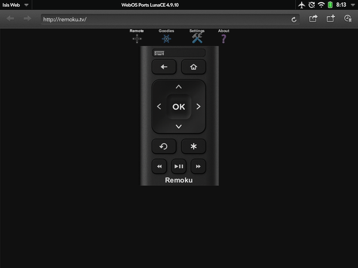

# Control Your Roku from an HP TouchPad

Got a Roku? Great! Wish your webOS devices could control it? Me too! And great news, you **can** with [remoku.tv](http://remoku.tv).

There’s one catch, it seems to only work on webOS 3.x which means you can only get it to work on your HP TouchPad or HP TouchPad Go. Browse to the site and tap the settings icon. You can do a scan on your home network for a Roku or go into your Roku network settings to find the IP and manually enter the last 3 digits.

If you’re an Android dual-booter on the TouchPad you can of course use the official Roku app from the Play Store but for the webOS die-hards you can always make a shortcut in your apps to the website.

I recommend using [Shortcut Launcher](http://forums.webosnation.com/webos-apps-games/310073-awesome-update-shortcut-launcher.html) ([download](https://app.box.com/s/mr83ds9q5b9da0fycq48fnzkcxqzw6dp)) to make a nice looking Roku icon in your launcher. Here’s an icon to download and use. Have fun!

#webosforever
