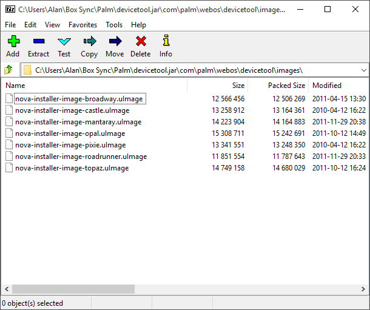

# The Ultimate Bypass Activation Tool

In this post-Palm/HP-servers-webOS-world it’s necessary to have all of the tools to keep our devices alive. Most of us still around on the [webOS Nation forums](http://forums.webosnation.com/) are well equipped with tools like [OpenSSL](http://forums.webosnation.com/webos-internals/330666-openssl-updater-fixing-certificate-issues.html) and a multitude of patches that reestablish dead synergies and apps alike.

But there are those that join our beloved forums as new members or returning webOS users that skipped away to alternate platforms for whatever reason. Some are surprised to find they can no longer log in to their devices. That can be a problem. pivotCE author, Preemptive, did a great job explaining all of the options for [bypassing first-use activation](https://pivotce.com/2015/06/24/tip-how-to-bypass-activation/). He mentioned Grabber5.0’s combined devicetool to bypass all devices. But it was missing the TouchPad Go (Opal). And with it being buried in a forum I decided to combine the Go file into his tool and put it up here in its own article.

For your downloading pleasure, enjoy an all inclusive [devicetool.jar](https://app.box.com/s/n6izie2yzxdgyju227y7qr1pqsc787vj).

Did I miss one? If you know something I don’t, drop me/us a line on [Twitter](https://twitter.com/pivotce) and we’ll add it. You can see from the pic above what’s in it.

#webosforever
