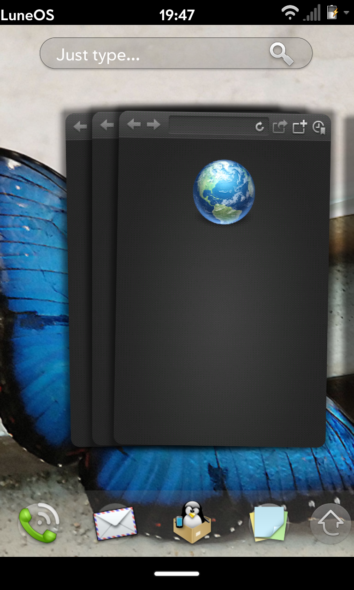

# The webOS browser is aging but whose fault is it?

I’ve read it before and said it myself. The webOS browser isn’t what it used to be. But what’s to blame? Is it old webOS browser programming? Outdated webkit? Slower processors? Smaller amounts of RAM? Well, it could be all of that but **modern web practices aren’t helping things**. And that’s a problem for *web*-OS.

Symbian OS enthusiast site, All About | Symbian, [explains some of the frustration](http://www.allaboutsymbian.com/flow/item/21431_Next_time_you_get_impatient_wi.php) of using an older smart phone browser in a modern day web-world. Basically, what used to be done in 25k  is now done in 2.5mb…per page! Yikes! I remember downloading 4mb mp3s back in 1999 on a 56k modem. It took hours! Thanks to broadband that quickened up and even though our 3G Pres and “4G” GSM Pre3s have faster-than-dial-up service, there’s a cap to how quickly you can pull down and view 2.5mb worth of webpage.

All About | Symbian goes on to say, “Like [S60] Web back in the day, it was doing its job, but the goalposts had moved and it was being asked to process more and more complex HTML and javascript – and a lot more of it”. They quote [The Register’s article](http://www.theregister.co.uk/2016/04/22/web_page_now_big_as_doom/) on web bloat:

> > The average web page is now roughly the same size as the full install image for the classic DOS game *Doom*, apparently. This is according to Ronan Cremin, a lead engineer with Afilias Technologies and dotMobi’s representative for the W3C (World Wide Web Consortium). Cremin points to data from the [HTTP Archive](http://www.httparchive.org/interesting.php?a=All&l=Apr%201%202016) showing that, at 2.3MB, the average page is now the same size as the original [DOS install](http://www.dosgamesarchive.com/download/doom/) of the id Software mega-hit.
> >
> > The HTTP Archive report places the average web page at around 2,301KB. This is smaller than *Doom*‘s 2,393KB footprint, but only slightly. Most of the page bloat is due to images, which take up on average 1,463KB of data. Next is script code, which occupies 360KB, followed by video, averaging 200KB per page.
> >
> > Cremin notes that the growing size of pages isn’t exactly a good thing, and is an indication of how wasteful some sites have become in the era of prevalent broadband connections.
> >
> > “Recall that *Doom* is a multi-level first person shooter that ships with an advanced 3D rendering engine and multiple levels, each comprised of maps, sprites and sound effects,” he said. “By comparison, 2016’s web struggles to deliver a page of web content in the same size. If that doesn’t give you pause, you’re missing something.”

So the last 5 years has seen significant uptick in what’s being transferred and our little browser is sifting through the rubble of the shattered web that was. The next time you fire up a modern site on your webOS device, don’t get too frustrated with it. It’s doing the best it can with the changing web.

The really great news is that LuneOS has a very modern browser which you can read about in [the latest release notes](http://pivotce.com/2016/05/13/luneos-may-stable-release-cafe-mocha/) here on pivotCE from webOS Ports! Get excited for the future, people! *THE FUTURE*.

#webosforever
