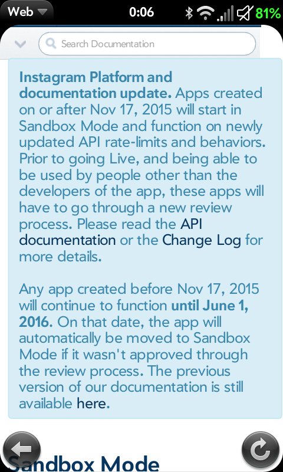

# Instagrio hit by Instagram’s API Change, Now in ‘Sandbox Mode’

I don’t like reporting on broken webOS apps. Nope. But here’s another. This time ‘[Instagrio](http://www.webosnation.com/app-review-instagrio)‘, the Instagram view-only app, has been disabled by Instagram themselves. The jerks!

Back in November of 2015, Instagram notified developers of 3rd party apps that their API change required updated and resubmitted apps for continued access. It also requires a vetting process to determine the app is “kosher”. My word there, not theirs. You can read the explanation on [their developer blog](http://developers.instagram.com/post/133424514006/instagram-platform-update).

There’s still a chance to get Instagrio back to functioning normally but the project needs a developer. Interested? Here’s a couple ideas to get you started:

Grab the legacy [code from Github](https://github.com/ionull/instagrio)! Or better yet the [EnyoJS test version](https://github.com/ionull/instagrio-hd) code.

Get the API keys from the Android app version .apk file…

> [@ionull](https://twitter.com/ionull) [@pivotCE](https://twitter.com/pivotCE) [@EnyoJS](https://twitter.com/EnyoJS) [@baldric555](https://twitter.com/baldric555) [@dkirker](https://twitter.com/dkirker) [@_minego](https://twitter.com/_minego) I.e. Put the APK through a decompiler, take the API keys from there 😛
>
> — Herrie (@Herrie1982) [June 2, 2016](https://twitter.com/Herrie1982/status/738382080875208707)

Or alternately you can [beg the original creator](https://twitter.com/ionull) on Twitter! You can also download the [now defunct version of Instagrio](https://app.box.com/s/1m5a1mp750jav0j0vpgq53ewgitb7ry6).

Pay your respects [with a comment](http://forums.webosnation.com/webos-apps-games/279600-instagram-webos-instagrio-0-0-4-a.html) on the forums.

#webosforever
