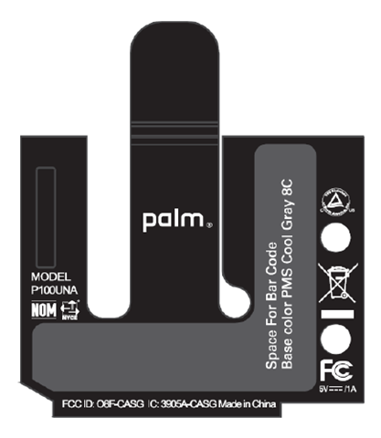

# Rare webOS Devices, Episode 3

**UPDATE: Well, it turns out I didn’t do my research properly. The P100UNA was the Telcel Palm Pre. I got pretty excited there for a minute, didn’t I? It’s still unique in that this is a marked pre-production unit with no back-mirror branding and has an AT&T configuration.**

> [@alan_morford](https://twitter.com/alan_morford) hey just want to let you know… P100UNA is not an AT&T Pre. It's a production device, the Telcel Pre.
>
> — Calvin C (@ToniCipriani5) [July 8, 2016](https://twitter.com/ToniCipriani5/status/751391636110860288)

In this the third episode of rare webOS devices, I take a look at a protoype Pre 3 and the ~~never-before-seen~~ P100UNA also known as the ~~AT&T~~ Telcel Palm Pre.

For those owners of an AT&T branded Palm Pre Plus, don’t get upset. Yes, you have an AT&T Pre but it’s a ‘Plus’. What I have in my possession as an original (orange keyboard and gesture area button) ~~AT&T~~ Telcel Palm Pre with an ATT configuration which predates the AT&T Palm Pre Plus.

We first heard about the device on webOS Nation forums when it [cleared the FCC](http://www.webosnation.com/gsm-palm-pre-passes-through-fcc-doesn-t-fry-brains). Clearly that was before the Sprint exclusive deal.

The other device to show, while cool, is a bit more run-of-the-mill. A prototype Pre3 with a glorious HP Palm back. I do love the back.

Check the video!

[YouTube video](https://www.youtube.com/watch?v=MzSf7cohWo4)

#webOSForever

Image: webOS Nation
