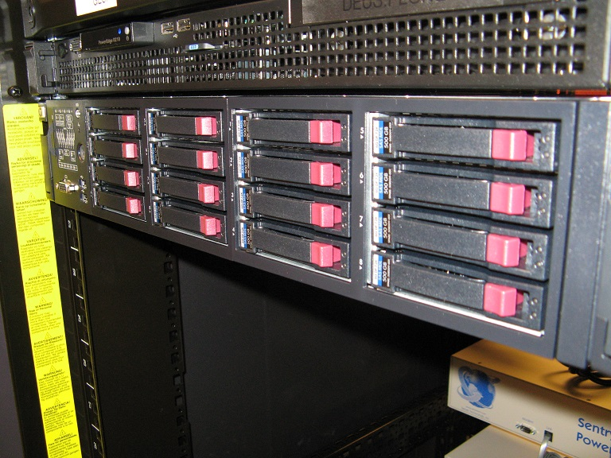

# UPDATE: webOS Internals/Ports Sites (were) Offline

**UPDATE: They’re back! That was fast!**

> And we're back. Thanks so much for the patience. The admin has been fed and we have new members for Ports! Thanks all!
>
> — webOS Ports (@webosports) [July 27, 2016](https://twitter.com/webosports/status/758111306327044096)

If you’ve been incessantly hitting refresh on your web browser trying to get [webos-ports.org](http://webos-ports.org) and/or [webos-internals.org](http://webos-internals.org) to load, you’re not alone. Unfortunately, they may not come back online any time soon.

*This is the WOSI server as Internals calls it. The first server donated by HP.*

The sites are hosted on the same server. Surprised? Well, if you think about it, webOS Internals spawned webOS Ports. In fact, the earliest members of Ports came from the Internals team. That’s the server pictured to the right. [HP donated it](http://www.webosnation.com/hp-donates-server-homebrew-webos-internals-group).

The admin (yes, there’s only one left) was notified that the web server had been reported to be attacking other servers. Not good. You may remember when the [patch portal was hacked](http://pivotce.com/2013/12/22/webos-patches-web-portal-hacked/). With little time and the position only one person deep, the solution was to take the patch portal down. It was a sad day but rest assured, *this* take down **should** only be temporary though the reason for taking it down is similar.

**The data is still there!** ~~The server is literally off.~~ The web server is off but the server itself is still on. If you were using webOS Internals’ doctor page just point your browser to [palm.si](http://palm.si) instead.

The good news is the LuneOS [testing](http://build.webos-ports.org/luneos-testing/images/) and [stable](http://build.webos-ports.org/luneos-stable/images/) builds site is still there as it’s not hosted on the same web server. 😀

### You can help

[webOS Ports is looking for volunteers](http://pivotce.com/2014/09/22/webos-ports-help-wanted/) still and has been looking for more web admins for a while. Are you interested? Contact them via Twitter [@webosports](https://twitter.com/webosports) on IRC: Freenode:#webos-ports or email webos.ports@gmail.com.

#webOSforever
