# Guest Guide: Mimic webOS in Android

I bet you’ve seen topics on webOS Nation forums and our article here on pivotCE about [Making Android More Like webOS](http://pivotce.com/2015/10/21/making-android-more-like-webos/). Well, webOS Nation forums user, Shuswap, just kicked it up a notch.

He recently [shared with me on Twitter](https://twitter.com/visiblink/status/768265391713890304) that he’d made a pretty sweet Android mod to mimic webOS. I asked for a tutorial and he obliged! Read on for his great work and get ready to webOS-ify your Android!

### Overview

This is a guide to adding webOS-style features to your Android device, complete with gesture area, gestures, and icons. Here is a quick video demonstrating the result:

[YouTube video](https://www.youtube.com/watch?v=EYKPKOKlL-A)

The tutorial below explains the process step by step. It assumes that you already know [how to flash a ROM](http://lifehacker.com/how-to-flash-a-rom-to-your-android-phone-30885281). In order to proceed, you will need to be running the Dirty Unicorns ROM, and will need several applications from the Play Store: [Nova Launcher](https://play.google.com/store/apps/details?id=com.teslacoilsw.launcher&hl=en), [GMD Gesture Control Lite](https://play.google.com/store/apps/details?id=com.goodmooddroid.gesturecontroldemo&hl=en), [Wave Launcher](https://play.google.com/store/apps/details?id=com.wavelauncher&hl=en), [Invisible active Widget](https://play.google.com/store/apps/details?id=com.nminvisible.android.widget), [FontFix](https://play.google.com/store/apps/details?id=com.jrummy.font.installer), [Boot Animations](https://play.google.com/store/apps/details?id=com.jrummy.apps.boot.animations&hl=en), and [Roundr](https://play.google.com/store/apps/details?id=mohammad.adib.roundr&hl=en). This has been tested successfully with and without [Multirom](https://play.google.com/store/apps/details?id=com.tassadar.multirommgr&hl=en) on the Nexus 4 and without Multirom on the LG G2.

### Before we webOS-ify…

Before you can set up a webOS-ified Android, you need to do the following things:

1. **MAKE A BACKUP** and then flash the Dirty Unicorns ROM (and a set of GAPPS, if you want them – if you don’t, you’ll have to find alternate methods of downloading apps). Note: first boot can take a very long time. Be patient.

- You need Dirty Unicorns specifically, because it has the Fling navigation bar, which you will use to create the gesture area.
- Check the supported devices section at <http://dirtyunicorns.com/> to find out if they support your device. Downloads are available at the site as well, but it’s a good idea to check out the XDA thread for Dirty Unicorns on your device. The thread for the Nexus 4 is here: <http://forum.xda-developers.com/nexus-4/orig-development/rom-dirty-unicorns-mako-edition-t3326301>.

2. After installing the ROM, proceed through the initial device set up and log into your Google account for Play Store access.
3. Install [Nova Launcher](https://play.google.com/store/apps/details?id=com.teslacoilsw.launcher&hl=en).
4. Install [GMD Gesture Control Lite](https://play.google.com/store/apps/details?id=com.goodmooddroid.gesturecontroldemo&hl=en).
5. Install [Wave Launcher](https://play.google.com/store/apps/details?id=com.wavelauncher&hl=en).
6. Install [FontFix](https://play.google.com/store/apps/details?id=com.jrummy.font.installer).
7. Install [Roundr](https://play.google.com/store/apps/details?id=mohammad.adib.roundr&hl=en).
8. Install [Boot Animations](https://play.google.com/store/apps/details?id=com.jrummy.apps.boot.animations&hl=en).
9. Install a file manager. (*[Root Explorer](https://play.google.com/store/apps/details?id=com.speedsoftware.rootexplorer&hl=en) (paid) or [Amaze File Manager](https://play.google.com/store/apps/details?id=com.amaze.filemanager&hl=en) are pretty good*)
10. Install [Invisible active Widget](https://play.google.com/store/apps/details?id=com.nminvisible.android.widget).
11. [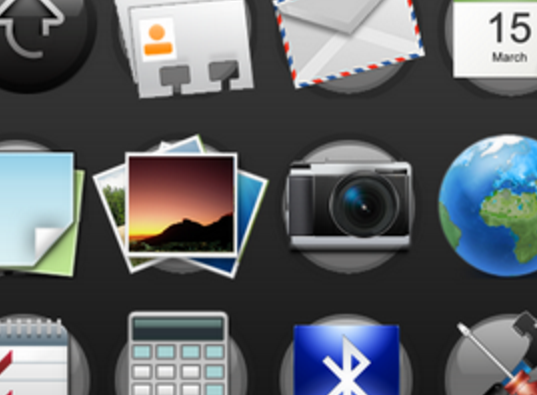](https://app.box.com/s/bi1bjdwk4ppyvupodd6gcbm1smlqlnu2)
    *Click me to download a pretty nice webOS icon set Alan put together.*

    Get the webOS icons and wallpaper you need. You can harvest them from a webOS device or doctor. There’s a good discussion at <http://forums.webosnation.com/webos-discussion-lounge/325891-default-icon-location.html> and there are more icons in the app folders in /media/cryptofs/apps/usr/palm/applications/. Alternatively, you can find the icons online. See <http://webos-ports.org/wiki/Graphics_Work> and <http://www.veryicon.com/icons/system/palm/>. I found the launcher up-arrow icon in this set: <http://flamemo.deviantart.com/art/Palm-web-OS-icons-122466330>. The white line for the gesture area is here: <http://imgur.com/a/sE5QS>. Or click the icon box on the right to download a pre-built set.
12. Put the icon images and wallpaper in the “pictures” folder on your device.
13. While you’re harvesting icons and wallpapers go ahead and grab two Prelude fonts from /usr/share/fonts: Prelude-Medium and Prelude-MediumOblique.

**Step 1: Change the Launcher and Wallpaper**

Get the [stock webOS wallpapers](https://app.box.com/s/5g038tmirsp9wl17qu3lfzztbre4139r) or super awesome [Just type… wallpapers](https://app.box.com/s/4bx4xtpzhz9t0wjjj810skr7sy9dr4df) for Step 11 below.

1. Enter the app drawer. Go to Settings > Home and choose “Nova Launcher.”
2. Press the arrow in the top left to return to settings.
3. Select Display > Wallpaper > Gallery and navigate to the folder in which you saved your wallpaper. Agree with permissions dialogs if any appear. Press “Set wallpaper” at the top left of the screen.
4. Back out of settings to the home screen and push the home button to start Nova Launcher.

**Step 2: Set the Swipe Up Gesture**

Note: On reboot, you may not have up-swipe. Simply relaunch GMD and all will be well. #bugs

1. Enter the app drawer. Select the GMD Gestures App.
2. Grant root access.
3. Select the “Home” gesture (the top one).
4. Select “Pinch Points” and change it to “Swipe UP.”
5. Select “4 Touch Points” and change it to “1”. Press Okay.
6. Select “Anywhere” and change it to “Bottom Border.”
7. Select “Advanced Options” and make sure that “Active On Keyboard” is toggled on. Hit the arrow in the top left to go back one screen.
8. Press the check mark in the top right of the screen to save your changes.
9. Press and hold “Back” and select “Remove.” Repeat for all other actions (except “Home”).
10. Select the three dots at the top right of the screen. Choose “Device Setup.”
11. Set the Border Size to 10mm.
12. Reduce the Gesture Size Adjustment to somewhere around -30.
13. Press the check mark in the top right of the screen to save your changes.
14. Select the three dots at the top right of the screen. Choose “Settings.”
15. Ensure “Start on Boot” is toggled on.
16. Select “Notification.” Choose “Hide Notification.”
17. Select “Gesture Toast” and choose “None.”
18. Under “Gesture Vibration,” you might want to slide the slider all the way to the left to get rid of the haptic feedback.
19. Exit the app.
20. Enter the app drawer. Go to Nova Settings > Gestures & inputs > Home button and select “App drawer.”

**Step 3: Create the Gesture Area**

1. Go to Settings > Dirty Tweaks > Navigation > Navigation Bar.
2. Select “Navigation mode.”
3. Choose “Fling”
4. Select “Fling settings.”
5. Select Right short swipe > Select custom action > Home
6. Select Left long swipe > Select custom action > Back (“Left short swipe” should already be set to “Back.”)
7. Select Single Tap Right > Select custom action > Recents
8. Select Single tap left > Select custom action > Recents
9. Select Right long swipe > Select custom action > No action
10. Select Long press right > Select custom action > No action
11. Any other gestures should be set to “No action.”
12. Toggle off “Animate logo”
13. Select “Custom logo image” and navigate to the folder where you placed the white line image for the gesture area.
14. Toggle off “Show ripple”
15. Toggle off “Enable gesture trails”
16. Exit the app.
17. Enter the app drawer. Select Nova Settings > Look & feel. Toggle off the “Transparent notification bar” setting.
18. Exit Nova Settings.

**Step 4: Set up the Dock and Customize the Icons**

1. If you long press (press and hold) and then drag the icons on the dock, you can rearrange them. Move the app drawer icon to the far right. It may try to combine with another app icon and create a folder. Just keep moving it around until the other icons slide over to make room.
2. If you long press the icons, a menu will appear. Long press the app drawer icon. Select edit. Tap the icon to the left of the App label.
3. Select “Gallery apps.” Choose “Gallery.” Navigate to folder where you placed the up-arrow launcher icon for the app drawer.
4. Select the launcher icon.
5. Press “Done.” Press “Done” again.
6. Long press and remove any unwanted app shortcuts from the dock.
7. Long press and remove unwanted app shortcuts from the desktop.
8. Wait to add any new shortcuts to the dock until later (step 19).
9. Enter the app drawer and select Nova Settings > Dock > Dock Background.
10. Set “Shape” to Rectangle.
11. Under “Content” choose “Tint.” Select the blue-grey color (top row, second from left).
12. Set the “Transparency” slider to around 70%.
13. Exit “Nova Settings.”
14. Enter the app drawer. Long press and drag to “Edit” at the top right any app you wish to change the icon for.
15. Select “Gallery apps.” Choose “Gallery.” Navigate to folder where you placed the icon.
16. Select the icon.
17. Press “Done.” Edit the App label if necessary. Press “Done” again.
18. Repeat for each icon you wish to alter.
19. When you have finished editing the icons in the app drawer, long press and drag to the dock any icon you want on the dock.

**Step 5: Change the App Drawer Appearance**

1. Enter the app drawer. Select Nova Settings > App & widget drawers.
2. Toggle off “Frequently used apps”
3. Scroll down and select “Background”
4. Select the blue-grey color (top row, second from the left)
5. Select “Background” again.
6. Set the “Transparency” slider to 7%. Backswipe in the gesture area to exit.
7. Scroll down and select “Transition Animation.” Select “Slide up.” Press “Done.”
8. Scroll down and toggle off “Search bar”
9. Toggle off Enable fast scroll bar or leave it enabled and change the color to white (similar to the webOS Scrollbars patch from Preware but only for the app drawer)
10. 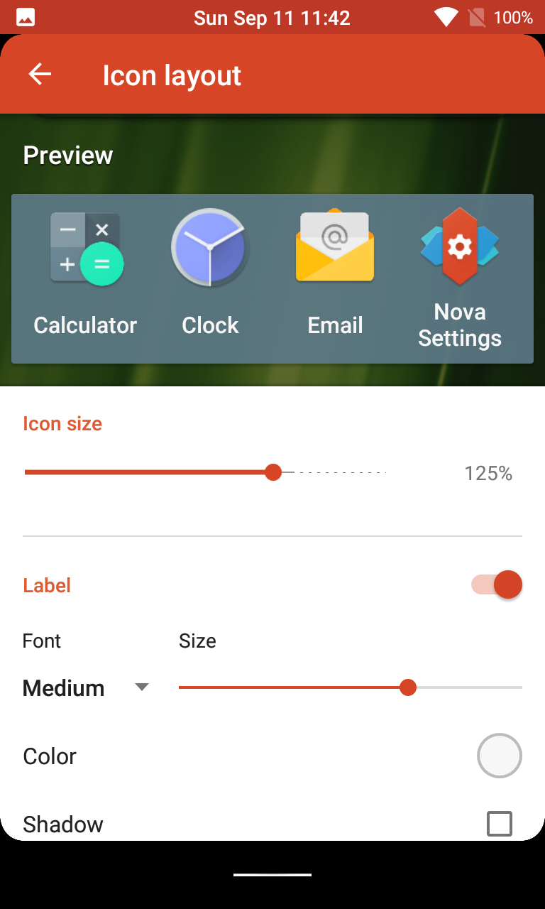To mimic webOS’ 3×4 icon grid on the Pre3 tap Drawer App Grid and set it there. You’ll notice the apps seem pretty far apart. Feel free to play with icon size and font size in Icon Layout in Nova settings. The images below in Step 13 show my setup of 125% icon size and Medium font size with the slider at about 60% to the right and white text color. Feel free to play with it.
11. Exit the app.

**Step 6: Clean Up the Desktop**

1. Enter the app drawer. Go to Nova Settings > Desktop.
2. Toggle off “Persistent search bar” if necessary.
3. Select “Page indicator.” Choose “None.”
4. Exit the app.
5. On the desktop, press and hold the Google search bar. Choose “Remove.”
6. If additional icons or widgets appear on the desktop as a result of the above steps, press and hold them, and select “Remove.”

**Step 7: Move the Status Bar Clock**

1. Enter the app drawer. Go to Settings > Dirty Tweaks > Status Bar > Clock & date > Alignment. Select “Center clock.”

**Step 8: Eliminate Haptic Feedback (Vibration on Touch Events) (Optional)**

1. Enter the app drawer. Go to Settings > Sound & notification > Other sounds. Toggle off “Touch sounds” and “Vibrate on touch” if desired.
2. Go to Settings > Language & input > Android Keyboard > Preferences. Toggle off “Vibrate on keypress.”

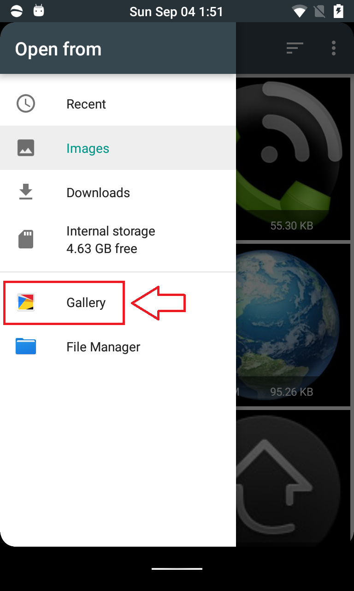
*Make sure to tap Gallery or your selection won’t save.*

**Step 9: Set Up Wave Launcher**

1. Open Wave Launcher. Back swipe.
2. Select settings.
3. Ensure that the boxes for “Enable on startup” and “Soft keyboard has precedence” are both checked.
4. Select “Number of apps.” Set to five (or the number of shortcuts you have in the dock).
5. Scroll down and de-select “Auto advance on edit.” Back swipe to return to the main setup screen.
6. Select “Calibrate.” Set the size and location of the launch trigger (shown in pinkish red). I set mine to the bottom left, so that it’s unlikely to be accidentally triggered. Back swipe to return to the main setup screen.
7. 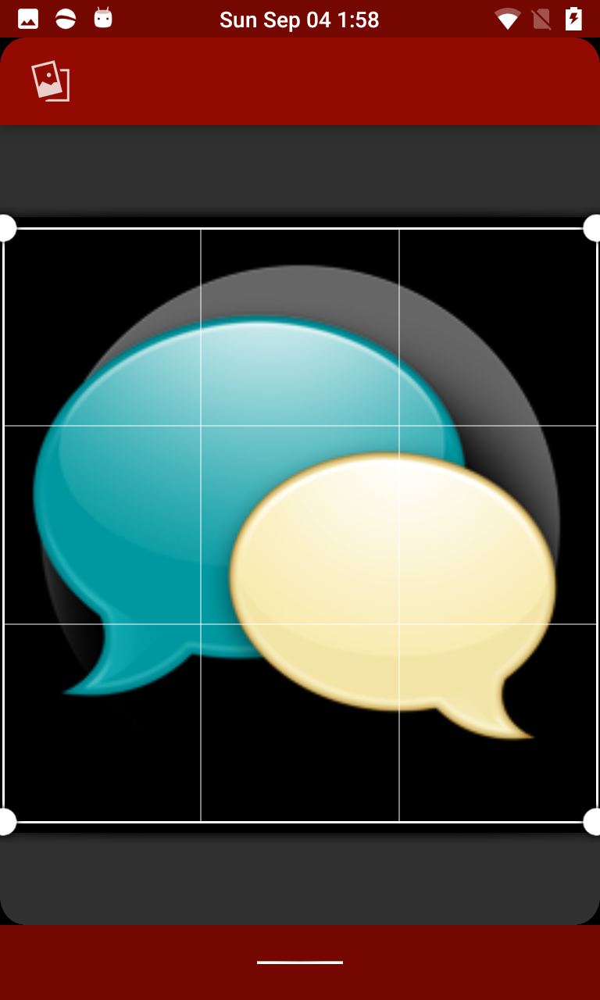
   *Tap the double image icon to save on the top left.*

   Select “Edit wave.” Select the apps for each position. I mirrored my dock apps, so that it is most like webOS. After you have chosen an app, you can long press the icon on the wave launcher to bring up a menu and change the icon to match the customized icons on the launcher. Make sure to use Gallery and tap the double image icon on the top left to save.
8. If you want the app tray shortcut in the far right position, when you’re adding that shortcut, select the up-right arrow to the right of the android robot. Scroll down through the list and select “Nova Action” and then “App drawer.” Long press the icon on the wave bar and proceed to change the icon to the webOS launcher icon.
9. Back swipe to return to the main setup screen.
10. At this point, you may want to change the wave launcher transparency to match that of the dock. If so, select “Edit Colors” and adjust the slider marked “A” to your preferred setting.
11. Exit the app.

**Step 10: Configure Roundr**

1. Enter the app.
2. You might have to toggle “Enable Roundr” off and on to get the app to start the first time.
3. Ensure that “Start on boot” is checked.
4. Set the corner radius. Using my Pre3 as a guide, I set the corner radius at 18 on my LG G2, but different screen dimensions may call for a different setting.
5. Uncheck “Hide on KitKat home.”
6. Back swipe to exit the app.
7. Go to Settings > Dirty Tweaks > Multi-tasking > Recents > Toggle off “Recents panel Search bar”
8. Tap Immersive Recents and select Fullscreen (otherwise Roundr won’t display right on card view)

**Step 11 (Optional, if you chose one of the webOS backgrounds in Step 1) Configure Invisible active Widget for “Just type”**

1. 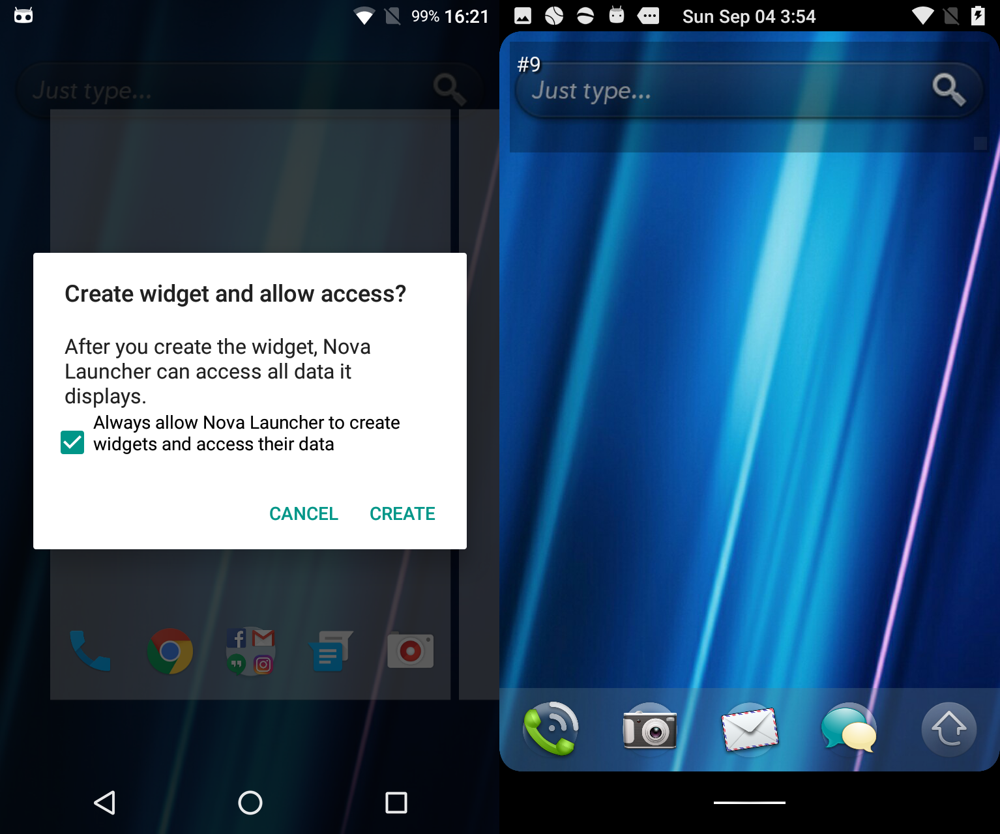Long press on your homescreen and tap Widgets.
2. Tap and hold on “Invisibles active Widge.. 2 x 1” and drag it to the top left corner of your homescreen. (Toggle the checkbox and tap Create if prompted from Nova Launcher).
3. Tap and hold on the dark numbered box on your homescreen and tap Resize in the pop-up that appears.
4. Drag the right side of the box as far right as it lets you.
5. Tap outside of the box anywhere on your homescreen and then tap the dark box you made to open Invisible active Widgets.
6. You’ll see your Widget ID and below that “Launch app”. Tap “Launch  app”. From here you can select your favorite search app. Google or BlackBerry Device search are obvious choices. (If you don’t have the [BlackBerry Manager app which comes with the entire suite of BlackBerry Android apps](http://forums.crackberry.com/android-apps-f444/working-blackberry-priv-apps-any-android-device-no-root-required-1059855/)…you’re missing out).
7. Once you’ve selected your search app, toggle Config Mode to off and tap OK. You can now select the area your Just type bar is in to launch the app!

**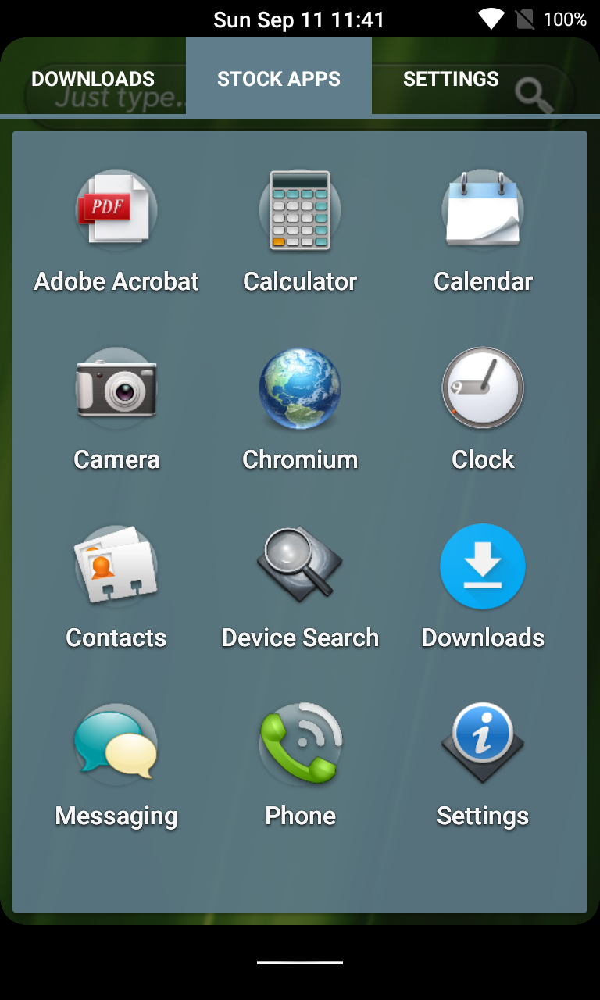Step 12 (Optional, if you have Nova Launcher Prime): Create Tabs in the App Drawer** *(Prime is totally worth it!)*

1. If you have the [paid version of Nova Launcher](https://play.google.com/store/apps/details?id=com.teslacoilsw.launcher.prime&hl=en), you can set up multiple tabs in the app drawer by going to Nova Settings > App & widget drawers and toggling on “Tab bar.”
2. Select “Menu action icons” and uncheck all the choices. Press “Done.”
3. Scroll down and select “Drawer groups” to create tab sections.
4. After you create the groups, select each group, and use the check boxes to choose which apps to assign to the group/tab.
5. You can also assign individual apps to tabs from the app drawer. Just enter the app drawer and long press and drag app icons to “Edit” at the top. You can assign the app to a particular group/tab in the edit dialog.

**Step 13 (Optional): Replace System Fonts**

1. 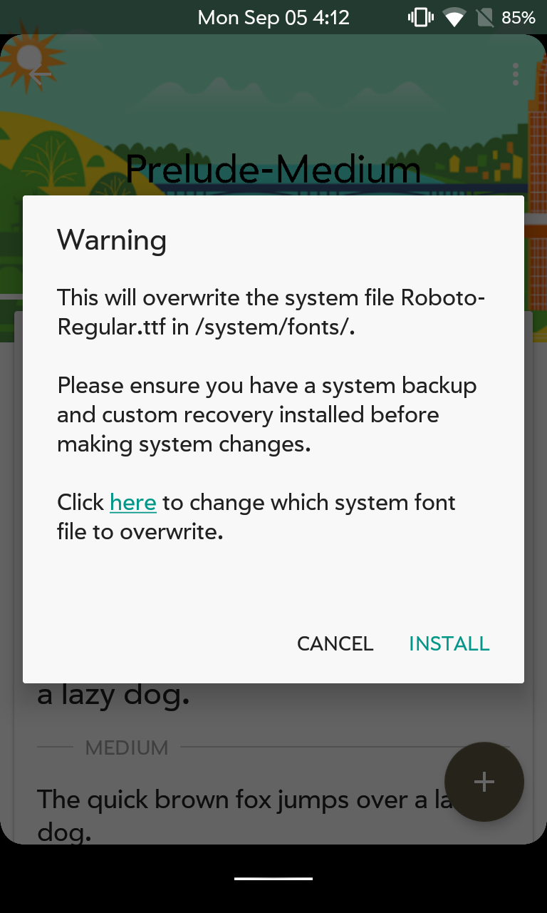
   *Tap the underlined “here” word to change which system font to replace.*

   Copy Prelude-Medium and Prelude-MediumOblique to your device and remember where you put them.
2. Open FontFix.
3. Tap the + button.
4. Tap the folder icon and browse to where you saved the fonts.
5. Tap Prelude-Medium and tap Select.
6. On the next screen you’ll see a preview of the font. Tap +.
7. Tap INSTALL.
8. A warning pop-up appears. For the **first font only** all you have to do here is tap INSTALL because it defaults to the primary font Android uses. It will ask you to reboot. You can tap not now if you want and continue to the other two.
9. Repeat steps 2-7 (yes you will select Prelude-Medium again) but this time tap Here on the warning pop-up. See the image ->
10. Choose Roboto Medium and tap INSTALL. Again reboot or not, up to you.
11. Repeat steps 2-4. On step 5 choose Prelude-MediumOblique then continue on and tap Here again on the warning pop-up. Scroll and choose Roboto Italic and tap INSTALL. This time reboot. See some before and after pics below.

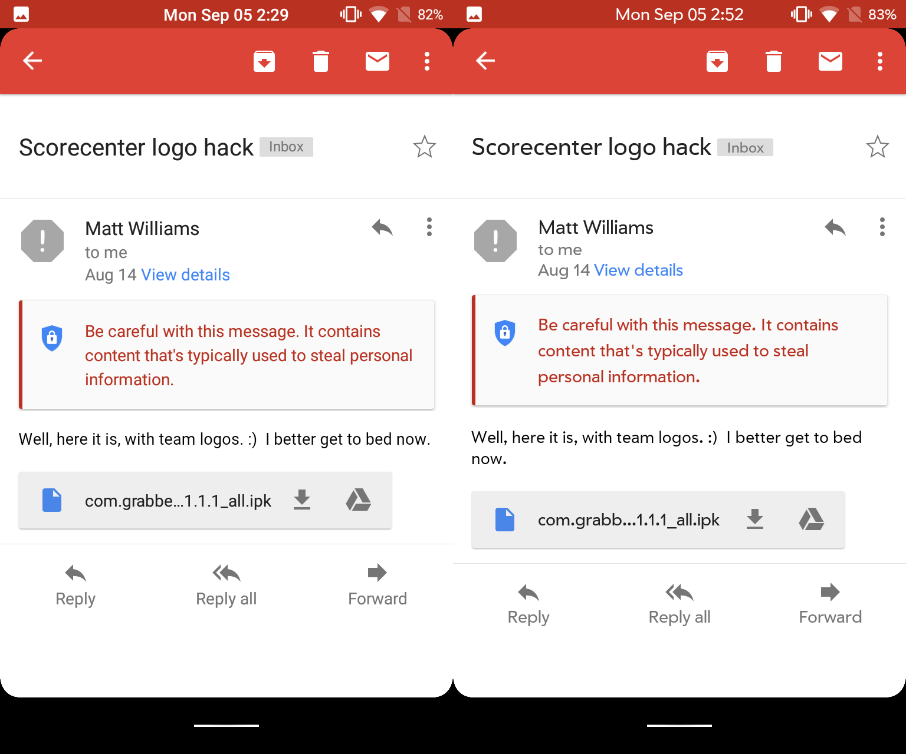

*GMail Before and After*

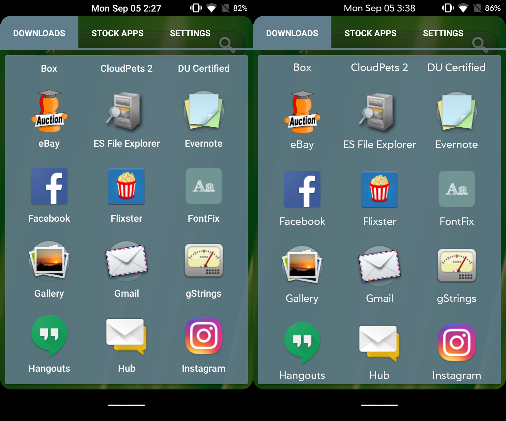

*Launcher Before and After*

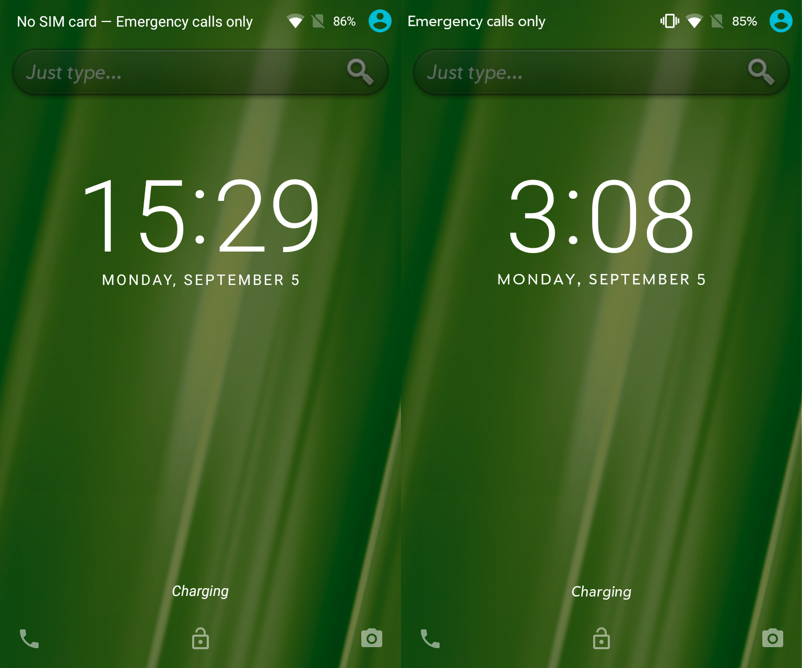

*Lockscreen Before and After*

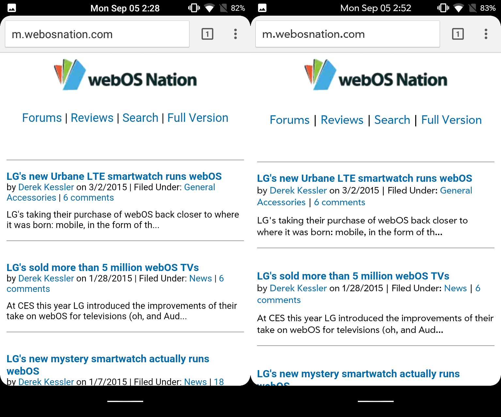

*Web Before and After*

**Step 14 Add Ringtones, Notifications, and System Sounds**

To add Palm ringtones and notification sounds ([download them all here](https://app.box.com/s/pej4bnz41s52ukhbl4ytghv5j59ongcj)):

1. Copy the Palm ringtones to /sdcard/ringtones on your Android device
2. Copy the notification sounds to /sdcard/notifications
3. Go to Settings > Sound & notification > Default phone ringtone and select a ringtone. Your newly added ringtones should appear in the list. If they don’t, you may need to reboot your device to repopulate the list.
4. Go to Settings > Sound & notification > Default notification ringtone and select a notification sound. You can also do app specific sounds as you see fit within each app.

Changing system sounds requires you to follow a different procedure:

1. This is simply an example. You can change any system sound you want to change using the procedure below. I wanted to add the sound that webOS makes when you plug in the USB charger.
2. First, you’ll need a file manager with root file management capabilities so that you can modify system files. I use the [Amaze file manager](https://play.google.com/store/apps/details?id=com.amaze.filemanager&hl=en), available via F-Droid, and this tutorial assumes that you are using Amaze (some new fodder for redditors to debate…)
3. After installation, launch Amaze file manager.
4. Press the hamburger menu in the top left corner. Select settings. Scroll to the bottom of the settings screen and toggle on “Root Explorer.” This allows you to modify system files.
5. If you navigate to /system/media/audio/ you’ll find four sound folders. The ‘ui’ folder contains many of the system sounds.
6. Using Amaze, I copied the webOS sound file ‘notification.wav’ to /system/media/audio/ui. To move the file use the following procedure. When you’re in the folder with notification.wav, press and hold the file, and then press the double-box icon to the left of the trash can to copy it. Go to /system/media/audio/ui and press the clipboard icon to paste the file into the folder.
7. Press and hold the file WirelessChargingStarted.ogg, select the three-dot menu in the top right, and press rename. Rename the file something like WirelessChargingStarted_old.ogg so that you still have a copy later.
8. Press and hold the file notification.wav, select the three-dot menu in the top right, and press rename. Rename the file WirelessChargingStarted.ogg
9. The WirelessChargingStarted.ogg file is the sound file played when you connect a USB charger (go figure). It doesn’t matter that the palm notification file that you renamed is not really an ogg file. Android will use it anyways.
10. Press the hamburger menu in the top left corner of the Amaze file manager. Select settings. Scroll to the bottom of the settings screen and toggle off “Root Explorer” so that you don’t modify system files by accident later.
11. If you’re a visual learner, see this video: <https://www.youtube.com/watch?v=iEie6mbcDGM> Note that the names of the files he is changing in the video are outdated, but his procedure was the basis for the one described here.

**Step 15 (Optional) Replace the Boot Animation**

Nothing against the big unicorn but wouldn’t you rather have an HP or Palm logo pulsing as you boot your device into webOS-droid? The files below are at the Nexus 4’s resolution of 768×1280.

1. Download either the [Palm animation](https://app.box.com/s/sg3v1p221sliwa8r4v2q967nc58phdid) or the [HP animation](https://app.box.com/s/bdcy8o4504imyi4wq8ee540d41k85dnr).
2. Copy the zip file to your device and remember where you put it.
3. Swipe up to open the app launcher and open Boot Animations.
4. Tap SKIP
5. Tap the big + on the bottom right
6. Tap Install from local storage.
7. Find the zip file and tap on it once to highlight it.
8. Tap Select
9. You can preview it here if you want but if you’re ready, tap the big + button.
10. Grant Boot Animations root access.
11. Feel free to create a backup or uncheck it if you don’t care.
12. Tap INSTALL (it happens pretty quickly and you can see a notication at the top that it’s done)
13. Exit the app

[YouTube video](https://www.youtube.com/watch?v=01PKFSFfgGI)

**Interested in Additional Tweaks?**

There are alternative, customizable task-switchers in Settings > Dirty Tweaks > Multi-Tasking > Recents. Unfortunately, neither provides a webOS-style card interface. Rather, they display running apps in a slide-out pane. I found that both the “OmniSwitch” and “slim recents” task switchers caused unwanted interference with the webOS-style gestures, but you may have better luck.

If you discover a webOS-style card-based Android task switcher, you are obligated to report it in the forums at webOS Nation!

### The Result

Tada! Happy modding! Jump in to ask questions to Shuswap or comment in general [in the thread on the Forums](http://forums.webosnation.com/other-oss-devices/331376-android-customized-mimic-webos.html).

[YouTube video](https://www.youtube.com/watch?v=F_PGaRTQFbY)
