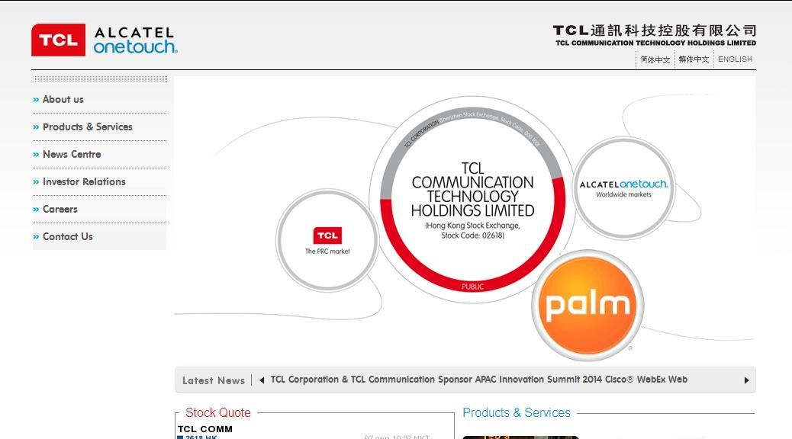

# TCL, Blackberry & Palm

Shortly after the end of CES, I searched idly for any news from TCL. You may have read that they recently [acquired the rights to make & sell Blackberry hardware](https://www.engadget.com/2016/12/15/blackberry-phones-live-on-thanks-to-a-deal-with-tcl/). Longtime readers will recall [TCL’s announcement at 2015’s CES](https://pivotce.com/2015/01/07/tcl-relaunches-the-palm-brand/) that they had acquired from HP, the last remaining piece of Palm Inc: The brand name. To create an image for that story, I added Palm’s logo to the image on TCL’s website:

*Palm joins TCL*

Since that announcement, where TCL encouraged the ‘Palm community’ to participate in developing a device worthy of the name, there has been silence. Now, some have speculated that we could see some kind of combined Palm/Blackberry wonder device, but so far only [a Blackberry has been revealed](https://www.engadget.com/2017/01/04/blackberry-mercury-hands-on/). If you click the link, you can see the familiar keyboard style & this points up the difference between the two purchases: One is a license to manufacture a branded product including hardware & the software that runs on it. The other is just a brand name. Of course, nothing prevents TCL from making anything it wants & calling it a Palm device, but despite it’s recent travails, the Blackberry brand is a going concern with up to date & current technology. Palm is not.

In my search for TCL/Palm news, I of course visited [the website](http://tclcom.com/) & the image at the top of this story is from that site. My only change this time was to enlarge it. Note how the Blackberry logo has been added, then realise that the Palm logo doesn’t appear on their website & to my knowledge, never has.

Two years on from the 2015 announcement, this likely tells us all we need to know about the future of the Palm brand, but there is one optimistic spin that can be put on this: TCL own the Palm brand. There’s a lot more direct benefit from the Blackberry arrangement, but it’s a licensing deal & one that has resulted from Blackberry’s problems in selling it’s own product. TCL’s Alcatel brand has long been an affordable, no doubt profitable, but unspectacular also-ran in the mass market. The team-up gives TCL access to a technology leader, a respected brand & enables Blackberry to concentrate on software, letting TCL worry about selling product to the masses. If TCL succeed, some of the profit will return to Blackberry. If they fail or the deal turns sour for some other reason, they have another brand ready to be painted on a high-quality handset; A brand unencumbered by licensing fees or any other external requirements: Palm. But really, don’t hold your breath!
