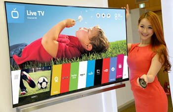

# Russian Video Tutorial to root your webOS TV

Do you speak Russian? Do you have have an LG webOS TV? Do you want to root it?

For that tiny fraction of a percentage of you out there, do I have a video for *you*! We [talked about](https://pivotce.com/2017/08/12/it-seems-a-webos-tv-has-been-rooted/) root on LG webOS TVs a while back but the instructions were a bit…daunting, though not being a Russian speaker myself I can’t say if the video is much better.

So, if someone wants to translate and overdub this in English for the community that’d be great! Also, if someone can please explain why you’d *want* root access on a TV, that would be good to know too.

[YouTube video](https://www.youtube.com/watch?v=PSWPcDGjz2A)

[Talk about it!](http://forums.webosnation.com/lg-webos-tv/331754-pivotce-seems-webos-tv-has-been-rooted.html)

#webOSforever
