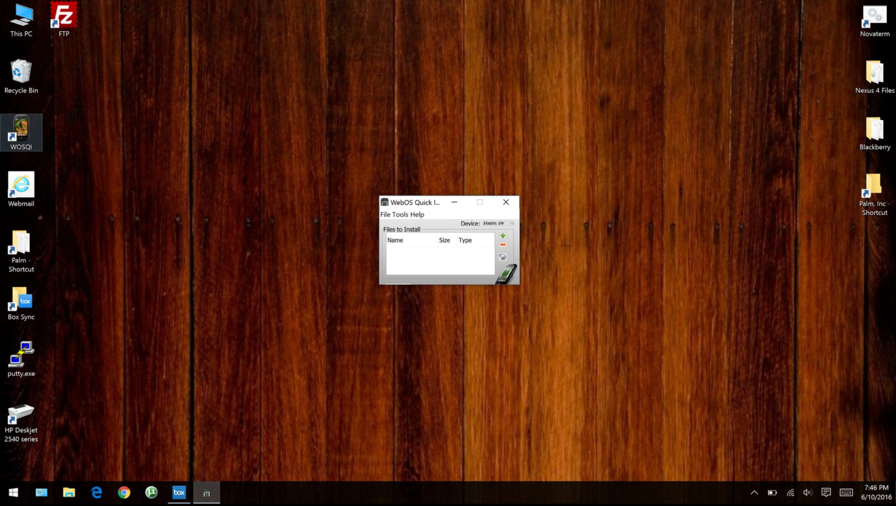

# Fix Java applications for high DPI display

Does [webOS Quick Install](https://pivotce.com/2013/12/25/happy-christmas/) look like this on your computer? Well, if you have a high resolution display (QHD+, 4k, etc.) on your Windows PC, there’s a fix for that.

Over at [superuser](https://superuser.com/questions/988379/how-do-i-run-java-apps-upscaled-on-a-high-dpi-display/1207925#1207925), someone having a similar issue posed the “how do I fix it” question because holy cow, that’s hard to read.

I’d been struggling with it myself for about a year and never had much luck fixing it. This fix however, fixed not only my Java app issues (specific to webOS Quick Install and Nova Device Installer) but also fixed other apps that don’t scale well like 7zip (by making the change to the 7zip exe).

Here’s the fix:

1. Find java.exe and/or javaw.exe likely found in C:\Program Files\Java\jre(version#)\bin.
2. Right click on it and select -> Properties
3. Go to Compatibility tab
4. Check Override high DPI scaling behavior.
5. Choose System for Scaling performed by:
6. Click OK

Launch your java app and tada!

#webOSforever

Thanks to webOS friend, FastbootOEM for the tip!
