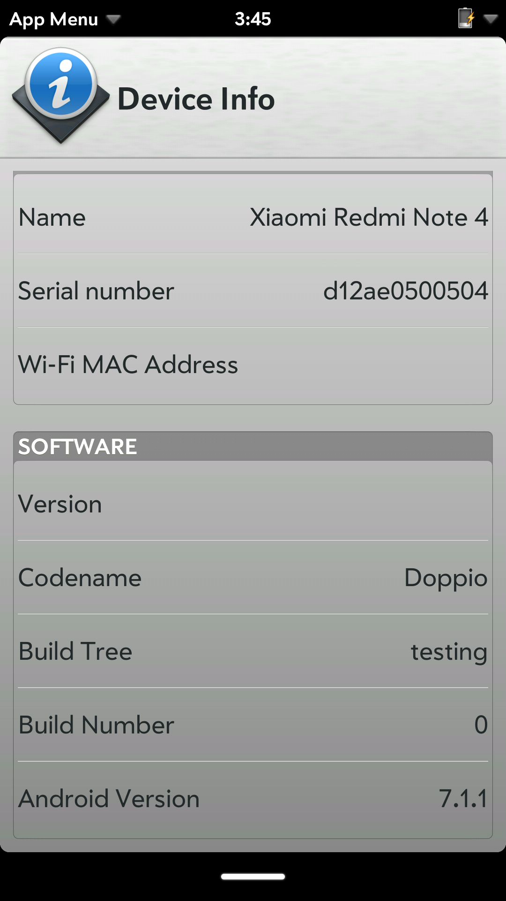

# LuneOS project still progressing

It’s been quite a while since our last release and we’ve been keeping quiet lately. Some of the team members have also enjoyed some well deserved time off in the meanwhile as well. The majority of what we’ve been working on hasn’t been and isn’t ready for public consumption.

But quite a lot of things have happened in the past couple of months.

Here’s what we’ve been working on since the previous release:
-Updated various underlying OS bits: IM plugins such as SkypeWeb, YahooPlusPlus.
-Update from BlueZ4 to BlueZ5. This one is a major upgrade that requires all our targets to have major rework on low level code and this has been taking a long time but is now complete for the Nexus 4 and Nexus 5. This also required us to rework our Settings App plugin for BlueTooth. Since we were never really happy with the plugins and their negative impact on the performance combined with the still uncertain future of the Enyo framework, we decided to start rewriting the Settings app in QML. This will also bring back the individual Settings icons back to the launcher, like they were available on legacy webOS 2.x and 3.x.
-Added various bits and initial work for VPN plugin support for ConnMan.
-Cleanup various configuration files.
-Changed the default wallpaper to a nice new high quality LuneOS one! Thanks to Hans Kokx (aka HaDAk for the great photos!)
-Various minor tweaks to configuration.

We’ve been working on some new porting targets as well. Seeing that Halium is now available for a large number of target devices (50+ at the time of writing), users/developers have come along wanting to try LuneOS on their Halium supported device too so we’re trying to assist those in getting LuneOS working. This is still a lot of work in progress, but results look promising in general. This also would mean we will support Android 7.1.x based devices and Aarch64 bits architecture (ARM 64 bits chipsets).

New targets we are currently developing for are: Xiaomi Redmi Note 4x (mido), OnePlus X (onyx), Google/Huawei Nexus 6P (angler) and Motorola G4 (athene). These are in various stages of development currently.

We’ve also been assisting the [PostmarketOS guys in getting LuneOS running](https://postmarketos.org/blog/2017/12/31/219-days-of-postmarketOS/#luneos-ui) on their build system and targets with great success so far! There are still bits to be added and polished but it’s already a great start to see how far they have been able to come in such short time!

We’re also looking into integrating more with [Halium](https://docs.halium.org/en/latest/) , allowing more and easier ports of the LuneOS!

We plan to be back with a new release in due course, in the meanwhile you can always check our [our latest nightlies](http://build.webos-ports.org/luneos-testing/images/)!
