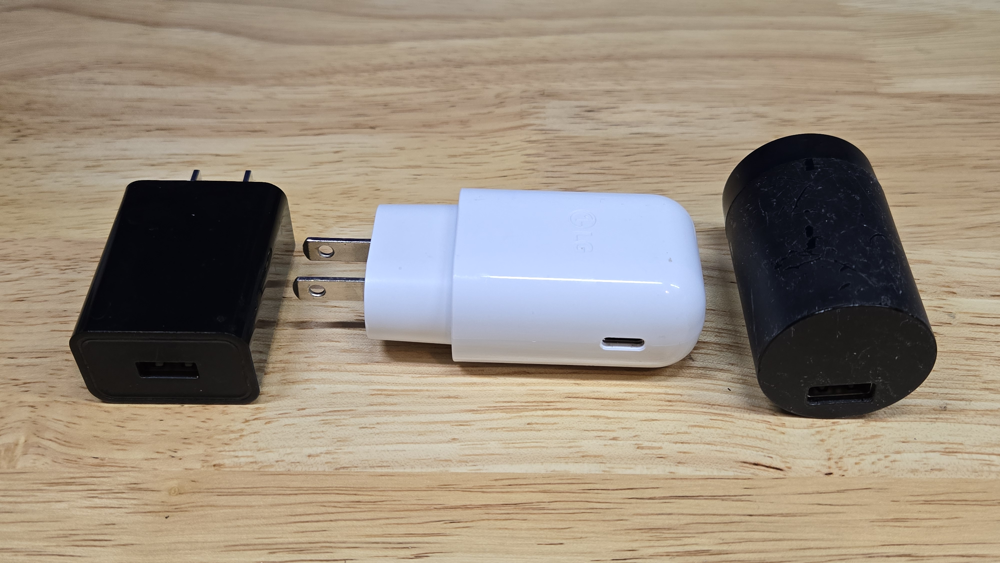
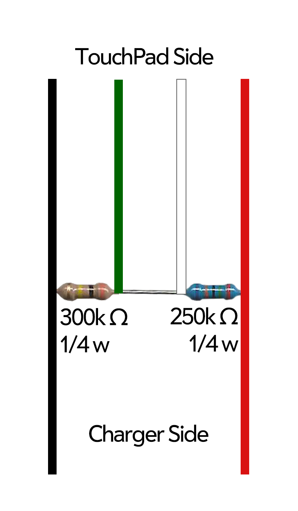
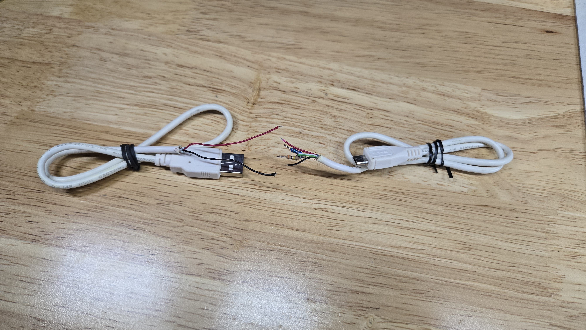
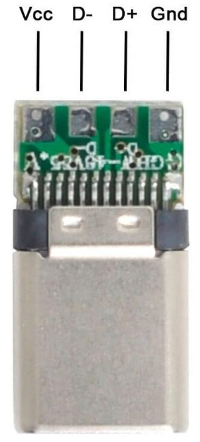
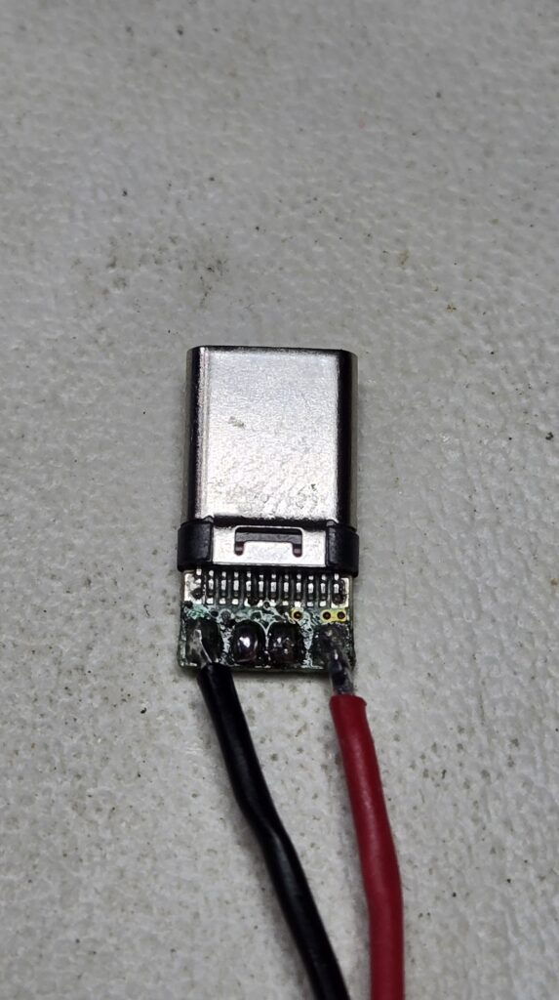
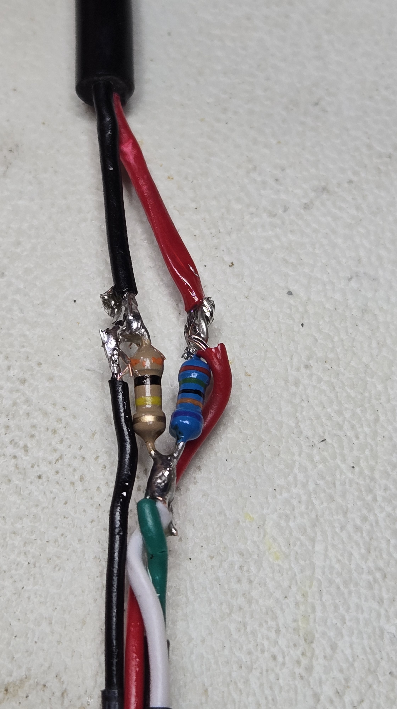
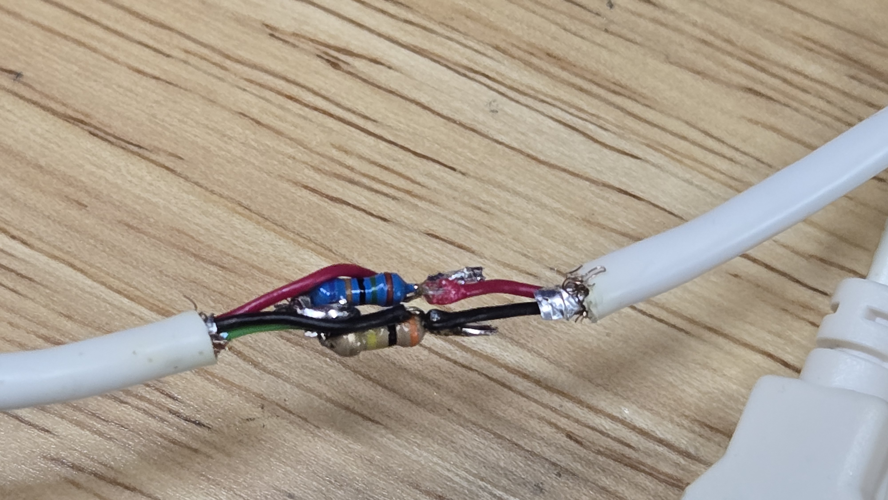

# Guide: Create an “Original Barrel” Charging Wire for your HP TouchPad

I’m pretty sure it’s safe to say there are more HP TouchPads left in the world than there are their matching original barrel chargers. This means if you have a TouchPad today, you’re probably using a TouchStone, a computer, or any other random USB A charging brick to (very slowly) charge your 13 year old device. And it means you’ve seen the error message in the image above every time you’ve plugged it into anything other than the original barrel charger or a computer. Fun fact, you can trick the TouchPad into charging normally and not feeding you the message by creating your own custom micro USB or USB C cable if you’ve [modified your TouchPad](https://pivotce.com/2024/09/25/guide-converting-the-touchpads-micro-usb-port-to-usb-c/).

## Stuff You’ll Need

Assuming you have a micro USB (ie. non USB C modified TouchPad) you’ll need:
1. A 4-wire micro USB to USB A cable
2. [250k](https://www.ebay.com/itm/395668581460?var=664409417315) and [300k](https://www.amazon.com/gp/product/B00CVZ4ORM/) 1/4 watt resistors (1 each per cable)
3. Soldering iron and solder
4. Heat shrink or electrical tape

If you’re making a USB C cable but only want to use it with a USB A charger then you’ll need:
1. A 4 wire USB C to USB A cable
2. Items 2-4 above

If you’re making a true USB C to USB C cable that you plan to use with a USB C 3.1 charger you’ll need:
1. [A 4-wire USB C cable](https://www.amazon.com/gp/product/B0CRKKH5T1)
2. [A USB C board with 5.1k resistor and the housing for it](https://www.amazon.com/gp/product/B07T97LC9L)
3. Any 2-wire cable or a 4-wire cable that you’ll cut the data wires out of (green and white typically) and that you’ll cut the ends from
4. Items 2-4 from the first section above

## Prepare the Wires

Regardless of which cable you’re making, the end that goes to the TouchPad will need all 4 wires and the resistors. So grab the 4-wire cable of your choice and strip the ends, and I recommend pre-tinning them with some solder.

## Build the TouchPad Side of the Cable

See the image below for how to arrange the resistors. If you’re making a USB A cable, go ahead and cut into two pieces, set aside the USB A side, and grab the micro or USB C for this part.. It doesn’t matter how far away from either end you go, it’s your choice. Strip the wires back so you have enough bare wire to work with.

1. Solder the ground (black) wire to one side of the 300k resistor.
2. Solder data- (green), data+ (white), the other side of the 300k resistor, and one side of the 250k resistor together.
3. Then solder the other end of the 250k resistor to the red (power) wire.

## Build the Charger Side of the Cable

If you’re making a USB A cable, then all you have left to do is reconnect power (red) and ground (black) to their corresponding colors on the TouchPad side of the cable, trim off the data lines from the USB A side, clean it all up with some heat shrink or electrical tape and you’re done!

If you’re making a USB C to USB C cable grab the USB C board I linked above and your 2-wire cable (or 4-wire that you’ve trimmed the data lines from). You’ll also have to cut the end off to make room for the new connector.

1. Pre-tin the board on the two outside pads marked as VCC and Gnd in the image below.
2. Solder on the red (power) wire to VCC and then black (ground) to Gnd. If you bought the housing and boards together, don’t forget to put the housing on the wire before you start soldering. You also may need some super glue to keep the plastic housing from coming apart.
3. Back at the TouchPad side of the wire, take the other end of your 2-wire cable and attach red and black to their corresponding ends, clean it up with some heat shrink or electrical tape and you’re done!

## Final Thoughts

You should now be able to use any charger you want to and the TouchPad will believe you’re plugged into a normal battery charger and will allow the normal charge rate flow through.

Note, you’ve effectively removed the ability to use this cable for Data since the data lines are no longer connected.

Also, for those who modded the TouchPad with USB C, the port already has 5.1k resistance but cannot communicate that to a USB C 3.1 charger with the added resistance on the data lines. This is why the TouchPad end of the USB C cable must be a “dumb” 4-wire USB C cable and the charger end needs the 5.1k resistance to tell the charger on that end to send power. This also means that you must remember which end is which, but don’t worry. Picking the wrong direction won’t hurt anything as the USB C charger won’t allow power since the wire doesn’t tell it to. I marked the TouchPad side of the USB C cable with a dab of orange paint pen.

Finally, I hope you found this helpful or at the very least entertaining! I had fun exploring the different ways of making this work and [live streamed it on Twitch](https://www.twitch.tv/radrepairs).

#webos4ever
